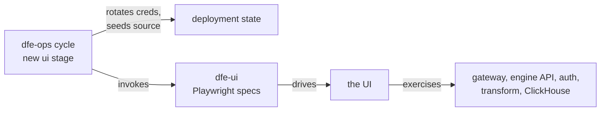

<!--
  Project:      dfe-infra
  File:         docs/ACCEPTANCE-AUTOMATION.md
  Purpose:      Automating the UI half of acceptance, and why the manual pass was not enough
  Language:     Markdown

  License:      BUSL-1.1
  Copyright:    (c) 2026 HYPERI PTY LIMITED
-->

# A manual gate nobody runs catches nothing

[`ACCEPTANCE-CYCLE.md`](ACCEPTANCE-CYCLE.md) already describes the pass this
document automates, and argues it should stay manual: an operator sees a login
landing on the wrong team in seconds, where a suite only sees what someone
knew to write. That argument is sound and this does not retire it.

It has one failure mode, and we just hit it. On 2026-09-03 the devex
deployment was 13 days old and `last_login_at` on its only account was empty.
Nobody had logged in, so nobody had reached step 4 of the cycle. Step 4 is
"Create an org", and creating an org is exactly where first-run setup dies
(dfe-ui#206). A gate that is not run is not a weaker gate; it is no gate.

[`TESTING-CYCLE.md`](TESTING-CYCLE.md) automates the rest already:
`preflight`, `stack-deploy`, `verify`, `teardown`, gated on the two default
E2E tests and the smoke suites. **No stage drives the UI.** That is the gap.

## The rule that would have caught it

**The acceptance stack must differ from the build defaults in every way a real
deployment differs.**

dfe-ui has `initialSetup.spec.ts`, and it walks the whole wizard: welcome,
organisation, login, user, break-glass reset, complete. It passes. It cannot
catch dfe-ui#206:

- CI runs against a stack whose admin password is still the build default,
  which is the only configuration where the wizard's auto-login works.
- `e2e/config/login.helpers.ts` imports `BREAK_GLASS_ADMIN_PASSWORD` from the
  product's own constants, so the test types whatever the app baked in. Against
  a rotated deployment it gets the same value wrong, in step with the app.

The suite asserts the wizard NAVIGATES. It never asserts the wizard
AUTHENTICATES against a deployment that rotated its credential. So the new
stage rotates the break-glass password before it runs, and reads every
credential from the deployment rather than from a product constant.

## What "deployed and working" means

1. **k8s**, **dfe-docker on a VM**, **dfe-docker locally**, and
   **developer-local**: the repos a UI developer clones (dfe-engine,
   dfe-schemas, dfe-deploy, dfe-ui) run from source on one machine, the way
   the UI is actually developed. Bugs that only show in a packaged deploy are
   invisible there, and the reverse is just as true, so it is a target in its
   own right. It also proves the developer docs from a clean checkout.
2. Playwright drives **onboarding end to end**, then the key UI features.
3. **Auto-merge on** for the deploy repo, so the gate is not hand-driven.
   The knob exists: `DFE_GITOPS_MODE`, `governance/settings/gitops.yaml`
   `auto_merge`, `PUT /api/v1/gitops/auto-merge`.
4. A **filebeat source** with transform-vrl and the shipped filebeat VRL
   ingests real data, and the rows are visible through dfe-ui and HyperDX.

Item 4 spans everything: source creation through the API, routing to a
dedicated topic, a transform instance, the loader, a typed table, and two
read paths over the result.

## Who owns which half

**dfe-infra** gains one stage in the existing cycle, between `verify` and
`teardown`. It rotates credentials, seeds the filebeat source, invokes the
suite, and owns the end-to-end case.

**dfe-ui** owns the specs and page objects, beside the code they drive, so UI
authors maintain them and the library grows with the product.

**Two tiers, and a spec has to know which it is in.** dfe-ui's existing suite
runs against `make e2e-server`: a dev-posture engine that mounts an
unauthenticated seed API at `/api/e2e/seed-static` (`reset_all`,
`seed_setup_complete`, `seed_organisation`, accounts with chosen passwords).
That is fast and hermetic, and it is exactly the build-default stack this
document says acceptance must not run on. A real deployment never mounts
that API -- the local docker engine answers 404 -- so any spec that calls
`e2eClient({ seedScript })` cannot run in the acceptance stage. Acceptance
specs seed through the product API and the deployment's own credentials, or
not at all.

The human cycle stays. It moves to what it is uniquely good at: judgement
about what a screen SHOULD say, rather than whether a button exists.

## Build it in this order

1. **Rotate-then-onboard**, on local docker. Smallest target, and it fails
   today, so it is the first honest red test.
2. **Key UI features** once onboarding passes: sources, schemas, query,
   the app surface.
3. **The filebeat case**, which needs a source, a transform instance and both
   read paths.
4. **k8s and the VM**, once the local suite is stable.

Each step gates the next. A suite that cannot complete onboarding cannot test
anything behind it.

## Two things block the k8s target

- **The devex gateway.** All eight DFE HTTPRoutes attach to `dfe-gateway`,
  which is `Programmed=False reason=AddressNotAssigned` and cannot get an
  address on a cluster with no LB controller. `eg-gateway` works in the same
  namespace on `externalIPs: [10.66.0.200]` and admits routes from every
  namespace. One value, `gateway.name`, moves all eight.
- **The `local` profile default.** `argocd/values/local.yaml` ships
  `type: LoadBalancer` with empty `externalIPs` for the bare-cluster profile,
  and nothing asserts a gateway ever got an address. That is what let it sit
  unnoticed for 155 days.
