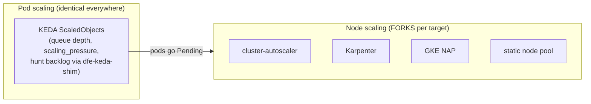

# Autoscaling: the two layers and the per-target fork

Two independent layers scale a DFE deployment. Conflating them is the classic
mistake, so the split comes first:

- **Pod scaling is KEDA, on every target.** The charts ship the ScaledObjects
  (receiver, loader, hunt-runner via the fail-safe dfe-keda-shim); nothing about
  KEDA changes between on-prem and cloud.
- **Two triggers render and the HPA takes the higher.** The app charts ship both
  `keda.cpu` (native scaler, nothing of ours in the path) and
  `keda.pressure.enabled: true` -- the scalo ScalingPressure composite through the
  fail-safe dfe-keda-shim. The shim matches the bare `scaling_pressure` gauge and
  any `<prefix>_scaling_pressure` for that ServiceName (dfe-engine#379), so the four
  wire names the Rust apps use today all resolve without an app release. The shim
  address is derived from the release namespace (dfe-common.kedaShimAddress), so a
  deployment in any namespace resolves it without a values override;
  `keda.pressure.shimAddress` is for a shim outside the release namespace only.
  dfe-transform-vector ships `keda.pressure.enabled: false`: it sets no
  `scaling_pressure` gauge, so cpu is its only live trigger.
  `bootstrap/keda-scale-test.sh` proves the path on each deploy. Its scale-out bound
  is derived from the ScaledObject's own polling interval plus the HPA sync period
  rather than fixed (dfe-infra #275), and it exits 3 for UNPROVEN where the HPA read
  the injected pressure above target and still left the replicas alone, which is the
  unreproduced stall in dfe-infra #134 and is neither a working scaler nor a broken one.
- **Node scaling forks by target.** KEDA makes pods Pending; what turns Pending
  pods into new nodes depends entirely on where the cluster runs. That fork is a
  DECLARED decision, recorded here -- never an assumption baked into a chart.

## Which trigger each tier gets

CPU at 70% is the baseline everywhere and never comes out: it is native KEDA with
nothing of ours in the path, so a component outage cannot take scaling with it. The
question each tier answers is whether the composite renders beside it.

| Tier | Pressure | Ceiling | Why |
| ---- | -------- | ------- | --- |
| slim | off | 2 | No broker and a 2-replica ceiling. CPU is the whole signal worth having, and the shim is not worth putting in the path for it. |
| single | on | 3 | Carries a broker, so `kafka_lag` measures the backlog an I/O-bound loader's CPU hides. Ceiling = `defaultTopic.partitions` (3); a 4th consumer joins the group and gets nothing. |
| mesh | on | 10 | No broker, but every stage holds what the next has not taken, so `buffer_depth` and `memory` carry what `kafka_lag` carries elsewhere. Replicas share load through the Service, so no partition count bounds the ceiling. |
| scale | on | 12 | Carries a broker. The ceiling is a DIVISOR of `defaultTopic.partitions` (12) so every reachable replica count holds the same number of partitions -- at 10, two consumers hold 2 and eight hold 1, and the busy pair sets the group's lag. |

**Composite pressure, not the native KEDA `kafka` scaler.** The native scaler reads
consumer-group lag from the broker and needs no shim. It is also blind to the two
things that decide whether another pod helps: the composite gates to 0 when the
downstream sink's circuit is open (more loaders cannot relieve a dead ClickHouse)
and forces 100 over the memory threshold (scale before the OOM). Lag alone would
scale the loader out against a sink already refusing writes, and the composite
carries the lag term too. A deployment that wants the native scaler can have it --
`keda.triggers` takes a verbatim scaler list the chart passes straight through.

**The thresholds are inherited, not measured.** 70 on both the CPU trigger and the
0-100 composite came across from the fleet default and has no load run behind it.
Sizing them needs a run with more source topics or more partitions on `default_land`
than a single-source rig has, because replicas 4-12 would otherwise idle -- that
work is dfe-infra#146 and is not closed by the trigger choice above.

## The fork decision for DFE deployments

| Target | Node autoscaler | Notes |
| ------ | --------------- | ----- |
| On-prem Rancher/RKE2 (the baseline, incl. our devex + DFE clusters) | **None today: static node pool.** cluster-autoscaler IF the node layer gains a provisioning API (Rancher node pools on a cloud provider, Harvester, etc.) | Karpenter is NOT an option here -- it needs a cloud provisioning API. A fixed fleet (our 3-node cluster) is the sovereign/air-gap default: capacity planning replaces node autoscaling, and KEDA still does the pod side. |
| AWS EKS | **Karpenter** | The practised choice when a DFE deployment lands on EKS. |
| Azure AKS | **Karpenter via Node Auto Provisioning** (managed addon) | NAP mode, not self-hosted Karpenter. |
| GCP GKE | **GKE Node Auto-Provisioning** (native) | No native Karpenter on GCP -- do not plan for it. |
| Multi-cloud / mixed | **cluster-autoscaler** | The portable fallback; runs everywhere. |

Rationale, the general rule this instantiates (any target-conditional
component is a documented fork, chart stays neutral, name the portable
fallback), and the Karpenter guard-rail examples live in the HyperI k8s
standard (`standards/infrastructure/k8s.md`, "Node Autoscaling") -- this file
records only what THIS repo deploys per target.

## Where the choice lives

Per the product rule (every deployment choice is a parameter): the node
autoscaler is installed by the deployment's own bootstrap/overlay for its
target, NEVER by the shared charts. No chart in `helm/charts/` may reference
Karpenter, cluster-autoscaler, or any node-pool API -- a chart that assumes a
node autoscaler quietly breaks the on-prem baseline, which is the first-class
target the stack validates against.
