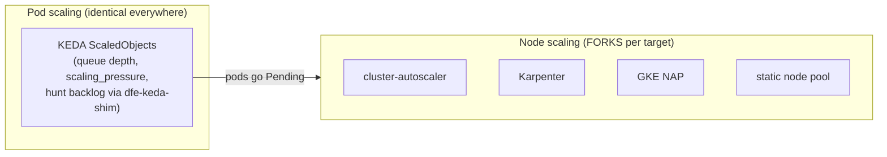

# Autoscaling: the two layers and the per-target fork

Two independent layers scale a DFE deployment. Conflating them is the classic
mistake, so the split comes first:

- **Pod scaling is KEDA, on every target.** The charts ship the ScaledObjects
  (receiver, loader, hunt-runner via the fail-safe dfe-keda-shim); nothing about
  KEDA changes between on-prem and cloud.
- **scaling_pressure is opt-in until every app emits the gauge.** The app charts
  ship `keda.pressure.enabled: false` (dfe-infra #302), so the native cpu scaler is
  the shipped trigger. A deploy turns pressure on in its own overlay -- see
  `argocd/values/local-dfe.yaml` -- and the shim's composite then renders alongside
  cpu, with the HPA taking the higher of the two. Turning it on outside namespace
  `dfe` also needs `keda.pressure.shimAddress`, because the chart default names
  `dfe` (dfe-infra #301). `bootstrap/keda-scale-test.sh` proves the path on each
  deploy and skips its real-app phase where pressure is off.
- **Node scaling forks by target.** KEDA makes pods Pending; what turns Pending
  pods into new nodes depends entirely on where the cluster runs. That fork is a
  DECLARED decision, recorded here -- never an assumption baked into a chart.

## The fork decision for DFE deployments

| Target | Node autoscaler | Notes |
| ------ | --------------- | ----- |
| On-prem Rancher/RKE2 (the baseline, incl. our devex + DFE clusters) | **None today: static node pool.** cluster-autoscaler IF the node layer gains a provisioning API (Rancher node pools on a cloud provider, Harvester, etc.) | Karpenter is NOT an option here -- it needs a cloud provisioning API. A fixed fleet (our 3-node cluster) is the sovereign/air-gap default: capacity planning replaces node autoscaling, and KEDA still does the pod side. |
| AWS EKS | **Karpenter** | The practised choice when a DFE deployment lands on EKS. |
| Azure AKS | **Karpenter via Node Auto Provisioning** (managed addon) | NAP mode, not self-hosted Karpenter. |
| GCP GKE | **GKE Node Auto-Provisioning** (native) | No native Karpenter on GCP -- do not plan for it. |
| Multi-cloud / mixed | **cluster-autoscaler** | The portable fallback; runs everywhere. |

Rationale, the general rule this instantiates (any target-conditional
component is a documented fork, chart stays neutral, name the portable
fallback), and the Karpenter guard-rail examples live in the HyperI k8s
standard (`standards/infrastructure/k8s.md`, "Node Autoscaling") -- this file
records only what THIS repo deploys per target.

## Where the choice lives

Per the product rule (every deployment choice is a parameter): the node
autoscaler is installed by the deployment's own bootstrap/overlay for its
target, NEVER by the shared charts. No chart in `helm/charts/` may reference
Karpenter, cluster-autoscaler, or any node-pool API -- a chart that assumes a
node autoscaler quietly breaks the on-prem baseline, which is the first-class
target the stack validates against.
