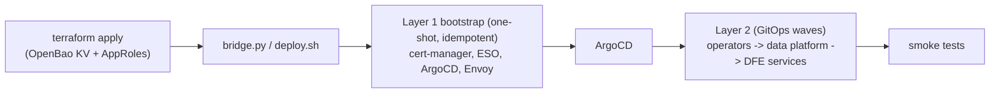
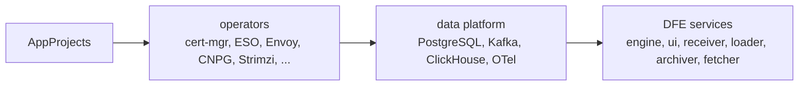
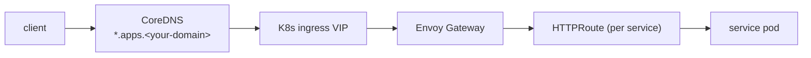
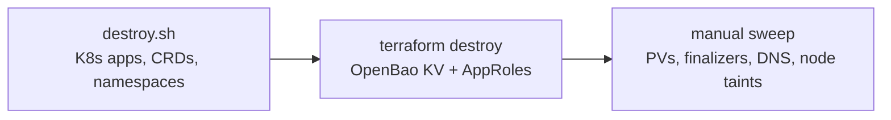

# Build, test and cleanup on devex

How to build, test, deploy and cleanly tear down dfe-infra on the on-prem
**devex** environment (Proxmox-hosted RKE2 + Rancher, CoreDNS, OpenBao). For the
platform-side contract -- what devex provides and what it expects cleaned up --
see `hyperi-io/hyperi-infra:docs/DFE-INFRA-ON-DEVEX.md`.

## Model: two layers



Layer 1 is a one-shot, idempotent bootstrap. Layer 2 is continuous GitOps via
ArgoCD ApplicationSets (`argocd/appsets/`), with values cascading
`common.yaml` -> `<cloud>.yaml` -> `profile-<profile>.yaml` (`argocd/values/`).
All component versions come from `versions.yaml` (the SSoT).

## Prerequisites

- A kubeconfig for the devex RKE2 cluster -- `kubectl get nodes` works.
- An OpenBao token for your Vault/OpenBao (e.g. `bao.example.com`; Terraform uses it).
- Registry pull credentials: copy `bootstrap/local.env.example` to
  `bootstrap/local.env` and fill it in.
- Tooling at the versions pinned in `versions.yaml` (terraform/opentofu, helm).

## Build and validate

CI (`.github/workflows/`) runs on every push/PR:

- `tf-validate` -- `terraform validate` + module `*.tftest.hcl`, matrixed over terraform and opentofu.
- `helm-lint` -- `helm lint` over the charts in `helm/charts/` and the `helm/library/` charts.
- `docker-build` -- builds the utility images under `docker/` (only on changes there).

Locally:

```bash
helm dependency update helm/charts/<chart>
helm lint helm/charts/<chart>
terraform -chdir=terraform/modules/<module> test
```

DFE service images themselves are built per-service (via hyperi-ci), not here --
dfe-infra ships the Helm charts that deploy them.

## Deploy to devex

Integrated path:

```bash
cp bootstrap/local.env.example bootstrap/local.env   # fill in creds
bash bootstrap/deploy.sh --cloud local
```

`deploy.sh` runs `terraform apply`, then `bridge.py` (which reads the Terraform
outputs and runs the Layer 1 bootstrap), after which ArgoCD syncs Layer 2.

Step by step:

```bash
cd terraform/environments/local
terraform init && terraform apply          # creates OpenBao KV mount + AppRoles
cd -
python3 bootstrap/bridge.py --tf-dir terraform/environments/local
kubectl -n argocd get app -w               # watch Layer 2 sync
```



Transform services (wasm, vrl, vector, elastic, splack) sync only on clusters
labelled with the `scale` profile. Set `DFE_DRY_RUN=true` to preview without
applying.

## Test

```bash
bash bootstrap/run-all-smoke-tests.sh      # or the individual smoke-test*.sh
bats bootstrap/tests/*.bats                # OIDC independence + helm rendering
terraform -chdir=terraform/modules/<module> test
```

Smoke tests check namespaces, pod readiness, CRDs, and Gateway/HTTPRoute/network
policies against the live cluster. Note: there is no isolated integration-test
namespace today -- smoke tests validate the running deployment.

## DNS and ingress



Service hostnames are served by HTTPRoutes (Envoy Gateway,
`helm/charts/envoy-gateway-config/`) under the deployment's `*.apps.<your-domain>`
wildcard; cert-manager issues the TLS. A service needing a name outside the
wildcard requires a CoreDNS record added in hyperi-infra
(`hyperi-io/hyperi-infra:infra/coredns/zones/`).

## Cleanup / teardown



1. **In-cluster:** `bash bootstrap/destroy.sh` (prompts to confirm; supports a
   force flag). Deletes ArgoCD apps + ApplicationSets, the data CRDs, the DFE
   namespaces, and the platform Helm releases.
2. **State:** `cd terraform/environments/local && terraform destroy` -- removes
   the OpenBao KV mount and AppRoles. **Do not skip this** or secrets/AppRoles
   are orphaned.
3. **Manual sweep** (not yet automated -- checklist):
   - [ ] `kubectl get pv` -- confirm local-path PVs were reclaimed.
   - [ ] Clear stuck finalizers (CNPG / Strimzi / ClickHouse) if deletion hangs.
   - [ ] Remove any non-wildcard CoreDNS records added in hyperi-infra.
   - [ ] Remove DFE node taints/labels so future scheduling is not blocked.
   - [ ] Confirm no orphaned OpenBao paths remain.

Redeploy with `terraform apply` + `bridge.py` again.

## Troubleshooting

- **ImagePullBackOff** -- check registry creds (`bootstrap/local.env`, imagePullSecrets).
- **App stuck OutOfSync** -- `kubectl -n argocd get app`; check ESO / SecretStore health.
- **Route not serving** -- is the Gateway/HTTPRoute programmed and the cert issued?
- **Teardown hangs** -- clear CRD finalizers (`kubectl patch ... --type merge -p '{"metadata":{"finalizers":[]}}'`).

## See also

- `hyperi-io/hyperi-infra:docs/DFE-INFRA-ON-DEVEX.md` -- the platform-side contract
- `hyperi-io/hyperi-infra:docs/ARCHITECTURE.md`, `ENVIRONMENTS.md`, `DNS-ARCHITECTURE.md`, `OPENBAO-SECRETS.md`
