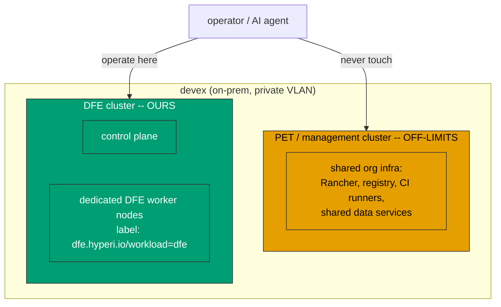
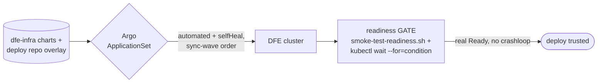

<!--
  Project:   dfe-infra
  File:      docs/DEVEX-OPERATIONS.md
  Purpose:   Operations manual for testing + operating DFE on the devex
             environment. Secret-free by design: names WHAT and WHY, and points
             to hyperi-infra (always private) as the SSoT for sensitive specifics
             (endpoints, IPs, credentials, access).
  Copyright: (c) 2026 HYPERI PTY LIMITED
-->

# DFE devex operations manual

How to test, deploy, verify and tear down DFE on the on-prem **devex**
environment - for HyperI engineers and their AI agents. **Read the golden rules
before you touch devex.** This doc holds the operational model and the rules;
every sensitive specific (endpoints, IPs, credentials, access steps) lives in
the private `hyperi-io/hyperi-infra` repo, which this doc references and never
inlines. Companion: [DEVEX-LIFECYCLE.md](DEVEX-LIFECYCLE.md) (build/deploy/
teardown mechanics).

## Golden rules (read first)

1. **devex is TWO separate clusters, not one.** A shared **pet / management**
   cluster (org infra) and a separate **DFE** cluster (ours). Know which one you
   are on before you run anything.
2. **NEVER change the pet cluster.** It hosts non-DFE org infrastructure. It is
   not ours - do not deploy to it, reconfigure it, or delete anything on it.
3. **DFE is fenced onto its own worker nodes** (a nodeSelector + taint). Do not
   relax the fence or run DFE on the pet/control-plane nodes to "make scheduling
   work" - if DFE pods are Pending, fix the DFE worker nodes, not the fence.
4. **hyperi-infra (private) is the SSoT** for every sensitive specific. This doc
   names WHAT and WHY; hyperi-infra holds the WHERE and the HOW-to-authenticate.
5. **FQDNs, never raw IPs**, in anything you write.

## The two clusters

- **Pet / management cluster** - the shared org platform. NOT DFE, and off-limits:
  never deploy, change, or destroy anything here. Its endpoint + node inventory
  are in hyperi-infra.
- **DFE cluster** - our standalone test/usage cluster: its own control plane plus
  dedicated DFE worker nodes (the node names follow a `dfe-` prefix convention;
  exact names + endpoint in hyperi-infra). This is where DFE deploys and where
  you operate.

**The trap that keeps biting (humans and AI):** the two clusters have DIFFERENT
API endpoints. Querying the pet cluster's endpoint will **not** show the DFE
cluster's nodes - their absence there does **not** mean they are missing or
unjoined. To see or operate the DFE cluster you MUST target ITS endpoint (see
hyperi-infra). Confirm which cluster you are on (`kubectl config current-context`
+ the server) before concluding anything about topology.

## The fencing model

DFE workloads carry `nodeSelector: dfe.hyperi.io/workload=dfe` and tolerate the
matching node taint, so they land ONLY on the dedicated DFE worker nodes - never
on the pet or control-plane nodes. This isolation is deliberate. If DFE pods sit
`Pending` with "didn't match node affinity/selector", the correct fix is to
restore/join the DFE worker nodes, NOT to remove the selector (that would spill
DFE onto the pets). The scheduling config in `argocd/values/` is correct as-is.

## Access

Access is security-sensitive, so it lives in hyperi-infra, not here:

- Cluster inventory (names, endpoints, node roles): `hyperi-io/hyperi-infra:docs/INVENTORY.md`
- devex platform contract + access/runbook: `hyperi-io/hyperi-infra:docs/DFE-INFRA-ON-DEVEX.md`

Never inline credentials, tokens, IPs, Vault paths, or kubeconfigs into this
repo. Read them from hyperi-infra when you need them, and clean up any local
secret artefacts (kubeconfigs, keys) under a gitignored `.tmp/` when done.

## Deploy and verify (the GitOps cycle)

Deploy is declarative GitOps, not a script loop (mechanics in
[DEVEX-LIFECYCLE.md](DEVEX-LIFECYCLE.md)):

- **Deploy:** change git (dfe-infra charts, or the deploy-repo overlay the engine
  writes); Argo ApplicationSets (`argocd/appsets/`) reconcile continuously in
  sync-wave order. Values cascade `common.yaml` -> `<cloud>.yaml` ->
  `profile-<profile>.yaml`; component versions come from `versions.yaml` (SSoT).
- **Verify:** do NOT trust "Argo Healthy" or "pod Running" alone (a Running pod
  can be 0/1; an app can be Healthy while a workload crashloops). Gate on the real
  signal: `bootstrap/smoke-test-readiness.sh` plus `kubectl wait
  --for=condition=Ready` / `=Synced` on the operator's own condition. A timeout is
  a backstop, never the thing you race against.

## Clean slate (reset a test cycle)

To start a cycle clean, remove the previous deploy's DFE resources **on the DFE
cluster only** (its DFE namespaces + Argo apps) and let Argo redeploy fresh from
the current git state. Full teardown steps: [DEVEX-LIFECYCLE.md](DEVEX-LIFECYCLE.md).
NEVER remove anything on the pet cluster - even DFE-looking leftovers there should
be raised with the platform owner, not deleted blindly.

## AI agent steering (the repeat mistakes - do not make them)

| Don't | Do | Why |
|---|---|---|
| Conclude cluster topology from one `kubectl get nodes` | Report it as "context X shows N nodes"; cross-check hyperi-infra `INVENTORY.md` | A single view is partial; the pet endpoint never shows DFE nodes |
| Say nodes "don't exist" when absent from a query | First confirm which cluster/endpoint you are on | The two clusters have different endpoints |
| Relax the DFE nodeSelector / run DFE on pet nodes to clear `Pending` | Restore the DFE worker nodes; keep the fence | The fence protects the pets |
| Touch, change, or delete anything on the pet cluster | Operate only on the DFE cluster | The pet cluster is shared org infra |
| Write raw IPs in prose/docs/commits | Use FQDNs / cluster + role names | IP-not-FQDN is a flagged habit and leaks less |
| Inline creds, endpoints, or Vault paths here | Point to `hyperi-io/hyperi-infra` (private SSoT) | This content is treated as shareable/public |

## SSoT pointers (sensitive specifics live here, always private)

- Cluster inventory + endpoints: `hyperi-io/hyperi-infra:docs/INVENTORY.md`
- devex platform contract + access: `hyperi-io/hyperi-infra:docs/DFE-INFRA-ON-DEVEX.md`
- Credentials/secrets: OpenBao on devex (paths in hyperi-infra, never in this repo).
