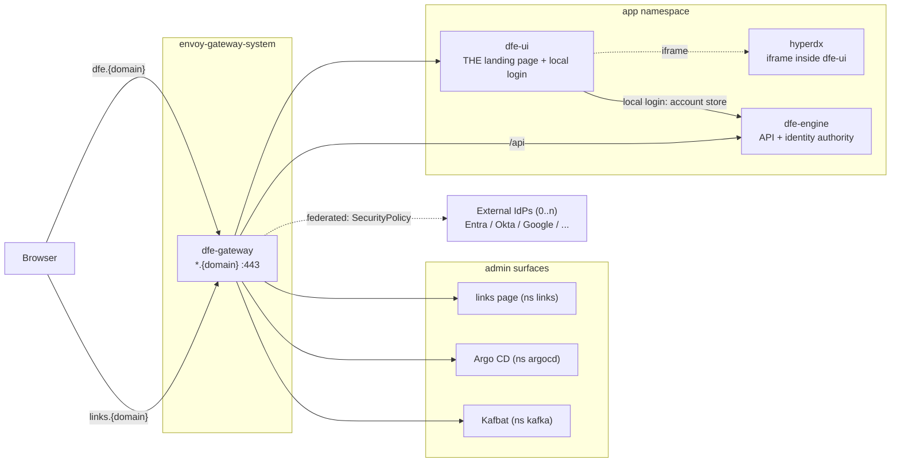

# Edge exposure and authentication

Internet-facing exposure on a cloud deploy (CIDR, rate limit, WAF, DNS):
[EDGE-AUTH-cloud.md](EDGE-AUTH-cloud.md).

How a DFE deployment's web surfaces get outside the cluster, and who is
allowed through. The model: every web UI with a login of its own is exposed
through the Envoy Gateway by default, one without renders only behind edge
OIDC, and access is controlled by OIDC. There is **no
bundled issuer** -- dfe-engine is the identity authority. It holds the
local account store and maps every identity to roles and org_ids, and
federated login rides **external OIDC providers configured at the Envoy
edge** (generic OIDC -- Entra, Okta, Google, Keycloak, or any conformant
IdP, dex included if a deployment runs its own). dfe-engine also mints
machine tokens (API keys + engine JWKS) for services -- a disjoint
audience from human sessions.

Edge OIDC is disabled by default: a vanilla deployment does LOCAL login
through dfe-ui against the engine's account store, so exposed-and-
authenticated is the default posture with no external IdP required. A
deployment that wants federation turns on one or more providers as a Helm
values change (`oidc.providers`); each gets its own Envoy `SecurityPolicy`
on the dfe-engine route.

Local accounts follow the tier: at SME they are the daily driver, at
enterprise they are BREAK-GLASS ONLY (an ops-managed random secret,
deliberately MFA-free -- break-glass exists for when the IdP is down) and
all real users federate. MFA always comes from the federated IdP, never
locally. SAML IdPs are unsupported (mainstream connectors are unmaintained
upstream); their OIDC face is the supported path.

Identity data stays OUT of the git CRUD cycle: accounts live in the
engine's account store (FerretDB or the YAML backend), role bindings in
the engine's runtime store, and git carries only deployment config
(provider issuer URLs, client refs) -- roles remain product vocabulary in
code.

Port-forwarding is the debug fallback, not the product access path: it
works on any deployment (it only needs kubectl), but nothing in the
product assumes it.

## Exposure topology

One Gateway fronts the whole HTTP plane. Each UI gets a hostname under the
deployment's `domain`; the route lives in the backend's namespace so only
the parentRef crosses namespaces (no ReferenceGrant needed). The gateway
LB type/class is swappable per deployment (`envoyGateway.service` values).



- **The plaintext `:80` listener carries exactly one route: a 301 redirect
  to `https`.** Every other `HTTPRoute` in the chart pins
  `parentRefs[].sectionName: https`, so nothing else can attach to `:80` --
  without it, a `:80` request gets a 404 instead of a redirect to TLS. On an
  internet-facing Gateway that lets an admin UI's Host header reach the
  cluster in cleartext with no certificate warning.
- **dfe-ui is always the landing page**, with HyperDX embedded as an iframe
  inside it -- HyperDX is never presented as its own URL.
- The links page is a convenience launch pad for admins (see below), never
  a landing page.

Per-surface OIDC behaviour (Kafbat, dfe-engine's browser vs machine paths,
and the rest) is in [Per-surface policy](#per-surface-policy) below.

## The identity plane: engine authority + external OIDC

dfe-engine is the authority: it holds the local account store, maps
users/groups to roles and org_ids, and mints machine tokens. There are two
browser login paths, and both resolve to the same engine-owned identity:

- **Local** (default): dfe-ui serves its own login form and authenticates
  the user against the engine's account store. This is the SME daily
  driver and the ENT break-glass path. No external IdP is required, which
  is what makes exposed-and-authenticated the DEFAULT posture.
- **Federated** (opt-in): the Envoy edge fronts the dfe-engine route with
  a `SecurityPolicy` per configured external OIDC provider. Envoy is the
  OIDC client; the engine only reads the forwarded claim headers. Adding
  or removing a provider is a Helm values change plus an ArgoCD sync --
  never a dfe-engine API call.

```mermaid
sequenceDiagram
    participant B as Browser
    participant E as Envoy Gateway
    participant X as External IdP (OIDC)
    participant UI as dfe-ui
    participant ENG as dfe-engine
    alt federated (provider configured)
        B->>E: GET https://dfe.{domain}
        E->>B: 302 /authorize (no session)
        B->>X: connector flow (OIDC)
        X->>B: 302 Envoy callback + code
        B->>E: /oauth2/callback?code=...
        E->>X: /token (code exchange, PKCE)
        X->>E: id_token (sub, email, groups)
        E->>E: validate vs provider JWKS,<br/>group policy (deny by default)
        E->>B: content, with X-Oidc-Subject/Groups headers to ENG
    else local (default, no provider)
        B->>UI: login form
        UI->>ENG: verify credentials vs account store
        ENG->>UI: session (dfe_token cookie)
    end
    Note over ENG: maps groups/users -> roles -> org_ids;<br/>local users have no groups,<br/>so per-USER role bindings apply
```

The `groups` claim a federated provider forwards is what the edge policies
match on and what the engine maps to roles and tenancy (`org_viewer` ->
pinned ClickHouse identity) -- one identity contract end to end. Local
users carry no groups, so the engine grants their roles through per-user
bindings instead.

## Route class, and the switches that reach it

Every route carries its class as data (`routes.<name>.class`), which
decides what switch can turn it off.

| Class | Routes | What can disable it |
|---|---|---|
| `product` | dfe-ui, dfe-engine | its own `enabled` -- nothing else |
| `infra` | Argo CD, HyperDX, Forgejo, Kafbat, links, Cruise Control | `exposure.infraUisExternal: false` first, then no login in front of it, then its backend not deployed, then its own `enabled` |
| `ingest` | otel, receiver | its own `enabled`; no UI switch reaches it |

Every web UI with a login renders by default, through a five-step cascade, first match wins:

1. Class `infra` plus `exposure.infraUisExternal: false` means not rendered.
2. Class `infra` with `ownLogin: false` (links, Cruise Control) means not rendered unless the edge policy is in front of it: `oidc.enabled`, an `oidc.providers` entry and `edgePolicy: true`.
3. A backend another chart has not deployed means not rendered: Cruise Control off the Kafka cluster tier, Forgejo unless `deployRepo.bundled` (the `dfe.hyperi.io/bundled-deploy-repo` cluster label).
4. `routes.<name>.enabled: false` means not rendered.
5. Otherwise rendered.

A public flag on a route with no login of its own (`ui.public.links: true`) and no edge OIDC fails the render by name rather than serving the route behind a CIDR-only policy. Under Argo CD that leaves the gateway Application in ComparisonError until the flag is removed or a provider is configured.

**`exposure.infraUisExternal` is the one flip that takes every ops surface
off the edge**, and it is ABSOLUTE for the class: a route's own
`enabled: true` does not beat it, so a lock-down cannot be picked apart one
route at a time, withdrawing their edge policies too. It never touches
dfe-ui or the engine API.

On a cloud deploy with an internet-facing Gateway Service, this defaults
off instead -- see [EDGE-AUTH-cloud.md](EDGE-AUTH-cloud.md).

The `exposure:` key is shared with the dfe-receiver chart, which reads
`exposure.mode` for its ingest door -- one block per deployment, each chart
reading the keys it owns.

## Per-surface policy

| Surface | Hostname | Class | Exposed by default | Edge policy |
|---|---|---|---|---|
| dfe-ui (+ HyperDX iframe) | `dfe.{domain}` | product | yes | local login by default; OIDC when a provider is configured |
| dfe-engine browser paths | `dfe.{domain}/api` interactive | product | yes | OIDC when configured; machine paths API-key/JWT, never redirected |
| Argo CD | `argocd.{domain}` | infra | yes | edge OIDC + group check; Argo signs in through the same provider, `dfe-admins` and `dfe-infra` -> admin, `dfe-infra-viewers` -> read-only ([gateway-oidc.md](deployment/gateway-oidc.md#argo-cds-own-login)) |
| Links page | `links.{domain}` | infra | only behind edge OIDC | edge OIDC + group check; no auth of its own |
| Cruise Control UI | `cruise-control.{domain}` | infra | only behind edge OIDC, Kafka cluster tier | edge OIDC + group check; no auth of its own |
| Forgejo (bundled fallback) | `git.{domain}` | infra | only where bundled | edge OIDC + group check |
| Kafbat | `kafbat.{domain}` | infra | yes | its own OIDC (integrated-app pattern) -- group check is app-side |
| HyperDX | `hyperdx.{domain}` | infra | yes | its own PEP on the `dfe_token` cookie -- group check is app-side |
| otel OTLP ingest | `otel.{domain}` | ingest | no (`otel.ingress.enabled`) | bearer token, checked by the collector |
| dfe-receiver ingest | `receiver.{domain}` | ingest | no | the receiver's own `server.auth` |

The gate on an infra route is a deny-by-default Envoy `SecurityPolicy`
carrying three blocks that only work together: `oidc` logs the user in and
mints a per-route access-token cookie, `jwt` re-validates that cookie
against the provider's JWKS, and `authorization` requires the `groups`
claim to carry one of `adminGroups` (`argocd/values/common.yaml`; names from dfe-engine
`docs/control-plane/rbac-vocabulary.md`; default `dfe-admins`,
`dfe-infra`). Authentication alone is not enough, and a token with no
groups claim is refused rather than admitted. Per-route cookie names stop a
session minted on one infra host being replayed on another.

Kafbat and HyperDX are exempt from the EDGE gate and check groups app-side
instead -- Kafbat runs its own OIDC against the same provider, and HyperDX
cannot complete an interactive redirect inside the dfe-ui iframe. Both stay
class `infra`, so the kill switch still covers them.

Gating Forgejo also closes git-over-HTTP from OUTSIDE the cluster. Nothing
in the product needs that: Argo CD and dfe-engine reach the deploy repo on
its in-cluster Service DNS.

Public hostnames on a cloud deploy, the render guard, CIDR, rate limit, WAF
and DNS specifics: [EDGE-AUTH-cloud.md](EDGE-AUTH-cloud.md).

## The ingest edge

Data ingest is a second door with its own model and by default skips the
Gateway entirely -- `dfe-receiver` renders its own LoadBalancers. A default
deploy is internet-facing on the ingest ports with an EMPTY source-range
allow-list and the receiver's own auth off. See
[INGEST-EDGE.md](INGEST-EDGE.md).

## The links page

A bundled static launch pad answering "where is everything?" for admins:
every surface the deployment exposes, with reachability dots. It renders
from the same GitOps values that deploy the services, so the sync that
moves a URL re-renders the page. Admins-only at the edge; on an undomained
rig it falls back to the port-forward layout.

## Admin links

The gateway publishes the admin UIs it renders as ConfigMap `dfe-admin-links` (key `admin_links.json`) in the app namespace, and the engine reads it as `DFE_ADMIN_LINKS`. The list comes from the same exposure cascade as the routes, so an infra route that does not render is not listed, and each entry carries the route's own hostname and its backend Service as the probe. Every infra route that renders must carry `adminLink` with a `name` and a one-line `purpose`, and one without fails the render by name. The engine reads the variable only at startup, so a list created after the engine started lands on its next restart.

## Status

The gateway install path is settled (`argocd/bootstrap/envoy-gateway-app.yaml`
installs the operator and CRDs; `envoy-gateway-config` configures it), and
the edge policy machinery is built and schema-validated.
