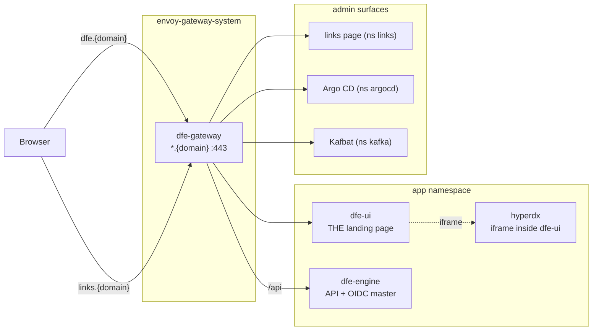
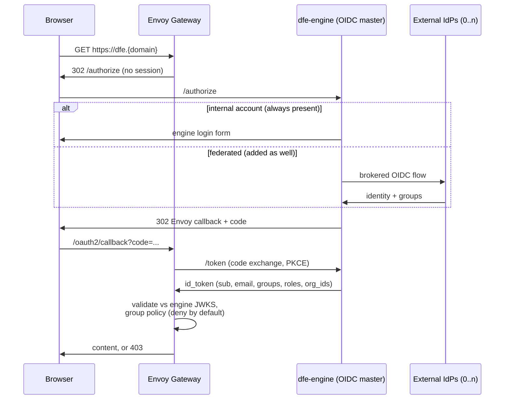

# Edge exposure and authentication

How a DFE deployment's web surfaces get outside the cluster, and who is
allowed through. The model: every web UI is exposed through the Envoy
Gateway by default, and every exposed UI is controlled by OIDC with
**dfe-engine as the deployment's OIDC master**. The engine's internal
users and groups are ALWAYS present -- the permanent base -- and any number
of external OIDC providers (dex, Entra, Google, Okta) can be added AS WELL,
additive alongside internal login, never a replacement. The login surface
offers them concurrently: local credentials plus one "sign in with X" per
configured external.

Port-forwarding is the debug fallback, not the product access path: it
still works on any deployment (it only needs kubectl), but nothing in the
product assumes it.

## Exposure topology

One Gateway fronts the whole HTTP plane. Each UI gets a hostname under the
deployment's `domain`; the route lives in the backend's namespace so only
the parentRef crosses namespaces (no ReferenceGrant needed). The gateway
LB type/class is swappable per deployment (`gateway.service` values).

- **dfe-ui is always the landing page**, with HyperDX embedded as an iframe
  inside it -- HyperDX is never presented as its own URL.
- The links page is a convenience launch pad for admins (see below), never
  a landing page.
- Kafbat does its own OIDC against the same identity plane (the
  integrated-app pattern) -- it is routed, not edge-policied.
- dfe-engine's browser paths sit behind the edge OIDC policy; its `/api`
  machine paths authenticate by API key/JWT and are never redirected to a
  login.

## The identity plane: dfe-engine as OIDC master

The gateway is ONE OIDC client with ONE issuer -- the engine. Internal
accounts come from the engine's own store and work from first boot, which
is what makes exposed-and-authenticated the DEFAULT posture: a vanilla
deployment needs no external IdP to be secure. Configured externals are
brokered by the engine; the edge never learns about them.

The claims the engine mints (`groups`, `roles`, `org_ids`) are the same
ones the edge policies match on and the same ones the tenancy layer pins
ClickHouse identities from -- one identity contract end to end.

## Per-surface policy

| Surface | Hostname | Exposed by default | Edge policy |
|---|---|---|---|
| dfe-ui (+ HyperDX iframe) | `dfe.{domain}` | yes | OIDC, any authenticated user |
| dfe-engine browser paths | `dfe.{domain}/api` interactive | yes | OIDC; machine paths API-key/JWT, never redirected |
| Argo CD | `argocd.{domain}` | yes | OIDC + Argo's own RBAC from the same groups |
| Links page | `links.{domain}` | yes | OIDC + `oidc.adminGroups` only (deny by default) |
| Kafbat | `kafbat.{domain}` | deployment's call | its own OIDC (integrated-app pattern) |
| Forgejo (bundled fallback) | `forgejo.{domain}` | no | expose deliberately |

The admin gate is a deny-by-default Envoy `SecurityPolicy`: the `groups`
claim must carry one of `oidc.adminGroups` (canonical names from
dfe-engine `docs/control-plane/rbac-vocabulary.md`; default `dfe-admins`,
`dfe-infra`). A token with no groups claim is refused, not admitted.

## The links page

A bundled static launch pad answering "where is everything?" for admins:
every surface the deployment exposes, with reachability dots. It renders
from the same GitOps values that deploy the services, so the sync that
moves a URL re-renders the page. Admins-only at the edge; on a rig with no
domain it falls back to the port-forward layout for debug access.

## Status

The gateway install path is settled (`argocd/bootstrap/envoy-gateway-app.yaml`
installs the operator + CRDs; `envoy-gateway-config` configures it) and the
edge policy machinery is built and schema-validated. The engine's OP surface
-- discovery, authorize, token, client registry -- and the management plane
above it (role bindings to users or groups of any provider, internal account
basics, external provider CRUD) are engine-side work. Edge OIDC ships
disabled and turns on per deployment once the engine issuer is configured;
on an undomained rig, UI access is by port-forward.
