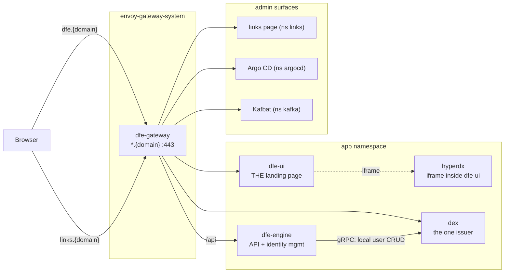

# Edge exposure and authentication

How a DFE deployment's web surfaces get outside the cluster, and who is
allowed through. The model: every web UI is exposed through the Envoy
Gateway by default, and every exposed UI is controlled by OIDC with a
**bundled dex as the deployment's one issuer**. Dex brokers every external
identity provider (generic OIDC -- Entra, Okta, Google, Keycloak -- and
LDAP/AD) as concurrent "sign in with X" choices beside its local login.
dfe-engine remains the identity MANAGEMENT plane: its users/groups CRUD
drives dex's local accounts (gRPC API), it maps identities to roles, and it
keeps minting machine tokens (API keys + engine JWKS) for services -- a
disjoint audience from dex's human sessions.

Local accounts follow the tier: at SME they are the daily driver, at
enterprise they are BREAK-GLASS ONLY (an ops-managed random secret,
deliberately MFA-free -- break-glass exists for when the IdP is down) and
all real users federate. MFA always comes from the federated IdP, never
locally. SAML IdPs are unsupported (dex's SAML connector is unmaintained
upstream); their OIDC face is the supported path.

dfe-engine and dfe-ui slave to exactly ONE issuer. A hardcore deployment
swaps the bundled dex for its corporate IdP directly -- dex not deployed,
no local accounts at all (its accepted trade: IdP down means no browser
login; machine tokens still work). Identity data stays OUT of the git
CRUD cycle: accounts live in dex's store, role bindings in the engine's
runtime store, and git carries only deployment config (issuer URL, client
refs) -- roles remain product vocabulary in code.

Port-forwarding is the debug fallback, not the product access path: it
still works on any deployment (it only needs kubectl), but nothing in the
product assumes it.

## Exposure topology

One Gateway fronts the whole HTTP plane. Each UI gets a hostname under the
deployment's `domain`; the route lives in the backend's namespace so only
the parentRef crosses namespaces (no ReferenceGrant needed). The gateway
LB type/class is swappable per deployment (`gateway.service` values).



- **dfe-ui is always the landing page**, with HyperDX embedded as an iframe
  inside it -- HyperDX is never presented as its own URL.
- The links page is a convenience launch pad for admins (see below), never
  a landing page.
- Kafbat does its own OIDC against the same issuer (the integrated-app
  pattern) -- it is routed, not edge-policied.
- dfe-engine's browser paths sit behind the edge OIDC policy; its `/api`
  machine paths authenticate by API key/JWT and are never redirected to a
  login.

## The identity plane: dex as the one issuer

The gateway is ONE OIDC client with ONE issuer -- dex. Dex's local
password store works from first boot, which is what makes
exposed-and-authenticated the DEFAULT posture: a vanilla deployment needs
no external IdP to be secure. Configured externals are dex connectors; the
edge never learns about them.

```mermaid
sequenceDiagram
    participant B as Browser
    participant E as Envoy Gateway
    participant D as dex (the issuer)
    participant X as External IdPs (0..n)
    participant ENG as dfe-engine
    B->>E: GET https://dfe.{domain}
    E->>B: 302 /authorize (no session)
    B->>D: /authorize
    alt local account (SME daily / ENT break-glass)
        D->>B: dex login form
    else federated (the ENT norm)
        D->>X: connector flow (OIDC / LDAP)
        X->>D: identity + groups
    end
    D->>B: 302 Envoy callback + code
    B->>E: /oauth2/callback?code=...
    E->>D: /token (code exchange, PKCE)
    D->>E: id_token (sub, email, groups)
    E->>E: validate vs dex JWKS,<br/>group policy (deny by default)
    E->>B: content, or 403
    Note over ENG: maps groups -> roles -> org_ids;<br/>dex local users have no groups,<br/>so per-USER role bindings apply
```

The `groups` claim dex forwards is what the edge policies match on and
what the engine maps to roles and tenancy (`org_viewer` -> pinned
ClickHouse identity) -- one identity contract end to end. Dex local users
carry no groups, so the engine grants their roles through per-user
bindings instead.

## Per-surface policy

| Surface | Hostname | Exposed by default | Edge policy |
|---|---|---|---|
| dfe-ui (+ HyperDX iframe) | `dfe.{domain}` | yes | OIDC, any authenticated user |
| dfe-engine browser paths | `dfe.{domain}/api` interactive | yes | OIDC; machine paths API-key/JWT, never redirected |
| dex | `dfe.{domain}` auth paths | yes | the issuer itself -- reachable, its own CSRF/session handling |
| Argo CD | `argocd.{domain}` | yes | OIDC + Argo's own RBAC from the same groups |
| Links page | `links.{domain}` | yes | OIDC + `oidc.adminGroups` only (deny by default) |
| Kafbat | `kafbat.{domain}` | deployment's call | its own OIDC (integrated-app pattern) |
| Forgejo (bundled fallback) | `forgejo.{domain}` | no | expose deliberately |

The admin gate is a deny-by-default Envoy `SecurityPolicy`: the `groups`
claim must carry one of `oidc.adminGroups` (canonical names from
dfe-engine `docs/control-plane/rbac-vocabulary.md`; default `dfe-admins`,
`dfe-infra`). A token with no groups claim is refused, not admitted.

## The links page

A bundled static launch pad answering "where is everything?" for admins:
every surface the deployment exposes, with reachability dots. It renders
from the same GitOps values that deploy the services, so the sync that
moves a URL re-renders the page. Admins-only at the edge; on a rig with no
domain it falls back to the port-forward layout for debug access.

## Status

The gateway install path is settled (`argocd/bootstrap/envoy-gateway-app.yaml`
installs the operator + CRDs; `envoy-gateway-config` configures it) and the
edge policy machinery is built and schema-validated. Remaining build: the
bundled dex chart (+ its dfe-docker compose service), the engine-to-dex
gRPC management path, per-user role bindings, and the edge flip to dex as
the one issuer. Edge OIDC ships disabled and turns on per deployment once
the issuer is configured; on an undomained rig, UI access is by
port-forward.
