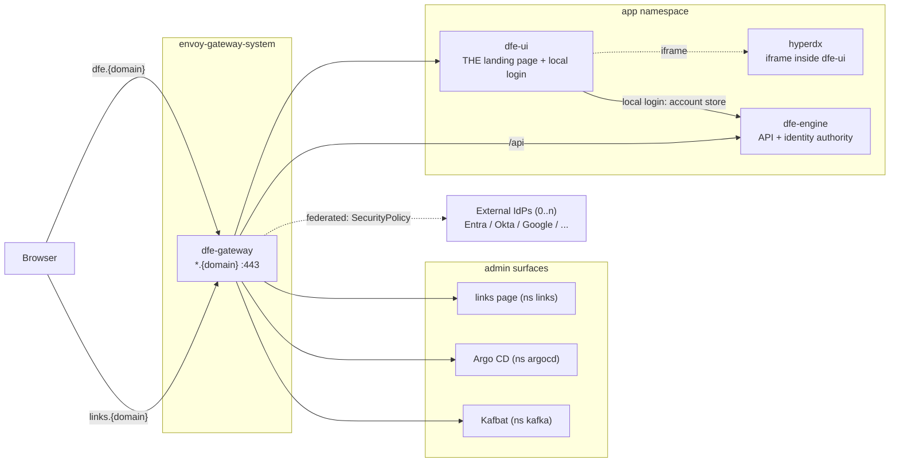

# Edge exposure and authentication

How a DFE deployment's web surfaces get outside the cluster, and who is
allowed through. The model: every web UI is exposed through the Envoy
Gateway by default, and access is controlled by OIDC. There is **no
bundled issuer** -- dfe-engine is the identity authority. It holds the
local account store and maps every identity to roles and org_ids, and
federated login rides **external OIDC providers configured at the Envoy
edge** (generic OIDC -- Entra, Okta, Google, Keycloak, or any conformant
IdP, dex included if a deployment runs its own). dfe-engine also keeps
minting machine tokens (API keys + engine JWKS) for services -- a disjoint
audience from human sessions.

Edge OIDC is disabled by default: a vanilla deployment does LOCAL login
through dfe-ui against the engine's account store, so exposed-and-
authenticated is the default posture with no external IdP required. A
deployment that wants federation turns on one or more providers as a Helm
values change (`oidc.providers`); each gets its own Envoy `SecurityPolicy`
on the dfe-engine route.

Local accounts follow the tier: at SME they are the daily driver, at
enterprise they are BREAK-GLASS ONLY (an ops-managed random secret,
deliberately MFA-free -- break-glass exists for when the IdP is down) and
all real users federate. MFA always comes from the federated IdP, never
locally. SAML IdPs are unsupported (the mainstream connectors are
unmaintained upstream); their OIDC face is the supported path.

Identity data stays OUT of the git CRUD cycle: accounts live in the
engine's account store (FerretDB or the YAML backend), role bindings in
the engine's runtime store, and git carries only deployment config
(provider issuer URLs, client refs) -- roles remain product vocabulary in
code.

Port-forwarding is the debug fallback, not the product access path: it
still works on any deployment (it only needs kubectl), but nothing in the
product assumes it.

## Exposure topology

One Gateway fronts the whole HTTP plane. Each UI gets a hostname under the
deployment's `domain`; the route lives in the backend's namespace so only
the parentRef crosses namespaces (no ReferenceGrant needed). The gateway
LB type/class is swappable per deployment (`gateway.service` values).



- **dfe-ui is always the landing page**, with HyperDX embedded as an iframe
  inside it -- HyperDX is never presented as its own URL.
- The links page is a convenience launch pad for admins (see below), never
  a landing page.
- Kafbat does its own OIDC against the same provider (the integrated-app
  pattern) -- it is routed, not edge-policied.
- dfe-engine's browser paths sit behind the edge OIDC policy when a
  provider is configured; its `/api` machine paths authenticate by API
  key/JWT and are never redirected to a login.

## The identity plane: engine authority + external OIDC

dfe-engine is the authority: it holds the local account store, maps
users/groups to roles and org_ids, and mints machine tokens. There are two
browser login paths, and both resolve to the same engine-owned identity:

- **Local** (default): dfe-ui serves its own login form and authenticates
  the user against the engine's account store. This is the SME daily
  driver and the ENT break-glass path. No external IdP is required, which
  is what makes exposed-and-authenticated the DEFAULT posture.
- **Federated** (opt-in): the Envoy edge fronts the dfe-engine route with
  a `SecurityPolicy` per configured external OIDC provider. Envoy is the
  OIDC client; the engine only reads the forwarded claim headers. Adding
  or removing a provider is a Helm values change plus an ArgoCD sync --
  never a dfe-engine API call. dfe-infra owns this config; dfe-engine
  reads headers.

```mermaid
sequenceDiagram
    participant B as Browser
    participant E as Envoy Gateway
    participant X as External IdP (OIDC)
    participant UI as dfe-ui
    participant ENG as dfe-engine
    alt federated (provider configured)
        B->>E: GET https://dfe.{domain}
        E->>B: 302 /authorize (no session)
        B->>X: connector flow (OIDC)
        X->>B: 302 Envoy callback + code
        B->>E: /oauth2/callback?code=...
        E->>X: /token (code exchange, PKCE)
        X->>E: id_token (sub, email, groups)
        E->>E: validate vs provider JWKS,<br/>group policy (deny by default)
        E->>B: content, with X-Oidc-Subject/Groups headers to ENG
    else local (default, no provider)
        B->>UI: login form
        UI->>ENG: verify credentials vs account store
        ENG->>UI: session (dfe_token cookie)
    end
    Note over ENG: maps groups/users -> roles -> org_ids;<br/>local users have no groups,<br/>so per-USER role bindings apply
```

The `groups` claim a federated provider forwards is what the edge policies
match on and what the engine maps to roles and tenancy (`org_viewer` ->
pinned ClickHouse identity) -- one identity contract end to end. Local
users carry no groups, so the engine grants their roles through per-user
bindings instead.

## Per-surface policy

| Surface | Hostname | Exposed by default | Edge policy |
|---|---|---|---|
| dfe-ui (+ HyperDX iframe) | `dfe.{domain}` | yes | local login by default; OIDC when a provider is configured |
| dfe-engine browser paths | `dfe.{domain}/api` interactive | yes | OIDC when configured; machine paths API-key/JWT, never redirected |
| Argo CD | `argocd.{domain}` | yes | OIDC + Argo's own RBAC from the same groups |
| Links page | `links.{domain}` | yes | OIDC + `oidc.adminGroups` only (deny by default) |
| Kafbat | `kafbat.{domain}` | deployment's call | its own OIDC (integrated-app pattern) |
| Forgejo (bundled fallback) | `forgejo.{domain}` | no | expose deliberately |

The admin gate is a deny-by-default Envoy `SecurityPolicy`: the `groups`
claim must carry one of `oidc.adminGroups` (canonical names from
dfe-engine `docs/control-plane/rbac-vocabulary.md`; default `dfe-admins`,
`dfe-infra`). A token with no groups claim is refused, not admitted.

## The links page

A bundled static launch pad answering "where is everything?" for admins:
every surface the deployment exposes, with reachability dots. It renders
from the same GitOps values that deploy the services, so the sync that
moves a URL re-renders the page. Admins-only at the edge; on a rig with no
domain it falls back to the port-forward layout for debug access.

## Status

The gateway install path is settled (`argocd/bootstrap/envoy-gateway-app.yaml`
installs the operator + CRDs; `envoy-gateway-config` configures it) and the
edge policy machinery is built and schema-validated. The engine account
store (local login + the group/user -> role -> org_id mapping) is the
identity authority, and the generic external-OIDC edge (`oidc.providers`,
per-provider `SecurityPolicy`, `jwtAuthn` claim forwarding) ships disabled
and turns on per deployment once a provider is configured. On an undomained
rig, UI access is by port-forward with local login.
