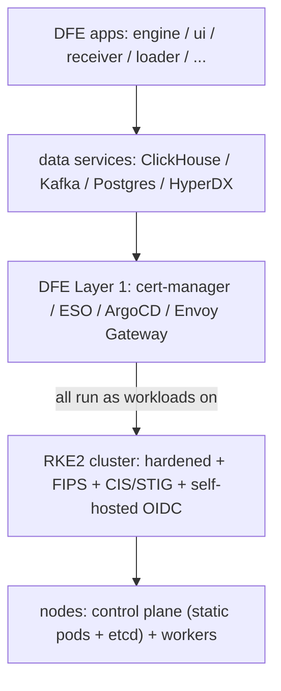
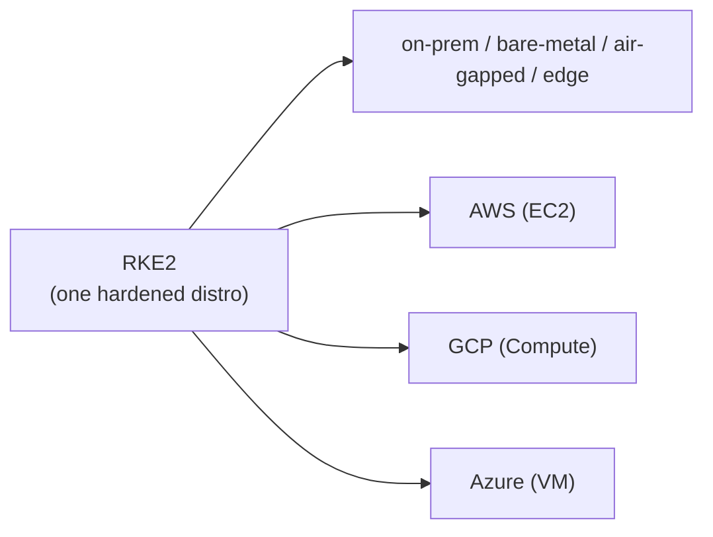

<!--
Project:   dfe-infra
File:      docs/RKE2.md
Purpose:   A primer on RKE2 - what it is, how it works with DFE, and why DFE
           uses and heavily standardises on it (incl. the federal compliance posture).
Language:  Markdown
License:   FSL-1.1-ALv2
Copyright: (c) 2026 HYPERI PTY LIMITED
-->

# RKE2 - a primer (the DFE Kubernetes distribution)

**Bottom line:** DFE runs on **RKE2** on every target - on-prem, air-gapped, and all
clouds. It is the hardened, US-Federal-grade Kubernetes distribution DFE deploys onto;
standardising on it gives us one consistent, compliant base everywhere, and the whole
DFE suite inherits its FIPS/STIG/CIS posture for free.

Managed Kubernetes (EKS/AKS/GKE) is a *supported additive* target for customers who
mandate it, not the default.

## What is RKE2

RKE2 (Rancher Kubernetes Engine 2, originally "**RKE Government**") is SUSE/Rancher's
security-focused, fully CNCF-conformant Kubernetes distribution. It keeps K3s's easy
single-binary install but rebuilds the internals for enterprise security and strict
upstream conformance:

- one `rke2` binary - `rke2-server` (control plane) or `rke2-agent` (worker)
- **containerd** (not Docker), **embedded etcd** (not SQLite)
- **hardened from first boot** - CIS defaults, audit logging on, anonymous auth off,
  one-flag secrets-at-rest encryption
- **FIPS-validated crypto** (Go + BoringCrypto)

It is not K3s (which runs the whole control plane in one process on SQLite, built for the
edge). RKE2 is the data-centre / regulated-workload sibling; many shops run both.

## How RKE2 works with DFE

**RKE2 in brief.** Each control-plane component (apiserver, scheduler,
controller-manager, etcd) runs as a **static pod** in `kube-system` - the upstream
`kubeadm` model - so each is visible and debuggable via `kubectl` (unlike K3s's single
process). A server node runs the control plane; agent nodes run the kubelet + CNI and
host the workloads.

**DFE sits on top of it.** DFE assumes a *conformant, running Kubernetes cluster* and
deploys onto it - RKE2 is how a bare machine or cloud VM becomes that cluster (the
"assume a bare cluster" Layer-0 baseline). DFE's own two layers run entirely as
workloads on the RKE2 cluster:

The boundary is clean: **DFE never manages RKE2's control plane** - Rancher/RKE2 own
etcd, upgrades and hardening; DFE assumes a conformant cluster and deploys into it. What
RKE2 provides flows up into DFE:

- the **hardened, FIPS, CIS/STIG** baseline becomes DFE's compliance floor;
- RKE2's **self-hosted OIDC issuer** is what DFE uses for per-pod cloud identity (AWS
  IRSA / GCP WIF / Azure Entra), so DFE's secrets + ESO flow works the same on every cloud.

## Why we use it, and heavily standardise on it

**One distribution everywhere.** DFE is a product suite other organisations deploy, so
the same base has to land identically on-prem, air-gapped and on every cloud.

One distro means one Kubernetes version matrix, one CNI/CSI, one hardening profile, one
identity pattern, one debugging surface and one set of docs - versus three divergent
managed distros (EKS/AKS/GKE differ on CNI, add-ons, auth and upgrade cadence). It runs
on bare-metal, any cloud's VMs and the edge, which is the widest customer reach, and
Rancher handles the fleet lifecycle (etcd snapshots, rolling upgrades). The honest cost:
we own etcd backup/restore, node OS patching, control-plane upgrades and the per-cloud
OIDC webhook - real, but bounded and single-path.

**It ticks the federal / regulated boxes.** This is a large part of the "why" (verify
version specifics with Rancher Government per deployment, as of 2026-07):

- **FIPS 140-2 validated crypto** (Go + BoringCrypto, CMVP certificate 4691) - the first
  NIST-FIPS-140-2-validated Kubernetes distribution. The STIG requires 140-2 **or** 140-3
  modules; confirm 140-3 module status for your build.
- **DISA STIG** - the **only** Kubernetes distribution with an official DISA-published
  STIG (Rancher Government Solutions RKE2 STIG, **V2R3**), derived from NIST SP 800-53 -
  what lets the DoD run it on network systems.
- **CIS Kubernetes Benchmark** - hardened by default (`cis` profile, `kube-bench`-scannable).
- **FedRAMP (cloud) / DISA STIG (on-prem)** - both need FIPS crypto, audit logging, strict
  access control and (often) air-gap; RKE2 meets them when configured correctly.
- **Iron Bank** (USAF hardened registry) + **SELinux enforcing**.

DFE deploys RKE2 with the hardened profile on, so a regulated or federal customer gets a
base that already clears FIPS/STIG/CIS - identically on-prem or in any cloud. A few STIG
controls (MFA / CAC-PIV, SIEM audit forwarding, air-gapped registry) need infrastructure
beyond the distro; DFE's auth layer (OIDC + the AuthZEN/CEL PDP) and the deploy
environment supply those.

## See also

- Multi-cloud + E2E plan: `docs/superpowers/plans/2026-07-12-e2e-acceptance-and-multicloud.md`
- Crypto posture: `docs/CNSA-STANDARD.md`
- Official: RKE2 architecture (`docs.rke2.io/architecture`), FIPS support
  (`docs.rke2.io/security/fips_support`), the DISA RKE2 STIG (NIST NCP checklist 1040).
