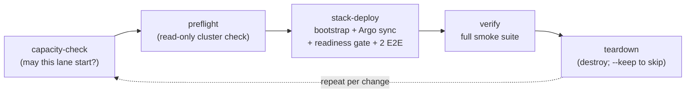

# The validation cycle: create -> test e2e -> destroy

This repeatable loop is the validation SSoT this repo owns -- THE way we prove
a DFE deployment works, on our clusters, on a teammate's clone, and on a
customer's estate. Everything estate-specific rides in a gitignored env file,
so the committed repo runs the same cycle everywhere.

One command runs the whole loop (the mode defaults to `scale`, the tier a
Kubernetes deploy also defaults to; a Compose deploy defaults to `slim`):

    python3 scripts/dfe-ops cycle --mode single \
        --kubeconfig .tmp/target.kubeconfig --env-file bootstrap/.env

The DFE deployment on a dev/test cluster is ephemeral by design: create it,
test it, destroy it, redeploy it in another mode, without asking anyone. The one
exception is a resident reference deployment (ghostburner), which is pinned to a
version and updated only explicitly after an extended stable-release period.

Each stage self-executes as its own `dfe-ops` subcommand (`capacity-check`,
`preflight`, `stack-deploy`, `verify`, `teardown`), so the cycle and the hand-run commands
can never drift -- and the cycle exports `--kubeconfig` as `KUBECONFIG` to
every stage, so all four aim at the SAME cluster (running `verify`/`teardown`
by hand uses your current context; check it first). A failed deploy still
destroys -- a broken cycle must not strand a half-stack. `--keep` skips the
destroy for interactive debugging on a dev cluster only.

## Upgrading a persistent deploy instead of cycling it

A reference deploy we keep running is not cycled -- destroying it is the whole
thing we do not want. Argo already tracks a git ref there, so a `git push` to
that ref IS the upgrade, and `refresh` is the other half: it hard-refreshes
every Application so the pushed commit lands now rather than at the next poll,
waits for every Application on a tracked repo to report Synced and Healthy with
no operation still running, then re-proves the deploy with the readiness gate
and the same smoke suite `verify` runs. Without that wait the gate exits on its
first clean poll, which is the old revision's pods.

    python3 scripts/dfe-ops refresh --mode slim \
        --kubeconfig .tmp/target.kubeconfig --env-file bootstrap/.env

It deploys nothing itself and tears nothing down. `--readiness-timeout` bounds
the sync wait and the gate separately. `--skip-verify` stops after the gate,
which proves the deploy is Ready but not that it works.

The smoke stage runs every check inside the app namespace, so `refresh` refuses
to start when neither `--env-file` (`DFE_NAMESPACE`) nor `--namespace` names one
-- without it every namespaced suite fails on `namespaces "dfe" not found`.
`--skip-verify` runs the gate alone and needs no namespace.

## What the readiness gate refuses

Beyond pod readiness and replica counts, the gate asks the engine's
`/api/v1/auth/setup-status` whether the deployment is running the shipped admin
password, and FAILS the deploy when it is and `DFE_ENV` names anything but a dev
posture (`dev`, `development`, `local`, `test`, `ci`). Ready is not the same as
safe: the deploy mints `admin` and `breakglass` through ESO Password generators,
so a stack still on the default has not taken them.

An engine too old to serve `default_credentials` answers without the field, and
that warns instead of failing -- the probe reached the engine and only the
contract is missing.

A probe that could not RUN at all is a different verdict and FAILS outside a dev
posture: an RBAC denial on `kubectl exec`, a wrong `READINESS_ENGINE_TARGET`, and
a non-200 from setup-status all leave the gate unable to say whether the shipped
password is in use, and passing on that is how a production deploy on the default
gets declared up. In a dev posture the same thing warns.

`dfe-ops creds` prints where each minted credential is fetched from, reading both
Secret names off the live engine Deployment.

## The env-file contract (how a teammate gets running)

Everything estate-specific -- addresses, domains, storage class, secrets
endpoints -- lives in ONE flat `DFE_*` env file. The committed
[bootstrap/local.env.example](../bootstrap/local.env.example) is the template
(placeholder values only: RFC 2606 domains, RFC 5737 addresses); the filled
copy (`bootstrap/.env`) is gitignored and distributed out-of-band, e.g. as a
Bitwarden secure note.

So the whole onboarding is:

1. `git clone` this repo.
2. Get the deployment's `.env` (Bitwarden) -> save as `bootstrap/.env`.
3. Get a kubeconfig (`python3 scripts/dfe-ops kubeconfig --node <addr> --out
   .tmp/target.kubeconfig`, or from whoever runs the cluster).
4. `python3 scripts/dfe-ops cycle --mode single --kubeconfig
   .tmp/target.kubeconfig --env-file bootstrap/.env`

No step edits a tracked file. If a value belongs in git, it is not
estate-specific; if it is estate-specific, it belongs in `.env` -- never both.

## The cluster contract ("vanilla Rancher") and preflight

The product rule: assume a vanilla Rancher/RKE2 cluster and BRING what the
stack needs. "Vanilla" concretely means the things bootstrap CANNOT create for
itself -- everything else (cert-manager, ESO, Argo CD, MetalLB, local-path
storage) is detect-or-install: an existing operator is adopted, an absent one
is installed.

What the cluster must supply:

| Contract item | Why | Preflight check |
| --- | --- | --- |
| Reachable API server, k8s >= 1.28 | the deploy target | FAIL if not |
| Admin-ish RBAC (create ns/CRD/clusterrole/deploy/secret) | bootstrap installs operators | FAIL if not |
| >= 1 Ready node (3 for `scale`) with headroom | scheduling | WARN under guidance floors |
| The workload node label, when the overlay selects on one | pods sit Pending forever without it -- looks like a chart fault, is the wrong cluster | FAIL if no Ready node carries it |
| A default StorageClass -- or none at all | PVCs; bootstrap falls back to local-path when absent | WARN/FAIL as applicable |
| A LoadBalancer path on cloud targets | on-prem gets MetalLB from bootstrap | WARN |
| Pull access to the image registry | image supply | WARN (checked from the operator's machine) |

Check any cluster in seconds, read-only, before touching it:

    python3 scripts/dfe-ops preflight --mode scale --env-file bootstrap/.env \
        --require-label dfe.hyperi.io/workload=dfe

Verified against both estate clusters 2026-07-22: the DFE cluster passes
clean; the neighbouring devex cluster fails exactly one check -- the workload
label -- which is precisely the wrong-cluster trap the check exists to catch.

## Targets: on-prem now, cloud by parameter

The cycle is target-neutral by construction: the target is (kubeconfig +
env file), nothing else.

- **On-prem Rancher/RKE2** (the first-class baseline): as above.
- **AWS (and other clouds)**: `tofu apply` the environment first, then
  either `--from-terraform terraform/environments/aws` (reads the outputs) or
  an `.env` exported from them. Cloud deltas live in the env file
  (`DFE_STORAGE_CLASS=gp3`, cloud LB, workload-identity annotations) -- the
  cycle itself is identical. **A cloud test deployment is destroyed the same
  day, no exceptions**: the cycle destroys by default, and when it was
  provisioned via `--from-terraform` the destroy stage also runs the IaC
  destroy (`teardown --with-terraform`), so the control plane and nodes die
  with the test -- not just the DFE workloads on them. `--keep` is for dev
  clusters only.

## What the stages actually run

| Stage | Wraps | Gate |
| --- | --- | --- |
| `capacity-check` | `--lane k8s` reads allocatable minus scheduled requests; `--lane docker` reads the daemon host's available memory | the mode's `lane_floor` in `scripts/profiles.py`; a breach REFUSES, and `--watch` keeps checking while a lane runs so the newer lane aborts instead of the host swapping |
| `preflight` | read-only kubectl against the target | cluster contract above |
| `stack-deploy` | offline pin/drift/render preflight, then `bootstrap/bootstrap.sh` (Layer 0/1 + Argo profile sync at the pinned stack) | bounded readiness + the 2 default E2E tests (receiver->CH data path, self-monitoring OTel) |
| `verify` | `bootstrap/run-all-smoke-tests.sh` | readiness, auth, data, KEDA, integration |
| `acceptance` | `--suite onboarding` drives the setup wizard and the first console session in Chrome (`--console-only` on a deploy already set up); `flows` is the engine repo's live pytest suite over port-forwards; `source` adds a source through the console, drives data through it and removes it (below); a suite that reads a source the deployment must already carry runs through the pytest passthrough | `all` runs onboarding FIRST and stops on it -- a deployment nobody could have onboarded has failed whatever the data path then does. The wizard's screens come from the engine's own `auth/setup-status`, so a screen the deployment no longer asks for is a failure rather than a variation |
| `ui` (opt-in: `--ui-repo`) | rotates the break-glass password, then the dfe-ui Playwright specs tagged `@acceptance` over `--ui-url` or a port-forward | onboarding and the key UI features, on a credential that differs from the build default -- see [ACCEPTANCE-AUTOMATION.md](ACCEPTANCE-AUTOMATION.md) |
| `teardown` | `bootstrap/destroy.sh` (`--with-terraform` also destroys IaC state) | leaves the cluster as preflight found it |
| `refresh` (not a cycle stage) | a hard-refresh annotation on every Argo Application, a bounded wait for those syncs, then `bootstrap/smoke-test-readiness.sh` and the `verify` suite | the tracked ref landed and every tracked Application is Synced + Healthy, then bounded readiness + the full smoke suite (`--skip-verify` stops at the gate) |

## The post-deploy source tests (`acceptance --suite source`)

Not part of the stock POST. The two default E2E tests prove the deploy moved data; these prove an operator can add a source and watch it work, so they run on demand after a deploy, here and on docker through dfe-docker's `make test-source`, which calls the same runner (`scripts/acceptance/source/run.py` with `engine.py` and `fetcher.py`). dfe-ops supplies the port-forwards, the `DFE_E2E_*` env and the archiver exec prefix.

Two cases, chosen with `--source-case`:

- `filebeat` (the default). The console creates the source (Configuration tab: name, display name, description, Archive on, match `_source equals <name>`; Meta Schema tab: the shipped `common-header/timeseries` 1.0.1 and `meta/beats/filebeat` 1.0.0), the `vrl` transform is attached, the source is deployed, and the bundled `pipelines/filebeat/filebeat.vrl` and `timezones.csv` from the dfe-transform-vrl checkout (`--transform-repo`) go into the instance's file sets. The filebeat corpus is posted at the receiver wrapped as `{message, tags, _source}`. Proof: the transform instance reports, the receiver routes, new rows in `<name>` carry `log_file_path` (only the program sets it), a zstd file appears under `<name>_land` in the archiver (`--archive-selector` names the pods, one exec per replica since each archives only its partitions), and the engine lists a HyperDX source for it.
- `cloudwatch`, run as `--aws-service cloudtrail`. The meta schema is authored by hand in the console, the fetcher stanza is set through the API (no fetcher origin in the console yet, dfe-ui #286), and the proof is rows arriving on their own within a poll interval. The deployment supplies `DFE_AWS_REGION` and `DFE_AWS_LOG_GROUP` in an env file and the fetcher credential Secret (`helm/charts/dfe-fetcher` `credentials.secretName`, keys `AWS_ACCESS_KEY_ID` and `AWS_SECRET_ACCESS_KEY`); the runner writes nothing to AWS. The test account's CloudWatch Logs group is empty by construction, so CloudTrail is the service that proves anything.

Every step lands a screenshot under `--shots-dir`, and the run ends by removing the source it made (`--keep` leaves it). A step the console cannot do yet goes through the API and is recorded as `api-fallback`, so the report says which half of the product was driven.
