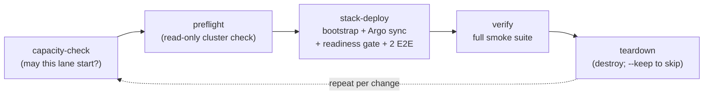

# The validation cycle: create -> test e2e -> destroy

This repeatable loop is the validation SSoT this repo owns -- THE way to prove
a DFE deployment works: on a development cluster, on a teammate's clone, on a
production estate. Everything estate-specific rides in a gitignored env file,
so the committed repo runs the same cycle everywhere.

One command runs the whole loop (mode defaults: `scale` on Kubernetes, `slim`
on Compose):

    python3 scripts/dfe-ops cycle --mode single \
        --kubeconfig .tmp/target.kubeconfig --env-file bootstrap/.env

A dev/test deployment is ephemeral by design: create it, test it, destroy it,
redeploy it in another mode, without asking anyone. The one exception is a
resident reference deployment, pinned to a version and updated
only explicitly after an extended stable-release period.

Each stage self-executes as its own `dfe-ops` subcommand, so the cycle and the
hand-run commands cannot drift, and the cycle exports `--kubeconfig` as
`KUBECONFIG` to every stage so all four aim at the SAME cluster (by hand they
use your current context; check it first). A failed deploy still destroys -- a
broken cycle must not strand a half-stack. `--keep` skips the destroy, on a dev
cluster only.

## Batching a full cloud cycle

A full cloud cycle runs once per BATCH of changes to the managed-Kafka path,
never once per finding -- a cycle proves a batch. Stage every proof job before
`tofu apply`, so no cluster time is spent authoring one. The managed cluster is
the long pole: it comes up first and goes down first, and its proofs run the
moment it reports ACTIVE. Proofs needing only the Kubernetes side run during its
waits. A broker-count change runs one direction only. Teardown starts the moment
the last proof lands.

## Upgrading a persistent deploy instead of cycling it

A reference deploy is not cycled: destroying it is the whole thing we do not
want. Argo tracks a git ref there, so a `git push` to that ref IS the upgrade,
and `refresh` is the other half. It hard-refreshes every Application so the
pushed commit lands now rather than at the next poll, waits for every tracked
Application to report Synced and Healthy with no operation still running, then
re-proves the deploy with the readiness gate and the `verify` smoke suite.
Without that wait the gate exits on its first clean poll, which is the old
revision's pods.

    python3 scripts/dfe-ops refresh --mode slim \
        --kubeconfig .tmp/target.kubeconfig --env-file bootstrap/.env

It deploys nothing and tears nothing down. `--readiness-timeout` bounds the sync
wait and the gate separately. `--skip-verify` stops after the gate, which proves
the deploy is Ready but not that it works -- and is the one path needing no
namespace: the smoke stage runs inside the app namespace, so `refresh` otherwise
refuses to start when neither `--env-file` (`DFE_NAMESPACE`) nor `--namespace`
names one, and every namespaced suite would fail on `namespaces "dfe" not found`.

## What the readiness gate refuses

Beyond pod readiness and replica counts, the gate asks the engine's
`/api/v1/auth/setup-status` whether the deployment is running the shipped admin
password, and FAILS when it is and `DFE_ENV` is not a dev posture (`dev`,
`development`, `local`, `test`, `ci`). Ready is not the same as safe: the deploy
mints `admin` and `breakglass` through ESO Password generators, so a stack still
on the default has not taken them.

An engine too old to serve `default_credentials` answers without the field, and
that only warns: the probe reached the engine and only the contract is missing.
A probe that could not RUN at all -- an RBAC denial on `kubectl exec`, a wrong
`READINESS_ENGINE_TARGET`, a non-200 from setup-status -- leaves the gate unable
to say whether the shipped password is in use, so it FAILS outside a dev posture
and warns inside one.

`dfe-ops creds` prints where each minted credential is fetched from, reading both
Secret names off the live engine Deployment.

## The env-file contract (how a teammate gets running)

Everything estate-specific -- addresses, domains, storage class, secrets
endpoints -- lives in ONE flat `DFE_*` env file. The committed
[bootstrap/local.env.example](../bootstrap/local.env.example) is the template
(placeholder values only: RFC 2606 domains, RFC 5737 addresses); the filled copy
(`bootstrap/.env`) is gitignored and distributed out-of-band, e.g. as a
Bitwarden secure note.

The whole onboarding:

1. `git clone` this repo.
2. Get the deployment's `.env` out-of-band -> save as `bootstrap/.env`.
3. Get a kubeconfig (`python3 scripts/dfe-ops kubeconfig --node <addr>
   --vault-path <kv path of the node SSH key> --out .tmp/target.kubeconfig`, or
   from whoever runs the cluster).
4. `python3 scripts/dfe-ops cycle --mode single --kubeconfig
   .tmp/target.kubeconfig --env-file bootstrap/.env`

No step edits a tracked file. If a value belongs in git, it is not
estate-specific; if it is estate-specific, it belongs in `.env` -- never both.
Two settings live there and nowhere else: `DFE_SKIP_PLATFORM_CHECK=true`
installs onto a cluster outside `platform.kubernetes`, warning as it goes; and
`DFE_LOCAL_PATH_DIR` puts the local-path-provisioner's volumes somewhere other
than upstream's `/opt/local-path-provisioner`, for nodes that keep their data
off the root filesystem. Unset is upstream's behaviour; an adopted StorageClass
ignores it.

## The cluster contract ("vanilla Rancher") and preflight

The product rule: assume a vanilla Rancher/RKE2 cluster and BRING what the
stack needs. "Vanilla" means the things bootstrap CANNOT create for itself --
everything else (cert-manager, ESO, Argo CD, MetalLB, local-path storage) is
detect-or-install: an existing operator is adopted, an absent one installed.

What the cluster must supply:

| Contract item | Why | Preflight check |
| --- | --- | --- |
| Reachable API server inside the stack's `platform.kubernetes` (versions.yaml) | the deploy target, and the support window | FAIL below the floor, as `bootstrap/check_platform.py` does at bootstrap |
| Admin-ish RBAC (create ns/CRD/clusterrole/deploy/secret) | bootstrap installs operators | FAIL if not |
| >= 1 Ready node (3 for `scale`) with headroom | scheduling | WARN under guidance floors |
| The workload node label, when the overlay selects on one | pods sit Pending forever without it -- looks like a chart fault, is the wrong cluster | FAIL if no Ready node carries it |
| A default StorageClass -- or none at all | PVCs; bootstrap falls back to local-path when absent | WARN/FAIL as applicable |
| A LoadBalancer path on cloud targets | on-prem gets MetalLB from bootstrap, pooled on `DFE_GATEWAY_IP`/`DFE_RECEIVER_IP` | WARN |
| Pull access to the image registry | image supply | WARN (from the operator's machine) |

Check any cluster read-only before touching it:

    python3 scripts/dfe-ops preflight --mode scale --env-file bootstrap/.env \
        --require-label dfe.hyperi.io/workload=dfe

On a shared cluster whose nodes lack the workload label, preflight fails that
check -- the wrong-cluster trap it exists to catch.

## Targets: on-prem now, cloud by parameter

The cycle is target-neutral: the target is (kubeconfig + env file), nothing else.

- **On-prem Rancher/RKE2** (the first-class baseline): as above.
- **AWS (and other clouds)**: `tofu apply` the environment first, then either
  `--from-terraform terraform/environments/aws` (reads the outputs) or an `.env`
  exported from them. Cloud deltas live in the env file (`DFE_STORAGE_CLASS=gp3`,
  cloud LB, workload-identity annotations) -- the cycle itself is identical. **A
  cloud test deployment is destroyed the same day, no exceptions**: the cycle
  destroys by default, and when it was provisioned via `--from-terraform` the
  destroy stage also runs the IaC destroy (`teardown --with-terraform`), so the
  control plane and nodes die with the test, not just the DFE workloads on them.
- **Local kind** (a throwaway cluster on the machine you run it from): `dfe-ops kind up --ref <ref> --mode single --env-file bootstrap/.env` creates the cluster on a docker network of its own, has the cluster CA sign each kubelet's serving certificate (kind's own carries no IP SAN, which metrics-server refuses), adds the StorageClass the `local-dfe` overlay asks for and two front-door addresses from that network for bootstrap's MetalLB, then runs the ref's OWN `stack-deploy` from a checkout of it, with Argo pinned to the resolved commit. `DFE_*` comes from the env files alone; DNS, an external deploy repo and CA persistence are forced off. On Linux the front door answers from the host; on Docker Desktop use the port-forwards `acceptance` opens, since `ui` needs the gateway hostname to resolve. `kind status` reports health, and `kind down` removes the cluster, its network and `.tmp/kind/<name>`, then proves each gone.

## What the stages actually run

| Stage | Wraps | Gate |
| --- | --- | --- |
| `capacity-check` | `--lane k8s` reads allocatable minus scheduled requests; `--lane docker` the daemon host's available memory | the mode's `lane_floor` in `scripts/profiles.py`; a breach REFUSES, and `--watch` keeps checking while a lane runs so the newer lane aborts instead of the host swapping |
| `preflight` | read-only kubectl against the target | cluster contract above |
| `stack-deploy` | offline pin/drift/render preflight, then `bootstrap/bootstrap.sh` (Layer 0/1 + Argo profile sync at the pinned stack) | bounded readiness + the 2 default E2E tests (receiver->CH data path, self-monitoring OTel) |
| `verify` | `bootstrap/run-all-smoke-tests.sh` | readiness, auth, data, KEDA, integration. The scale proof injects pressure through the shim twice: phase 1 takes a throwaway Deployment 1->2->1, phase 2 takes the real dfe-receiver above its own floor and back, and SKIPS where that app has no shim trigger -- the app charts ship `keda.pressure.enabled: true`, so phase 2 runs everywhere except the slim profile, which turns pressure off |
| `acceptance` | `onboarding` drives the setup wizard and first console session in Chrome (`--console-only` on a deploy already set up); `flows` is the engine repo's live pytest suite over port-forwards; `source` is the section below; a suite needing a source the deployment already carries goes through the pytest passthrough | `all` runs onboarding FIRST and stops on it: a deployment nobody could have onboarded has failed whatever the data path then does. The wizard's screens come from the engine's own `auth/setup-status`, so a screen the deployment no longer asks for is a failure, not a variation |
| `ui` (opt-in: `--ui-repo`, needs `--e2e`) | the onboarding runner signs in with the minted admin password, makes the forced password change and completes the wizard, then every dfe-ui spec not tagged `@docker-only` runs over the gateway URL, with the suite's time budgets raised for a deployed stack (`--test-timeout-ms` 120000, `--expect-timeout-ms` 30000, `--nav-timeout-ms` 30000) | a failed onboarding stops the run; an engine serving no `/api/e2e` is refused |
| `teardown` | `bootstrap/destroy.sh` (`--with-terraform` also destroys IaC state) | leaves the cluster as preflight found it |
| `refresh` (not a cycle stage) | the section above | the tracked ref landed and every tracked Application is Synced + Healthy, then bounded readiness + the full smoke suite |

## The post-deploy source tests (`acceptance --suite source`)

Not part of the stock POST: the default E2E tests prove the deploy moved data,
these prove an operator can add a source and watch it work. Run on demand after
a deploy, here and on docker through dfe-docker's `make test-source`, which
calls the same runner. Three cases, chosen with `--source-case`: `filebeat` (the
default) pushes a real corpus at the receiver through the bundled VRL, `elastic`
pushes the corpus's cisco_ios lines at a transform compiled into
dfe-transform-elastic, and `cloudwatch` (run as `--aws-service cloudtrail`) lets
a fetcher pull an AWS upstream.

The CloudWatch case needs a SIXTH env file naming the upstream
(`.tmp/aws-test.env`: `DFE_AWS_REGION`, `DFE_AWS_LOG_GROUP`), and
`--fetcher-credentials-vault-path kv/<path>` to put the AWS keys in the Secret
the fetcher chart names before the source is created.

What each case does and what proves it: [SOURCE-SUITE.md](SOURCE-SUITE.md).
