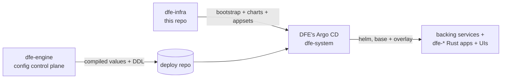

# dfe-infra architecture

dfe-infra is the DEPLOYMENT VEHICLE of the DFE product suite: the Helm
charts, Argo CD ApplicationSets, and bootstrap that put DFE onto a bare
Kubernetes cluster. It is the pinned base every deployment starts from. It
never writes config - the engine writes overlays and DDL into the deploy
repo, and this repo's appsets reconcile them; never the reverse.

## Where this repo sits in the suite

The hard boundary (suite invariant): **dfe-infra deploys, dfe-engine
configures.** The engine never installs backing services or authors Argo
Applications; this repo never reads or writes engine config. The
whole-suite map lives in the dfe-engine repo (`docs/architecture.md`
there) - this page covers only the infra side.

## What this repo owns

| Area | Where | What it does |
|---|---|---|
| Bootstrap | `bootstrap/` | bare-cluster Layer 0: detect-or-install for StorageClass, cert-manager, ESO, DFE's own Argo CD |
| ApplicationSets | `argocd/appsets/` | layer1 addons, layer2 data + apps (git-files fan-out over the deploy repo's `values/*-values.yaml`), scale-tier operators |
| Tier values | `argocd/values/` | `profile-{slim,single,scale}.yaml` + `common.yaml` + per-cloud overlays |
| App charts | `helm/charts/` | one base chart per dfe-* service + backing services (clickhouse-cluster, kafka, cnpg-cluster, ferretdb, hyperdx, forgejo, kafbat, otel-collector) |
| Chart library | `helm/library/dfe-common` | shared templates (image, KEDA scaledobject, names) |
| Version pins | `versions.yaml` | single source for chart/operator/image versions |
| Cloud prep | `terraform/` (OpenTofu-first, terraform-compatible) | secrets/IAM prep per cloud target |

## The overlay seam (how engine dials land here)

One mechanism: layer2-apps generates one Argo Application per
`values/<service>-<instance>-values.yaml` in the deploy repo, multi-source -
source 1 the pinned base chart here, source 2 the overlay file layered last
via `$values`. Adding/removing a values file adds/removes the app; the
engine turns dials, this repo defines what dials exist (every dial must be
a chart value).

> **Note:** the 2nd-pass review found the `$values` reference currently
> resolves to the values directory rather than the matched file - see the
> review report for the one-line fix before relying on overlay dials.

## Documents in this area

| Doc | Covers |
|---|---|
| [deployment/index.md](deployment/index.md) | layers, tiers, values cascade, bootstrap contract |
| [deployment/rke2.md](deployment/rke2.md) | RKE2, the hardened default distribution |
| [deployment/kafka/](deployment/kafka/README.md) | managed-Kafka guides + Redpanda licence gate |
| [deployment/deployment-logs/](deployment/deployment-logs/TEMPLATE.md) | per-deploy log template |
| [TESTING-CYCLE.md](TESTING-CYCLE.md) | THE validation loop (preflight -> deploy+E2E -> smoke -> destroy), the env-file contract, the vanilla-cluster contract |
| [AUTOSCALING.md](AUTOSCALING.md) | KEDA pod scaling vs the per-target node-autoscaler fork decision |
| [archive/](archive/) | the 2026-03 research corpus + superseded material (decision trail) |

DEVEX-LIFECYCLE.md and DEVEX-OPERATIONS.md remain at docs/ root pending
relocation to the private ops repo (they describe one vendor deployment,
not the product).
