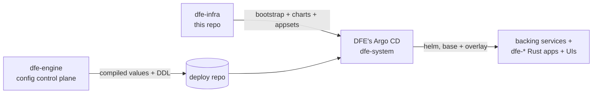

# dfe-infra architecture

dfe-infra is the DEPLOYMENT VEHICLE of the DFE product suite: the Helm
charts, Argo CD ApplicationSets, and bootstrap that put DFE onto a bare
Kubernetes cluster. It is the pinned base every deployment starts from. It
never writes config - the engine writes overlays and DDL into the deploy
repo, and this repo's appsets reconcile them; never the reverse.

## Where this repo sits in the suite

The hard boundary (suite invariant): **dfe-infra deploys, dfe-engine
configures.** The engine never installs backing services or authors Argo
Applications; this repo never reads or writes engine config. The
whole-suite map lives in the dfe-engine repo (`docs/architecture.md`
there) - this page covers only the infra side.

One named exception to "this repo owns its charts": **HyperDX is
controlled by the dfe-engine repo** (SSoT - it integrates most closely).
Anything HyperDX needs doing - the fork, the image, this repo's hyperdx
chart - goes through a GitHub issue on dfe-engine first. If it is
time-critical, security-urgent, or a small change that clearly cannot
impact dfe-engine, make it here directly and raise a dfe-engine issue
noting it was done, for politeness.

## What this repo owns

| Area | Where | What it does |
|---|---|---|
| Bootstrap | `bootstrap/` | bare-cluster Layer 0: detect-or-install for StorageClass, cert-manager, ESO, DFE's own Argo CD |
| ApplicationSets | `argocd/appsets/` | layer1 addons, layer2 data + apps (git-files fan-out over the deploy repo's `values/*-values.yaml`), scale-tier operators |
| Tier values | `argocd/values/` | `profile-{slim,single,scale}.yaml` + `common.yaml` + per-cloud overlays |
| App charts | `helm/charts/` | one base chart per dfe-* service + backing services (clickhouse-cluster, kafka, cnpg-cluster, ferretdb, hyperdx, forgejo, kafbat, otel-collector) |
| Chart library | `helm/library/dfe-common` | shared templates (image, KEDA scaledobject, names, the wait-for-engine init container) |
| Version pins | `versions.yaml` | single source for chart/operator/image versions |
| Cloud prep | `terraform/` (OpenTofu-first, terraform-compatible) | secrets/IAM prep per cloud target |

## Swappable components (the modularity contract)

The initial build is native-k8s-only, but every major component sits behind
a config-driven seam so a deployment swaps it without redesign. RKE2 is the
standard cluster for all deployments (on-prem and cloud) unless a deployment
has a strong reason otherwise. The seam is always an existing k8s
abstraction or a chart mode -- never a fork of the charts.

| Component | Seam | Knob | Swap targets |
|---|---|---|---|
| Cluster | vanilla-cluster contract | (bootstrap preflight) | RKE2 standard; EKS-class only with cause |
| DNS | external-dns / estate-managed | provider config; or the deployment's own DNS | CoreDNS record (on-prem), Route53, ... |
| Private CA / TLS | cert-manager ClusterIssuer | `tls.acme.*` or `tls.vault.*` (exactly one) | ACME/Let's Encrypt, Vault/OpenBao PKI; cloud CA issuer later |
| Secrets manager | ESO ClusterSecretStore | bootstrap store template + env | OpenBao/Vault, AWS SM (+IRSA), ... |
| Kafka | chart mode + endpoint | `kafka` chart mode, `kafka.bootstrapServers` | in-k8s single/Strimzi cluster, MSK, Redpanda (licence gate) |
| ClickHouse | chart mode + endpoint | `clickhouse.mode` single/cluster/external, `clickhouse.host` | in-k8s, ClickHouse Cloud SaaS, private cloud |
| Document store | mongo-protocol endpoint | ferretdb chart (own embedded documentdb PG -- the stack's only postgres) | bundled FerretDB, external mongo-protocol service |
| Edge / LB | Gateway API + EnvoyProxy CR | `envoyGateway.service.*` (type, class, annotations, externalIPs) | MetalLB, cloud NLB, NodePort behind HW LB, externalIPs with no LB controller |
| Deploy repo | provider mode | `DFE_BUNDLED_DEPLOY_REPO` + creds | bundled Forgejo, GitHub/GitLab |

A new architectural dependency must name its seam in this table before it
lands; a component reachable only through one provider is a bug.

Two files anchor the seams (the hyperi-ci versions.yaml pattern):
`versions.yaml` holds every pin, and `argocd/values/common.yaml` holds every
shared deploy-config fact -- including the canonical `hostnames:` map
(role-named service subdomains: `dfe`, `hyperdx`, `auth` for the issuer,
`argocd`, `git`, `kafbat`, `links`, `otel`) that the gateway routes, links
page and dfe-ui embed URLs all resolve from. A shared fact defined outside
these two files is config sprawl and gets consolidated on sight.

## Schema and topics: dfe-engine is the only controller

Nothing in this repo creates, alters or drops a ClickHouse database, table,
view, role or a Kafka topic. `dfe-schemas` declares every one of them and
dfe-engine applies them at its own startup, from the wheel pinned inside its
image, on both tiers and every broker provider. A CI guard
(`scripts/tests/test_engine_only_schema_control.py`) fails the build on DDL or
a topic-creation step reappearing under `helm/`, `argocd/`, `bootstrap/`,
`scripts/` or `terraform/`.

What that leaves this repo:

- **The clusters themselves.** ClickHouse and Kafka are deployed, sized, backed
  up and upgraded here. Only the schema inside them moved.
- **The managed-broker landing topics.** `terraform/modules/managed-kafka/`
  creates a landing topic for confluent-cloud and redpanda-cloud, driven by
  `kafka.landing_topics`. It provisions a managed cloud broker before DFE
  exists on it, the same shape as the MSK ACL job, so the guard allow-lists
  that one directory by name. Whether the path should go at all is #355.
- **The MSK first ACL.** `msk-bootstrap-job.yaml` writes the SCRAM principal's
  ACLs over SASL/IAM, because on a cluster that has stopped granting by default
  nothing can write the FIRST ACL unless it is already permitted. It creates no
  topic. Its grants are `kafka-user.yaml`'s, grant for grant: Read, Write,
  Create, Describe, Alter and Delete on topic `*`. Create makes the bootstrap
  topic set, Alter raises a partition count, and Delete is what deleting a source
  needs to take that source's `_land`/`_load` pair with it. Every cluster
  operation is withheld.
- **The ordering.** dfe-engine syncs at Argo wave 5, the otel collector at 6 and every other app at 7, and each app pod runs a `wait-for-engine` init container (`dfe-common.waitForEngine`) that polls the engine Service's `/readyz`. Ready means the last schema pass converged, so an app cannot start against an absent table -- which is the failure that reads as data loss and is really start ordering. The hunt runner ships in the engine's own chart and syncs in its wave, so the same init container is all that holds it until its coordination tables exist.

`bootstrap/smoke-test-integration.sh` asserts the engine's own `schema`
readiness check (CORE 0) before it looks at any pipeline. The per-object record
is `GET /api/v1/system/schema` on the engine.

## Dead-letter queues

Every k8s-deployed app dead-letters to a Kafka topic dfe-engine creates:
`dfe_receiver_dlq`, `dfe_loader_dlq`, `dfe_archiver_dlq`,
`dfe_fetcher_dlq`, and one shared `dfe_transform_dlq` for the transforms
(a transform overrides only when it genuinely needs its own). Kafka is
the DEFAULT DLQ target -- the file fallback cannot work under the charts'
read-only rootfs and silently drops. dfe-docker: DLQs are opt-IN per
component, EXCEPT the single-node full deploy, which carries the same
DLQ topics as k8s.

The five names and their retention are declared in dfe-schemas and
created by dfe-engine at its own startup, on every tier and every
provider -- a DLQ write happens AT failure time, the one moment nothing
can be creating topics, so the engine's wave-5 sync is what guarantees
they are there before an app can poison one. DLQ topics carry 7-day
retention against the 72h data-topic default: a poisoned message is
exactly the record an operator must still find days later, and once its
source offset commits it exists nowhere else. The four fleet apps are
pointed at their topic by chart env (the fleet-uniform `DLQ_TOPIC` /
`DLQ_MODE` contract, each in the app's own env regime); the transforms
cannot consume `dfe_transform_dlq` yet (dfe-transform-vrl#30,
dfe-transform-vector#46 own that wiring).

## The overlay seam (how engine dials land here)

One mechanism: layer2-apps generates one Argo Application per
`values/<service>-<instance>-values.yaml` in the deploy repo, multi-source -
source 1 the pinned base chart here, source 2 the overlay file layered last
via `$values`. Adding/removing a values file adds/removes the app; the
engine turns dials, this repo defines what dials exist (every dial must be
a chart value).

> **Note:** the 2nd-pass review found the `$values` reference resolving to
> the values directory rather than the matched file - confirm it against
> `argocd/appsets/layer2-apps.yaml` before relying on overlay dials.

## Documents in this area

| Doc | Covers |
|---|---|
| [deployment/index.md](deployment/index.md) | layers, tiers, values cascade, bootstrap contract |
| [deployment/rke2.md](deployment/rke2.md) | RKE2, the hardened default distribution |
| [deployment/on-prem.md](deployment/on-prem.md) | build, deploy, test and tear down on an on-prem cluster (the `local` target) |
| [deployment/kafka/](deployment/kafka/README.md) | managed-Kafka guides + Redpanda licence gate |
| [deployment/clickhouse.md](deployment/clickhouse.md) | CH target matrix + operator history (official operator / ClickHouse Cloud; private-cloud swap; Altinity untested) |
| [deployment/deployment-logs/](deployment/deployment-logs/TEMPLATE.md) | per-deploy log template |
| [TESTING-CYCLE.md](TESTING-CYCLE.md) | THE validation loop (preflight -> deploy+E2E -> smoke -> destroy), the env-file contract, the vanilla-cluster contract |
| [SOURCE-SUITE.md](SOURCE-SUITE.md) | the post-deploy source tests the cycle's `acceptance --suite source` runs: the two cases, what proves each, the reload-and-restart rule |
| [AUTOSCALING.md](AUTOSCALING.md) | KEDA pod scaling vs the per-target node-autoscaler fork decision |
| [EDGE-AUTH.md](EDGE-AUTH.md) | web-plane exposure + auth: every UI with a login external by default, route class (product/infra/ingest), the infra kill switch, edge OIDC + group RBAC, per-surface policy |
| [INGEST-EDGE.md](INGEST-EDGE.md) | the dfe-receiver data door: public LoadBalancers vs the Gateway route, source ranges, why an empty allow-list is the whole internet |
