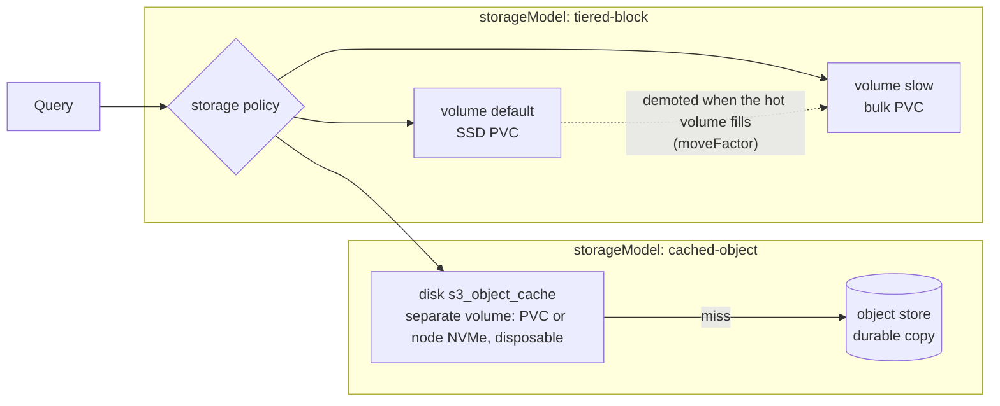

# ClickHouse SSD tiering

DFE can put recent data on SSD and bulk data on cheap storage without changing a
single table definition. It is opt-in per deployment through
`clickhouse.storageModel` in the `clickhouse-cluster` chart, and off by default.

This is the walkthrough for one model. The full matrix across both data stores --
every mode, every model, and the evidence behind each -- is
[storage.md](storage.md).

## Pick a storage model

`clickhouse.storageModel` is one dial with three settings, plus empty, which is
what it ships as: empty derives the model from whether an object store is
supplied (`clickhouse.objectStore.endpoint` set means `cached-object`, nothing
means `local`), and writing a value here overrides that. There is no second
knob: the model decides the disks, the policy and the volumes together. The
names are `<family>-<bulk>`, where the family says whether parts MOVE to the
bulk store or are COPIED to it. (Previously `tiered` and `s3backed`.)

| Model | Bulk data lives on | Fast tier is | Use when |
| --- | --- | --- | --- |
| `local` | one PVC | nothing | Default. Small deployments, or storage that is uniformly fast |
| `tiered-block` | a second PVC on a cheap class | the data PVC on an SSD class, holding recent parts | Block storage only, no object store |
| `cached-object` | an S3-compatible object store | a read-through cache -- on the data PVC by default, or on node-local NVMe with `clickhouse.objectStore.cache.volume: instance-store` (see [storage.md](storage.md)) | An object store is available |

The constraint that decides between the two non-default models: **ClickHouse
cannot cache one local disk on another.** The `cache` disk type only wraps
object storage, so over plain block storage the supported shape is a ranked
storage policy, not a cache. Attempting otherwise fails the server at startup
with "cached disk is allowed only on top of object storage". That is also why
`cached-block` is a named cell the chart does not build.



## The difference that matters: moves versus copies

In `tiered-block`, data **moves**. A part lives on exactly one volume, so the
cold volume is not disposable -- losing it loses those parts. Both volumes need a
durable StorageClass.

In `cached-object`, data is **copied**. The object store always holds the durable
copy, so losing the cache costs a cold cache and nothing else. The data volume
still has to be durable: it holds the map from ClickHouse paths to object blobs,
and that map cannot be rebuilt from the bucket.

## Turning tiering on

The model is fixed at cluster **creation**. The operator does not accept a new
disk on an existing `ClickHouseCluster`, so switching a live deployment means
recreating the cluster and restoring from a replica. The engine holds
`clickhouse.storageModel` and `clickhouse.tieredBlock.*` as protected vars and
refuses the edit for that reason.

The hot tier is the volume the deployment already has -- point
`clickhouse.storage.storageClass` at the SSD class and size it for the working
set. The `tieredBlock` dials describe the cold volume only.

```yaml
clickhouse:
  storageModel: tiered-block
  storage:
    storageClass: nvme-fast
    size: 200Gi
  tieredBlock:
    coldName: slow
    coldStorageClass: nvme-bulk
    coldSize: 4Ti
    moveFactor: 0.2
```

Both `mode: cluster` and `mode: single` render it. In cluster mode the operator
turns the extra claim into a mount at `/var/lib/clickhouse/disks/slow` and
registers a ClickHouse disk of the same name; in single mode the StatefulSet
mounts the same path and the chart declares the disk itself, so the two modes
end up with an identical on-disk layout. `mode: external` refuses it -- the
supplied ClickHouse owns its own storage.

## No table DDL is required

`moveFactor` is a property of the storage policy, not of a table. ClickHouse
demotes the oldest parts once free space on the hot volume falls below that
fraction, for every table on the policy. Nothing in dfe-engine changes.

Age-based demotion (`TTL ts + INTERVAL 7 DAY TO VOLUME 'slow'`) is a separate,
optional refinement. It is per-table DDL, so it belongs to dfe-engine's
governance rather than to this chart.

## The naming trap the chart guards

**Volume order sets tier priority, and the order is alphabetical.** The
Kubernetes API server re-serialises `settings.extraConfig` with sorted keys, so
the order written in the chart is not the order ClickHouse sees. Naming the
volumes `hot` and `cold` puts `cold` first, which makes the bulk disk the hot
tier -- silently, with no error, and every new insert landing on the wrong
device. `clickhouse.tieredBlock.coldName` must therefore sort after `default`,
and the chart fails the render if it does not:

```
clickhouse.tieredBlock.coldName "cold" sorts before "default", which silently
inverts the tiers -- the bulk volume would become the hot one. Pick a name
sorting after "default" (e.g. slow, tier2, warm)
```

The same ordering rule is why the `cached-object` cache disk is named
`s3_object_cache` behind `s3_object`: ClickHouse builds a cache only after the
disk it wraps. Those disk names, the policy names and the cold volume name are
runtime identity rather than labels -- renaming one on a live deployment is a
rebuild. See "Runtime identity" in [storage.md](storage.md).

## moveFactor needs two real devices

Demotion triggers on the hot volume's free space as a fraction of its total, so
the two tiers must be separate devices. Verified on a cluster whose hot tier was
an SSD root with 55.7 GiB free of 61 (a free ratio of 0.91) and whose cold tier
was a separate 491 GiB spinning disk. One node, one dataset, changing nothing
but the value:

| moveFactor | Where new parts ended up |
| --- | --- |
| 0.95 | `slow`, the spinning tier -- demoted with no TTL and no manual move |
| 0.2 | `default`, the SSD tier -- stayed hot |

Below `moveFactor` it demotes, above it does not, exactly as designed. Point
both StorageClasses at the same filesystem and both tiers report identical free
space, so demotion either never fires or fires constantly. That also makes
tiering untestable on a single-filesystem provisioner such as `local-path`.

## Verifying a deployment

```sql
-- Tiers resolved as intended. volume_priority 1 must be the fast one.
SELECT policy_name, volume_name, volume_priority, disks, move_factor
FROM system.storage_policies;

SELECT name, type, path, free_space, total_space FROM system.disks;

-- Where parts actually live.
SELECT disk_name, count(), formatReadableSize(sum(bytes_on_disk))
FROM system.parts WHERE active GROUP BY disk_name;
```

## The object-store path

`cached-object` covers S3, GCS and any S3-compatible on-prem store through its
endpoint. Its dials live under `clickhouse.objectStore` (see
[clickhouse.md](clickhouse.md)); the one worth setting deliberately is the
request bound. Left at the server defaults, a read against an unreachable store
blocked for over nine minutes before failing; `retryAttempts: 1`,
`connectTimeoutMs: 2000` and `requestTimeoutMs: 5000` brought the same failure
down to 10.4 seconds. Those numbers are a demonstration, not a recommendation --
one retry is aggressive against real S3, which returns transient 5xx routinely,
so pick production values against the actual store. What they must not stay is
unbounded, because a nine-minute stall on a dashboard is indistinguishable from
an outage.

Against GCS, set `supportBatchDelete: false` -- GCS rejects the batch-delete
call ClickHouse otherwise makes.

Azure Blob, `local_blob_storage` and a dedicated cache PVC are proven or partly
proven and deliberately not surfaced as values. They are follow-up cells with
their evidence and their blocking work in [storage.md](storage.md), alongside
the unbuilt `tiered-object` and `cached-block` models.

Benchmarks, per-platform cost modelling and workload identity in place of static
keys are all still open.
