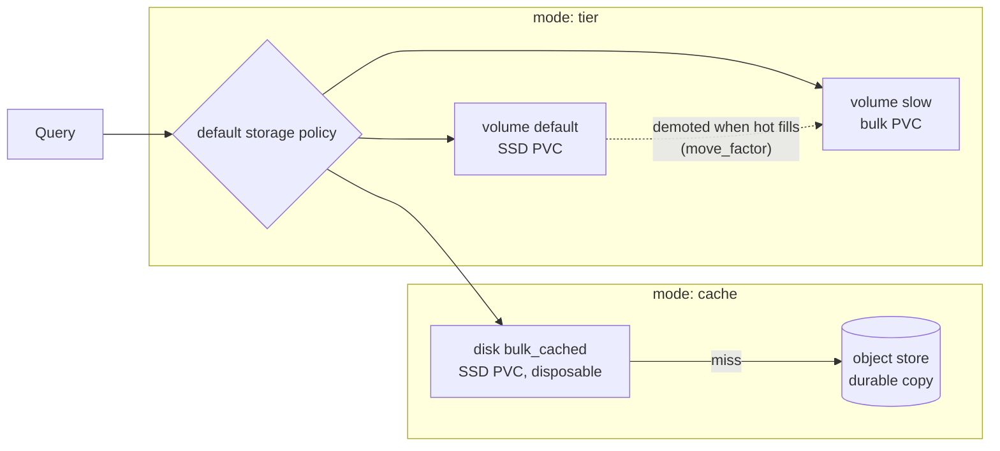

# ClickHouse SSD tiering and caching

DFE can put recent data on SSD and bulk data on cheap storage, without changing
a single table definition. It is opt-in per deployment via
`clickhouse.tiering.mode` in the `clickhouse-cluster` chart, and off by default.

## Pick a mode

The choice is made for you by what the customer's cluster actually has.

| Mode | Bulk lives on | Fast tier is | Use when |
| --- | --- | --- | --- |
| `off` | one PVC | nothing | Default. Small deployments, or storage that is uniformly fast |
| `tier` | a second PVC on a cheap class | an SSD PVC holding recent parts | Block storage only, no object store |
| `cache` | an S3-compatible object store (S3, GCS, MinIO, Ceph RGW) | an SSD PVC holding a disposable cache | An object store is available |

Azure Blob is wired up but **not yet verified against a real storage account**.
ClickHouse addresses it with `storage_account_url`, `container_name` and
`account_name`/`account_key`, which the chart emits. Authentication and
addressing were confirmed against the Azurite emulator; container creation could
not be, because Azurite 3.36.0 rejects the create-container call from ClickHouse
and from `az` alike ("Incoming URL doesn't match any of swagger defined request
patterns"), meaning the emulator does not implement the API version those
clients speak. Provision the container ahead of time and set
`containerAlreadyExists: true`, which is the better posture anyway since the
credential then needs no container-create right. Treat the first Azure
deployment as a test.

The constraint that decides it: **ClickHouse cannot cache one local disk on
another.** The `cache` disk type only wraps object storage, so over plain block
storage the supported shape is a ranked storage policy, not a cache. Attempting
otherwise fails at startup with "cached disk is allowed only on top of object
storage".



## The difference that matters

In `tier`, data **moves**. A part lives on exactly one volume, so the cold
volume is not disposable and losing it loses those parts. Both volumes need a
durable StorageClass.

In `cache`, data is **copied**. The object store always holds the durable copy
and the cache is write-through, so losing the cache costs a cold cache and
nothing else. The local data volume still must be durable: it holds the map
from ClickHouse paths to object blobs, and that map cannot be rebuilt from the
bucket.

## Turning it on

Both modes are fixed at cluster **creation**. The operator does not accept a new
disk on an existing `ClickHouseCluster`, so switching mode on a live deployment
means recreating the cluster and restoring from a replica.

For `tier`, point the existing data volume at the fast class and size the cold
volume:

```yaml
clickhouse:
  storage:
    storageClass: nvme-fast
    size: 200Gi
  tiering:
    mode: tier
    cold:
      name: slow
      storageClass: nvme-bulk
      size: 4Ti
    moveFactor: 0.2
```

For `cache`, supply the endpoint and a Secret holding the credentials:

```yaml
clickhouse:
  tiering:
    mode: cache
    cache:
      storageClass: nvme-fast
      size: 500Gi
      maxSize: 450Gi
    objectStorage:
      type: s3
      endpoint: https://BUCKET.s3.REGION.amazonaws.com/dfe/
      secretName: dfe-clickhouse-object-storage
```

Credentials reach the server as environment variables and are read back with
ClickHouse's `@from_env`, so they never appear in the CR, the generated
ConfigMap, or the preprocessed config on disk.

## No table DDL is required

`moveFactor` is a property of the storage policy, not of a table. ClickHouse
demotes the oldest parts once free space on the hot volume falls below that
fraction, for every table on the default policy. Nothing in dfe-engine changes.

Age-based demotion (`TTL ts + INTERVAL 7 DAY TO VOLUME 'slow'`) is a separate,
optional refinement. It is per-table DDL, so it belongs to dfe-engine's
governance, not to this chart.

## Two naming traps the chart guards

**Volume order sets tier priority, and the order is alphabetical.** The
Kubernetes API server re-serialises `extraConfig` with sorted keys, so the order
written in the chart is not the order ClickHouse sees. Naming the volumes `hot`
and `cold` puts `cold` first, which makes the bulk disk the hot tier, silently
and with no error. The cold volume name must sort after `default`; the chart
fails the render if it does not.

**The bulk disk's metadata path must be set explicitly.** It defaults to
`/var/lib/clickhouse/disks/<name>`, which the operator owns as the mount parent
for additional volumes and the server cannot write to. The chart pins it to
`/var/lib/clickhouse/object_metadata/<name>/` on the durable data volume, which
is where it belongs anyway.

## Failure behaviour in cache mode

Measured on a rig, not reasoned about.

| Fault | Behaviour |
| --- | --- |
| `enable_filesystem_cache = 0` at query time | Serves correctly, no restart. The kill switch works |
| Cache dropped under a running server | Re-fetches from the store, identical results |
| Blobs missing from the bucket | Fails loudly with `S3_ERROR`; `CHECK TABLE` reports `is_passed = 0` and names the key |
| Object store unreachable | Fails loudly, never wrong. **Time to fail is the problem** |

Nothing returned a wrong answer in any case, and nothing damaged a part. The one
result worth acting on is the last: with the retry and timeout settings left at
their defaults, a read against an unreachable store blocked for over nine minutes
before failing. Setting `retryAttempts: 1`, `connectTimeoutMs: 2000` and
`requestTimeoutMs: 5000` brought the same failure down to 10.4 seconds.

Those numbers are a demonstration, not a recommendation. One retry is aggressive
against real S3, which throws transient 5xx routinely, so pick production values
against the actual store. What the defaults must not stay is unbounded: for a
dashboard, a nine-minute stall is indistinguishable from an outage.

## Verifying a deployment

```sql
-- Tiers resolved as intended. volume_priority 1 must be the fast one.
SELECT policy_name, volume_name, volume_priority, disks, move_factor
FROM system.storage_policies;

SELECT name, type, object_storage_type, path FROM system.disks;

-- Where parts actually live.
SELECT disk_name, count(), formatReadableSize(sum(bytes_on_disk))
FROM system.parts WHERE active GROUP BY disk_name;

-- Cache mode only: hit ratio.
SELECT event, value FROM system.events WHERE event LIKE 'CachedReadBuffer%';
DESCRIBE FILESYSTEM CACHE 'bulk_cached';
```

In `cache` mode `system.disks` also lists the cache PVC as an unused local disk
named after `tiering.cache.name`. The operator registers a disk for every
additional volume; that one carries no data and is expected.

## moveFactor needs two real devices

Demotion triggers on the hot volume's free space as a fraction of its total, so
the two tiers must be separate devices. Verified on devex, one node, one dataset,
changing nothing but the value:

| moveFactor | Where new parts ended up |
| --- | --- |
| 0.95 | `slow`, the spinning tier -- demoted with no TTL and no manual move |
| 0.2 | `default`, the SSD tier -- stayed hot |

The hot volume there had 55.7 GiB free of 61 GiB, a free ratio of 0.91. Below
`moveFactor` it demotes, above it does not. Point both classes at the same
filesystem and both tiers report identical free space, so demotion either never
fires or fires constantly.

## Not covered here

Benchmarks, per-platform cost modelling, and workload identity in place of static
keys are spike work, not settled configuration. So is fault injection against the
cache device itself, which needs `dm-flakey` over a real block device.
