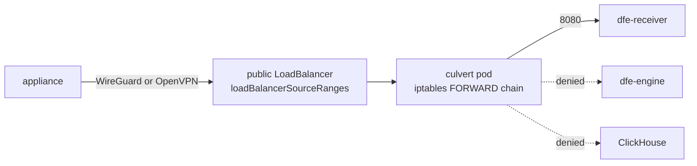

# Edge-fleet VPN

Appliances in the field have to post to the receiver, and most of them sit
behind carrier NAT with no fixed address and nothing to open a port on. The
edge VPN turns that around: each appliance DIALS IN, and the tunnel it holds
open is the path its records take. Nothing on the appliance's network is
exposed, and the receiver never needs a public address at all.

It is OFF unless a deployment asks for it, and it is offered on the `scale` and
`mesh` tiers.

## What it is

`helm/edge/culvert` deploys [culvert](https://github.com/hyperi-io/culvert),
a VPN server that speaks OpenVPN and WireGuard at once. The chart is
dfe-infra's, as for every other app in the suite; the image is pinned by tag
and digest in `versions.yaml` (`apps.culvert`, `digests.culvert`).

Two doors, both on one public LoadBalancer:

| protocol | port | why both |
|---|---|---|
| WireGuard | 51820/udp | the fast one, and the one a small appliance can run |
| OpenVPN | 1194/udp | the compatible one, and the one that carries OIDC login |

That is the chart's own default, not a fixed fact: on AWS a LoadBalancer
bills by the GB, so `argocd/values/edge-aws.yaml` points culvert at a NodePort
instead, reached through an address the deployer brings -- see
[aws.md](aws.md#receiver-ingress). That file is the edge module's AWS tier
table, one per flavour, layered by `argocd/appsets/layer2-edge.yaml` after the
cloud overlay; it also sets `pki.mode: external`, so a tunnel on a cloud
flavour names the Secret holding its CA, server certificate and key or the
chart refuses to render.

A client on a network that blocks UDP outright needs the OpenVPN TCP fallback:
add `{ name: openvpn-tcp, port: 1194, protocol: TCP, exposed: true }` to
`listeners`. It is left out by default because TCP inside TCP is slow and it is
a second door to defend. HTTPS tunnelling -- OpenVPN inside TLS on 443, or
WireGuard over WebSocket -- is culvert's censorship-evasion path and stays off:
it needs a publicly trusted certificate and buys an ingest fleet nothing.

## The tunnel's address on AWS

A NodePort has no address of its own, and on AWS the dial decides where one
comes from: `edge.ingest.tunnel.address.mode` is `byo` -- an address the
deployer already holds in front of the cluster -- or `forwarder`, the tier-2
opt-in where `terraform/modules/edge/aws` builds one.

**Every hop is built now, and none of it has been proven against a live
cluster. `byo` is still the default.** The instance lands in a public subnet, so
the Elastic IP receives, and the nodePort it rewrites each packet to is admitted
on the group the nodes carry. What a live run has to show is the DNAT path end to
end -- a client dialling the address reaching culvert's pod -- and the zone
placement holding, with that pod scheduled onto a node in the forwarder's own
availability zone.

The forwarder is a small SSM-managed instance holding an Elastic IP, with no
inbound ssh rule of any kind, admitting the tunnel's own UDP listeners from
`edge.ingest.tunnel.loadBalancerSourceRanges` (empty is 0.0.0.0/0, as everywhere
else here) and DNATing each to the nodePort `helm/edge/culvert/values.yaml`
pins, across whichever nodes are running. It reads that node list from
`ec2:DescribeInstances` -- its only grant -- once a minute, which is why the
flavour overlay sets `externalTrafficPolicy: Cluster`: any node has to forward,
whichever one holds the pod. EKS gives a managed node group the cluster's own
security group, whose ingress admits its own members alone, so the module adds
one rule to it per listener, sourced from the forwarder's security group rather
than a CIDR -- the hole is this one instance rather than everything sharing its
subnet, and it closes on a return to `byo`. The instance is pinned to one
availability zone (`edge.ingest.tunnel.address.zone`, defaulting to the
network's first), and both that zone and the Elastic IP are carried onto the
cluster secret -- the zone becomes culvert's own `nodeSelector` so the hop from
the forwarder to the pod stays inside one zone, and the address is what
external-dns publishes `vpn.serverCN` at.
`edge.ingest.tunnel.address.instance_type` sizes the instance by baseline
network bandwidth, since it moves every tunnel byte and does nothing else; the
default is the small arm64 shape `shapes/compute-shapes.yaml` already names,
and the family has to be Graviton to match the AMI the module resolves.

## Client addressing

Tunnel clients live in `100.64.0.0/10`, the CGNAT range reserved by RFC 6598,
declared once in `argocd/values/common.yaml` as `vpn.clientCIDR`. That range is
never used for pod or service CIDRs, so an appliance's own LAN and the cluster
cannot collide with the addresses handed to clients. The chart carves one /24
out of it per tunnel, in listener order, and refuses a range with no room for
that carve.

## Receivers only, in two layers

A tunnel that reached the whole namespace would be a hole through every control
the cluster has. Two independent layers stop that, and they fail differently,
which is why both are there.



- **The NetworkPolicy** (`helm/edge/culvert/templates/networkpolicy.yaml`)
  selects the receiver pods BY LABEL, so it is exact whatever the addressing
  is. Client traffic is SNATed onto the pod address on its way out of the
  tunnel, so what the pod may reach is what a client may reach.
- **culvert's own routing control** (`CULVERT_ROUTING_CONTROL_ENABLED`,
  `routes.destinations`) filters by CIDR inside the pod and pushes the same
  list to clients as their routes, so an appliance is routed at exactly what it
  is allowed to reach. Clients are isolated from each other as well.

The NetworkPolicy only bites because the culvert pods carry
`dfe.hyperi.io/egress-scoped: "true"`, which takes them OUT of the
namespace-wide egress baseline. Policies are additive: a pod that baseline
selects can always reach its whole namespace, and no later policy takes that
back. The cost of opting out is that the culvert chart states its WHOLE egress
surface -- DNS and telemetry included -- so anything a deployment adds (an
external PKI backend, an OIDC issuer outside the cluster) goes in
`networkPolicy.extraEgress`.

## Who may reach the door

`exposure.loadBalancerSourceRanges` is the ingress allow-list on the
LoadBalancer. It starts EMPTY, which means every source address on earth -- a
fleet that dials in from anywhere is the normal case here. A deployment whose
appliances sit in known ranges lists them.

Beyond that, culvert authenticates each client:

- **PKI** -- every client holds its own certificate. `pki.mode: local` mints a
  CA in the pod on first start, which is fine for a trial; without
  `persistence.enabled` every restart mints a new CA and every issued client
  config stops working. A deployment that has to be rebuildable uses
  `pki.mode: external` with a Secret carrying `ca.crt`, `server.crt`,
  `server.key` and optionally `crl.pem` and `tc.key`. **Both modes want the
  volume**: culvert writes its revocations and its WireGuard peer allocations
  into the same directory, so a restart without it re-issues a revoked peer's
  address. `argocd/appsets/layer2-edge.yaml` turns it on for every cloud
  flavour for that reason, and sets it there rather than in the flavour file
  because `persistence.enabled` is a key other charts read.
- **OIDC** -- `vpn.oidc.enabled` with the issuer and client id, the client
  secret riding a pre-created Secret. It sits under `vpn` because the cloud
  overlays set a top-level `oidc.enabled` for the gateway's edge OIDC on the
  UIs (`envoy-gateway-config`, see
  [aws-operations.md](aws-operations.md#admin-ui-exposure)), and that switch
  must not reach the tunnel. The client completes its login against the
  server's callback port, so add
  `{ name: oauth2-udp, port: 9000, protocol: TCP, exposed: true }` to
  `listeners`; the chart refuses to render without it, and refuses to render
  at all if a values file still carries the old `oidc.issuer` or
  `oidc.clientId`.

## Reaching an appliance from the bastion

Cloud flavours only -- on-prem the operator is already on the LAN and the module
supplies nothing.

An appliance holds its own tunnel open, so an operator reaches it through the hub
rather than by opening anything on the appliance's network.
[edge.md](edge.md#the-tunnels-inbound-and-reaching-one-appliance) carries the
mechanism, the four `dfe-ops bastion` verbs, what the appliance has to accept,
and the isolation regression to run on every change to `peers.classes`.

```
dfe-ops bastion hub <peer>      # route the client range at the pod, then shell
dfe-ops bastion peers           # name, tunnel address and last handshake
dfe-ops bastion join            # refused until hyperi-io/culvert#40 lands
dfe-ops bastion down            # revoke anything joined, THEN terminate
```

`edge.ingest.tunnel.admin_peer.ttl_minutes` and `peer_cidr` both belong to the
admin PEER, which waits on `hyperi-io/culvert#40`, so neither reaches a rendered
resource today. `render_dial.py` refuses a dial that sets either to anything but
its default and names that issue -- a field an operator sets, sees accepted and
gets nothing from is worse than one that stops, which is why the culvert chart
already refuses `exposure.loadBalancerSourceRanges` on a NodePort. What ends a
session is `dfe-ops bastion down`, which revokes and then terminates.

### How wide the hole is

`peers.classes.admin.adminCIDRs` is the toolbox instance's own `/32` -- one
host, not its subnet. That distinction is the whole point here: the subnet is a
`/20` shared with every EKS managed node group, with Karpenter, and under the
stock VPC CNI with every pod holding a secondary address on a node in that zone.

A `/32` goes stale on its own, because the instance is terminated and rebuilt on
every `dfe-ops bastion up`. So it is not written once at bootstrap: `up` learns
the new address from the toolbox module's own output after its targeted apply,
writes it on the Argo cluster secret, and waits until culvert's own
`CULVERT_DOWNSTREAM_ADMIN_CIDRS` carries it. `down` takes it off and waits for
that before the instance is destroyed. The cluster secret rather than the
Application, because the ApplicationSet controller reconciles a generated
Application back to its template and a patch there would not survive.

So there is no hole at all while no bastion is up, and the one that exists names
a single address. Delivery is the bound behind it: a packet only reaches an
appliance if something ROUTES the client range at the culvert pod, which takes
the host network namespace -- an ordinary pod cannot do it from inside its own,
and node root can. Behind that stands the appliance's own ssh and TLS
authentication.

### What a live run still has to prove

None of this has been exercised against a cluster. Two claims carry the weight:

- culvert's pinned image honours `CULVERT_DOWNSTREAM_ADMIN_CIDRS` with an
  ethernet-side ACCEPT and a NAT RETURN beside it, ahead of nothing that drops
  it first.
- An appliance accepts ssh on 22 and https on 443 on its tunnel interface from
  the admin's address. **That is an assumption to confirm with the EdgeStream
  Hub team**, not a fact this repo can check.

Run the isolation regression in the same window, and on every change to
`peers.classes`: one appliance peer still cannot reach another.

## One replica, and why

The chart holds at one pod and refuses more. WireGuard mints its server key
inside the pod and sources it from no secrets backend, so a second replica
issues client configs the first rejects and allocates the same tunnel
addresses. OpenVPN alone can scale out on shared external PKI, but this chart
runs the pair. The `replicas` key is deliberately not spelled `replicaCount`:
the scale profiles set that for every app, and this one cannot take it.

The pod also runs as uid 0 with `NET_ADMIN`, `SETPCAP`, `SETGID` and `SETUID`,
because OpenVPN and wg-quick create the tun device and program iptables NAT
before OpenVPN drops to nobody. A cluster enforcing restricted PodSecurity
admission rejects it unless its namespace is labelled
`pod-security.kubernetes.io/enforce=privileged`.

## Turning it on

The VPN is an app like any other, so enabling it is a values file appearing in
the deploy repo. Through the engine's app-management API:

```
POST /api/v1/apps/culvert/instances
{ "instance": "default",
  "values": { "vpn.serverCN": "vpn.example.com",
              "exposure.loadBalancerIP": "203.0.113.10" } }
```

That commits `values/culvert-default-values.yaml`, the layer2-edge
ApplicationSet turns the file into an Argo Application, and Argo deploys it.
`DELETE /api/v1/apps/culvert/default` removes the file and the app with it. The
console's Platform tab drives the same endpoints.

The tunnel is part of the edge module, so the deployment's `edge.enabled` is a
switch above this one: with it off, `argocd/appsets/layer2-edge.yaml` generates
nothing and the values file turns nothing on. Destroy the tunnel before turning
the module off -- the load balancer outlives the Application that asked for it.

`vpn.serverCN` is the name clients dial and the name the server certificate is
issued for, so it has to resolve to the LoadBalancer's address. Left empty it
derives `{hostnames.vpn}.{domain}` from the deploy-config SSoT.

Point the receiver at the tunnel with `exposure.mode: vpn` in its own overlay:
that leaves it on a ClusterIP with no public address at all, and its ingest
NetworkPolicy then admits the VPN pods instead of the world. Setting that mode
WITHOUT deploying the VPN leaves the receiver with no external path.

## Later

Client and key management -- issuing a config, revoking one, per-client routes
-- is culvert's own CLI today. Driving it from the engine and the console is a
later addition; this chart ships enable, disable and the deployment dials.

## Related

- [index.md](index.md) - the layers and the values cascade
- [../INGEST-EDGE.md](../INGEST-EDGE.md) - the receiver's other two exposure
  modes and what an open ingest door means
- [gateway-oidc.md](gateway-oidc.md) - edge OIDC for the HTTP surfaces
