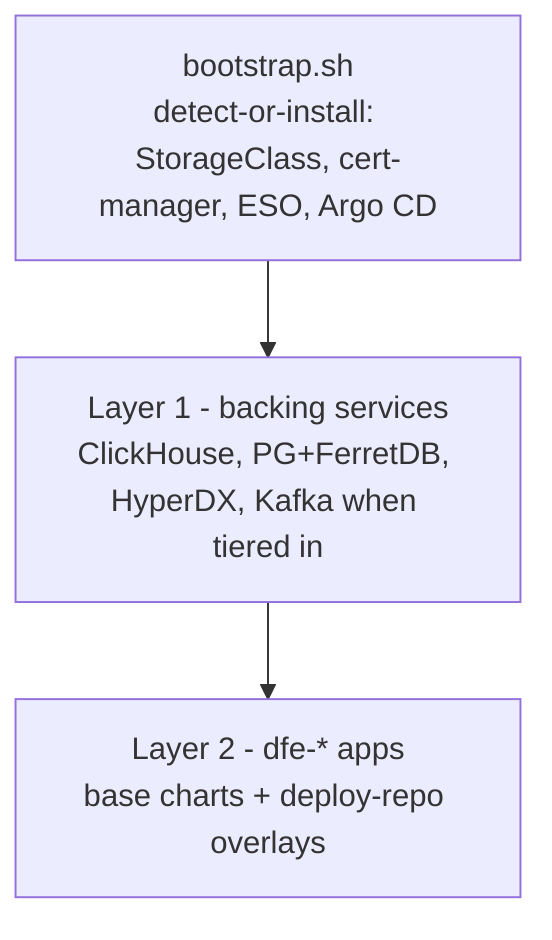

# Deploying DFE with dfe-infra

Bare cluster in, running DFE out: bootstrap lays the Layer 0 baseline,
DFE's own Argo CD reconciles the backing services (Layer 1) and the apps +
engine-authored overlays (Layer 2). Tier selection and every default live
in values files - a deployer overrides single dials, never templates.

## The three layers



- **Bootstrap** (`bootstrap/bootstrap.sh`): probes each dependency - adopt
  a healthy existing controller, install a DFE-owned copy otherwise. DFE's
  Argo lives in `dfe-system`, scoped to `dfe-*` namespaces so it coexists
  with any host Argo.
- **Layer 1** (`argocd/appsets/layer2-data.yaml` + `layer1-addons.yaml`):
  backing services from base charts + profile values only - no deploy-repo
  dependency, so they come up before any git host exists.
- **Layer 2** (`argocd/appsets/layer2-apps.yaml`): one Application per
  deploy-repo `values/*-values.yaml`, base chart + `$values` overlay.

## Tiers and the values cascade

The cluster secret's `dfe.hyperi.io/profile` label selects the tier;
values merge in this order (later wins):

```
helm/charts/<app>/values.yaml        chart defaults
argocd/values/common.yaml            fleet-wide overrides
argocd/values/profile-<tier>.yaml    tier composition (slim / single / scale)
argocd/values/<cloud|site>.yaml      per-target overrides
deploy repo values/<app>-...yaml     engine-authored overlay (Layer 2 apps)
```

Tier composition (what each enables by default) is documented suite-side
in dfe-engine `docs/deployment/index.md` - one home for that table. Kafka
on tier `single` uses the non-operator single-broker KRaft path
(`helm/charts/kafka`, `kafka.mode: single`); the Strimzi operator installs
only on `scale` clusters (`layer-scale.yaml`).

## Version pins

`versions.yaml` is the single source for chart, operator, and image
versions, checked by `scripts/check_versions_drift.py`. Pin rule for
images: `name:tag@sha256` digests - tags live in `apps:`, the immutable
digest half in `digests:` (`scripts/dfe-stack` renders the combined form
and `dfe-stack verify` re-checks digests against GHCR). A dfe-infra release
tag certifies the whole set as one stack version (`stack:` metadata +
lockstep `content:` repo tags); the full release model is in dfe-docs
`deployment/stack-versioning.md`.

## Related

- [architecture.md](../architecture.md) - where this repo sits in the suite
- [rke2.md](rke2.md) - the default distribution
- [kafka/](kafka/README.md) - managed-Kafka alternatives + Redpanda gate
- [deployment-logs/](deployment-logs/TEMPLATE.md) - record every deploy
