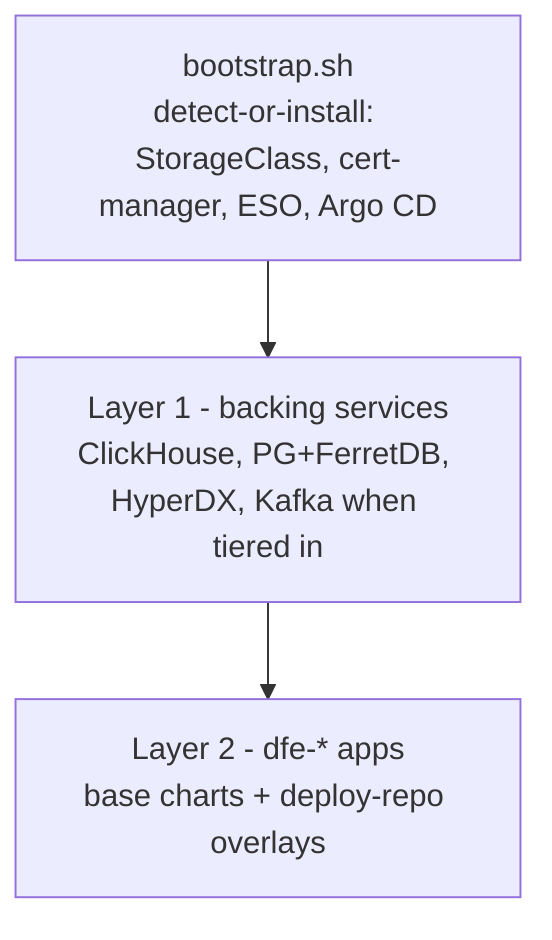

# Deploying DFE with dfe-infra

Bare cluster in, running DFE out: bootstrap lays the Layer 0 baseline,
DFE's own Argo CD reconciles the backing services (Layer 1) and the apps +
engine-authored overlays (Layer 2). Tier selection and every default live
in values files - a deployer overrides single dials, never templates.

## The three layers



- **Bootstrap** (`bootstrap/bootstrap.sh`): probes each dependency - adopt
  a healthy existing controller, install a DFE-owned copy otherwise. DFE's
  Argo lives in `dfe-system`, scoped to `dfe-*` namespaces so it coexists
  with any host Argo.
- **Layer 1** (`argocd/appsets/layer2-data.yaml` + `layer1-addons.yaml`):
  backing services from base charts + the deploy repo's `infra/` overlay.
- **Layer 2** (`argocd/appsets/layer2-apps.yaml`): one Application per
  deploy-repo `values/*-values.yaml`, base chart + `$values` overlay.

## Tiers and the values cascade

The cluster secret's `dfe.hyperi.io/profile` label selects the tier;
values merge in this order (later wins):

```
helm/charts/<app>/values.yaml        chart defaults
argocd/values/common.yaml            fleet-wide overrides
argocd/values/<cloud|site>.yaml      per-target overrides
argocd/values/profile-<tier>.yaml    tier composition (slim / single / scale / mesh)
deploy repo infra/common.yaml        deployment-wide (every appset)
deploy repo infra/<chart>.yaml       one data-layer or platform chart
deploy repo values/<app>-...yaml     engine-authored overlay (Layer 2 apps)
```

Everything from `infra/` down is the DEPLOYER's, and it is last, so
`clickhouse.mode`, `kafka.mode` and the storage models are reachable
without editing this repo. The profile file is a tier DEFAULT, not a lock.

The data layer therefore depends on the deploy repo resolving. On a bundled
deploy (no external git) the git host is `layer2-deploy-repo`'s own
single-source Application, so the data-layer and platform Applications
report ComparisonError until it is up and then converge.

Kafka on tier `single` uses the non-operator single-broker KRaft path
(`helm/charts/kafka`, `kafka.mode: single`); the Strimzi operator installs
only on `scale` clusters (`layer-scale.yaml`).

Which APPS a tier deploys is `apps.yaml`'s, not the profile file's --
[composition.md](composition.md) has the table and the derivation.

The `mesh` tier is `scale` without a broker: the stages hand records to each
other over gRPC. `mesh.enabled` puts a Gateway API listener in front of every
stage pool, because a Kubernetes Service balances per connection and gRPC
holds one open, so a sender would otherwise pin itself to one pod however many
replicas KEDA adds. Each pool's route carries its own policy
(`mesh.routePolicy`): a request timeout at or above the sender's 30 s deadline,
and retries only on connect failure and resource exhausted. A pod that keeps
answering unavailable leaves the rotation.

The receiver answers a sender only once the loader confirms delivery
(`acknowledgements.enabled`, on by default), and with that on it builds no
buffer or spool. A loader outage reaches senders as a 503 (unavailable over
gRPC) once the hold expires, and they retry from their own copy. With
acknowledgements off, the raised receiver buffer on this tier is the only
slack in the chain. An outage shorter than it is invisible to senders, and a
held record has already had its 2xx, so it dies with the pod.

## Storage model - decided at deploy, not after

Both data stores take a `storageModel` that fixes the on-disk layout for
the life of the deployment. It defaults to `local`, which changes nothing.
Models are named `<family>-<bulk>`: the family says whether data MOVES to
the bulk store or is COPIED to it, the bulk half says what that store is.

| chart | `local` | the alternatives |
|---|---|---|
| `clickhouse-cluster` | parts on the PVC | `cached-object` - parts on an object-store disk behind a local read-through cache; `tiered-block` - a hot SSD volume and a cold bulk volume, parts demoted as the hot one fills |
| `kafka` | every segment on the PVC | `tiered-object` - closed segments to object storage (KIP-405 tiered storage); the PVC sizes the hot window |

Growing a PVC instead needs `allowVolumeExpansion: true` on the
StorageClass and a StatefulSet recreate, because `volumeClaimTemplates`
are immutable. `local-path` cannot resize at all. That is what the storage
model exists to avoid.

Every model with an object bulk store reads its credentials from the
environment, materialised by ESO from `<project>/<env>/clickhouse/s3` and
`<project>/<env>/kafka/tiered` - never inline in a values file.

The engine holds the models and the modes as protected vars, so the API
refuses a post-deploy edit. See the deploy repo's `infra/README.md`.

**Every combination, its status and its evidence:
[storage.md](storage.md)** - the deploy-time matrix, including the cells
that are refused and the ones not built yet.

## Upgrading onto the generated JWT signing key

Releases before the ESO-generated key minted `dfe-engine-jwt` from the chart
template. On the first upgrade past that, the ExternalSecret adopts the
existing Secret (`creationPolicy: Owner`) and writes a new key into it, so
every token issued before the upgrade stops verifying and the engine rolls
once - operators and any machine caller log in again, and nothing else is
affected. `refreshPolicy: CreatedOnce` then holds that key for the life of the
deployment: on the rc.12 deployment the Secret's `resourceVersion` moved on
that first reconcile and held across the two renders after it. A deployment
that cannot take even one invalidation sets `auth.jwtSecret` to the key it
already has, which renders a plain Secret and no generator.

## Upgrading onto the `main` landing table

The landing table and the catch-all source are both named `main`. A deployment
cut before that rename landed has a `default` table holding its rows, and
nothing moves or drops it: the engine's DDL writer creates `main` alongside it,
the receiver stamps an unmatched record `_source: main`, and the loader writes
new records to `main`. Query the old table directly for anything older than the
upgrade, and drop it once nothing needs it.

The Kafka landing topic moves with the source name, from `default_land` to
`main_land`. The kafka chart pre-creates the new one; the old topic keeps
whatever it already holds until it is deleted.

## Version pins

`versions.yaml` is the single source for chart, operator, and image
versions, checked by `scripts/check_versions_drift.py`. Pin rule for
images: `name:tag@sha256` digests - tags live in `apps:`, the immutable
digest half in `digests:` (`scripts/dfe-stack` renders the combined form
and `dfe-stack verify` re-checks digests against GHCR). A dfe-infra release
tag certifies the whole set as one stack version (`stack:` metadata +
lockstep `content:` repo tags); the full release model is in dfe-docs
`deployment/stack-versioning.md`.

`content:` also records the dfe-docker ref that runs each stack. dfe-docker
cuts no per-stack tag, so the entry is a commit rather than a version, and
`dfe-stack cut` re-resolves it from dfe-docker main at cut time. To reproduce
an old stack's docker path, check dfe-docker out at that stack's recorded ref;
for the current stack, main is the ref.

`content:` also pins the authored files an app ships and the engine serves -
the reference transform pipelines, and the source catalogue a transform ships.
The engine chart's `content.entries` turns each pin into one init container
that fills `/etc/dfe-engine/content` from the pinned app image or the release
asset, and the engine reads that directory through `DFE_LIBRARY_SEED_DIR` and
`DFE_SOURCE_CATALOGUE_FILE`. The files never travel through a value or a
ConfigMap: the elastic catalogue alone is 344 KB, and either form
re-serialises it into etcd on every Argo sync. `entries` is empty while no
release carries its files as an asset and no Dockerfile copies them into the
image; each app that ships its files makes its entry live.

## Version check

Every DFE service boots with an opt-out release check: one POST of
`{product, current_version, os, arch, instance_id}` to the HyperI releases
endpoint, logging whether a newer version exists. The id is a one-way
UUIDv5 derived from the platform; deployment names are never sent; any
failure costs one WARN line and nothing else.

The `versionCheck` values key is the deployment override, rendered into
every app by the `dfe-common.versionCheckEnv` helper -- fleet-wide in
`argocd/values/common.yaml`, or per app in its overlay:

```yaml
versionCheck:
  enabled: false        # total opt-out -- no check, nothing sent (air-gap)
  sendInstanceId: false # keep the check, strip the install id
  apiUrl: ""            # point the check at a mirror
```

## Related

- [architecture.md](../architecture.md) - where this repo sits in the suite
- [wizard.md](wizard.md) - `dfe-ops init`, the prompt-driven wizard that writes a deployment.yaml dial
- [composition.md](composition.md) - which apps a profile deploys by default,
  how apps.yaml's `default_in` reaches Argo and Compose, and what an app with
  nothing to do does instead of crash-looping
- [storage.md](storage.md) - the storage-deploy matrix: service x mode x
  storage model, with the status and evidence behind every cell
- [edge.md](edge.md) - the edge module: every door into a deployment, grouped
  and tiered, with one table per flavour of what is on, what it costs and which
  dial key turns it
- [gateway-oidc.md](gateway-oidc.md) - edge OIDC: the values that turn it on,
  the private-CA IdP shape, and what Envoy Gateway cannot do with a groups claim
- [edge-vpn.md](edge-vpn.md) - the opt-in tunnel a field appliance dials in on:
  the two ports, the reserved client range, and how it reaches receivers only
- [toolbox.md](toolbox.md) - the troubleshooting image, the opt-in in-cluster
  pod, and the on-demand AWS bastion: off by default, read-only Kubernetes API
  access, and what each surface records
- [rke2.md](rke2.md) - the default distribution
- [aws.md](aws.md) - deploying on AWS: EKS, Karpenter, sizing, and the
  MSK/Confluent/Redpanda Kafka and ClickHouse choices
- [aws-operations.md](aws-operations.md) - running and tearing down a
  deployed AWS cluster: node pools and images, admin UI exposure, Kafka
  telemetry and autoscaling, teardown, upgrades
- [upgrade-rollback.md](upgrade-rollback.md) - the rollback runbook: what
  rolling back means per upgrade stage, the `dfe-ops upgrade rollback`
  refusal rule, the sizing config-vs-data rule, and the soak before a
  Kafka finalise
- [DEPLOY-HELPERS.md](../DEPLOY-HELPERS.md) - the release and deploy-overlay
  helpers, the logins a deploy carries, and the end-to-end recipe
- [DEPLOY-TLS-TRUST.md](../DEPLOY-TLS-TRUST.md) - which CA signs the gateway
  certificate: the self-signed default, estate PKI, and trusting the root once
- [kafka/](kafka/README.md) - managed-Kafka alternatives + Redpanda gate
- [clickhouse.md](clickhouse.md) - CH target matrix (official operator /
  ClickHouse Cloud; Altinity untested) + operator history, including the
  retired private-cloud pairing
- [upgrades.md](upgrades.md#migrating-from-dfe-2x-before-22) - migrating a
  pre-2.2 private-cloud deployment off the retired ClickHouse fork onto
  cached-object
- [deployment-logs/](deployment-logs/TEMPLATE.md) - record every deploy
