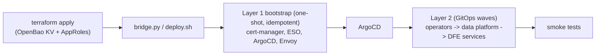
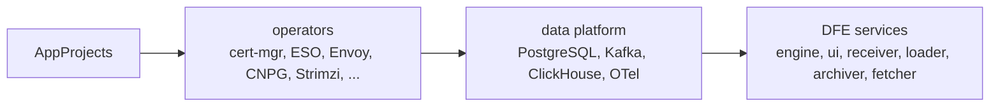
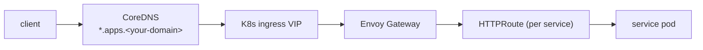
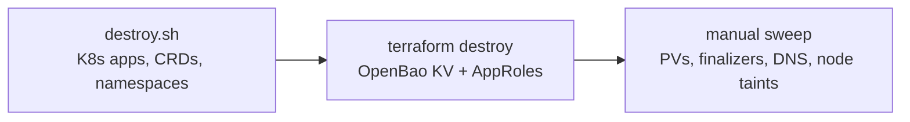

# Build, test and clean up on an on-prem cluster

How to build, test, deploy and cleanly tear down dfe-infra on an on-prem RKE2 +
Rancher cluster, with CoreDNS and OpenBao beside it, through the `local` cloud
target. The repeatable create -> test -> destroy loop over the same scripts is
[TESTING-CYCLE.md](../TESTING-CYCLE.md).

## Model: two layers



Layer 1 is a one-shot, idempotent bootstrap. Layer 2 is continuous GitOps via
ArgoCD ApplicationSets (`argocd/appsets/`), with values cascading
`common.yaml` -> `<cloud>.yaml` -> `profile-<profile>.yaml` (`argocd/values/`).
All component versions come from `versions.yaml` (the SSoT).

## Prerequisites

- A kubeconfig for the target RKE2 cluster -- `kubectl get nodes` works.
- Nodes for DFE to run on, labelled `dfe.hyperi.io/workload=dfe`. The `local`
  overlay (`argocd/values/local.yaml`) pins DFE to them with a hard nodeSelector
  and tolerates a matching `NoSchedule` taint, so a pool tainted at provisioning
  keeps other workloads off it. Bootstrap labels every node on this target
  (`DFE_LABEL_WORKLOAD_NODES`, default `true` for `local`); on a shared cluster,
  label the DFE nodes yourself and set it to `false`.
- For the `scale` tier, or any setting that reads a secrets store, an OpenBao
  token for your Vault/OpenBao (e.g. `bao.example.com`; Terraform uses it).
  slim, single and mesh need no store at all
  ([index.md](index.md#secrets-store-and-pull-secret)).
- `bootstrap/local.env`: copy `bootstrap/local.env.example` and fill it in.
  Registry pull credentials go in only for a private registry.
- OpenTofu (or Terraform) and helm on PATH. CI pins the exact versions it uses in
  the workflows themselves (`.github/workflows/tf-validate.yml`,
  `.github/workflows/helm-lint.yml`) -- `versions.yaml` does not pin CI tooling.

## Build and validate

CI (`.github/workflows/`) runs on every push/PR:

- `tf-validate` -- `terraform validate` + module `*.tftest.hcl`, matrixed over terraform and opentofu.
- `helm-lint` -- `helm lint` over the charts in `helm/charts/` and the `helm/library/` charts.
- `toolbox-build` -- builds the `dfe-toolbox` image family under `docker/` (only on changes there, or to `versions.yaml`).

Locally:

```bash
helm dependency update helm/charts/<chart>
helm lint helm/charts/<chart>
terraform -chdir=terraform/modules/<module> test
```

DFE service images themselves are built per-service (via hyperi-ci), not here --
dfe-infra ships the Helm charts that deploy them.

## Deploy

Integrated path:

```bash
cp bootstrap/local.env.example bootstrap/local.env   # fill in creds
bash bootstrap/deploy.sh --cloud local
```

`deploy.sh` runs `terraform apply`, then `bridge.py` (which reads the Terraform
outputs and runs the Layer 1 bootstrap), after which ArgoCD syncs Layer 2.

Step by step:

```bash
cd terraform/environments/local
terraform init && terraform apply          # creates OpenBao KV mount + AppRoles
cd -
python3 bootstrap/bridge.py --tf-dir terraform/environments/local
kubectl -n argocd get app -w               # watch Layer 2 sync
```



Transform services (vrl, vector, elastic) sync only on clusters labelled with
the `scale` profile. dfe-transform-splack and dfe-transform-wasm are coming and
sync nowhere yet. Set `DFE_DRY_RUN=true` to preview without applying.

## Test

```bash
bash bootstrap/run-all-smoke-tests.sh      # or the individual smoke-test*.sh
bats bootstrap/tests/*.bats                # OIDC independence + helm rendering
terraform -chdir=terraform/modules/<module> test
```

Smoke tests check namespaces, pod readiness, CRDs, and Gateway/HTTPRoute/network
policies against the live cluster. Note: there is no isolated integration-test
namespace today -- smoke tests validate the running deployment.

Argo `Healthy` and a pod's `Running` are not proof: a Running pod can be 0/1
ready, and an app can report Healthy while a workload crashloops. Gate on
`bootstrap/smoke-test-readiness.sh` plus `kubectl wait --for=condition=Ready` on
the operator's own condition. A timeout is a backstop, never the thing you race.

## DNS and ingress



Service hostnames are served by HTTPRoutes (Envoy Gateway,
`helm/edge/gateway/`) under the deployment's `*.apps.<your-domain>`
wildcard; cert-manager issues the TLS. A service needing a name outside the
wildcard needs its own record in whatever DNS serves the deployment's domain.

## Cleanup / teardown



1. **In-cluster:** `bash bootstrap/destroy.sh` (prompts to confirm; supports a
   force flag). Deletes ArgoCD apps + ApplicationSets, the data CRDs, the DFE
   namespaces, and the platform Helm releases.
2. **State:** `cd terraform/environments/local && terraform destroy` -- removes
   the OpenBao KV mount and AppRoles. **Do not skip this** or secrets/AppRoles
   are orphaned.
3. **Manual sweep** (not yet automated -- checklist):
   - [ ] `kubectl get pv` -- confirm local-path PVs were reclaimed.
   - [ ] Clear stuck finalizers (CNPG / Strimzi / ClickHouse) if deletion hangs.
   - [ ] Remove any non-wildcard DNS records added for the deployment.
   - [ ] Remove DFE node taints/labels so future scheduling is not blocked.
   - [ ] Confirm no orphaned OpenBao paths remain.

Redeploy with `terraform apply` + `bridge.py` again.

## Troubleshooting

- **ImagePullBackOff** -- check the image reference has a registry host first.
  A private registry needs `DFE_PULL_SECRET_TOKEN` in `bootstrap/local.env`.
- **App stuck OutOfSync** -- `kubectl -n argocd get app`; check ESO / SecretStore health.
- **Route not serving** -- is the Gateway/HTTPRoute programmed and the cert issued?
- **Teardown hangs** -- clear CRD finalizers (`kubectl patch ... --type merge -p '{"metadata":{"finalizers":[]}}'`).
- **DFE pods Pending on node affinity/selector** -- the DFE nodes lack the
  `dfe.hyperi.io/workload=dfe` label, or are gone. Label or restore them rather
  than removing the selector, which puts DFE on nodes it does not own.
  `dfe-ops preflight --require-label dfe.hyperi.io/workload=dfe` catches a missing
  label before a deploy.
