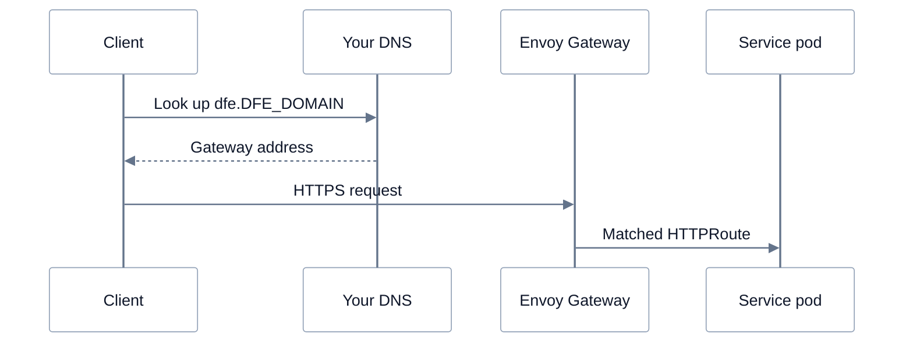

# DFE on Kubernetes on-premises

DFE on a Kubernetes cluster you run. You start with a bare cluster and end with a stack that has sent its first event through to ClickHouse. RKE2 is the reference distribution ([rke2.md](rke2.md)), and the charts don't need any particular one.

One command does the deploy. `dfe-ops stack-deploy` installs cert-manager, External Secrets and Argo CD, or adopts healthy ones the cluster has. Argo CD then syncs the backing services and the DFE apps at the versions the release pins. It finishes by sending an event through to ClickHouse and confirming the stack's telemetry landed. Then it writes your logins to a file you alone can read.

Pick the tier first, because it decides whether you need a secrets store.

| Tier | Transport | What runs | Secrets store |
|---|---|---|---|
| `slim` | gRPC | One replica of each stage, no broker. | None |
| `single` | Kafka | One replica of each, with a single Kafka broker in the cluster. | None |
| `scale` | Kafka | Replicas, a ClickHouse cluster and Strimzi Kafka. | OpenBao, for the broker's client credential |

`mesh` is in the charts but every deploy path rejects it. [README.md](README.md#tiers-and-the-values-cascade) has the layers and the values cascade. [composition.md](composition.md) lists which apps each tier runs.

## Before you start

- A kubeconfig for the cluster, so `kubectl get nodes` works. Then `helm`, `openssl` and Python 3 on the machine you deploy from.
- Kubernetes 1.35 or later, or 1.34 with the `ImageVolume` feature gate on in the API server and every kubelet. The DocumentDB operator mounts its extension into the dfe-hyperdx store as an image volume, and its admission webhook rejects the store without one. On 1.34, `bootstrap/check_platform.py` reads the gate from the API server's `/metrics` (it needs `get` on that URL). It rejects a cluster where the gate is off or unreadable, unless `DFE_IMAGE_VOLUME_ENABLED=true` says it's on in the API server and every kubelet.
- Nodes for DFE to run on, labelled `dfe.hyperi.io/workload=dfe`. The `local` overlay (`argocd/values/local.yaml`) pins DFE to them with a hard nodeSelector and tolerates a matching `NoSchedule` taint, so a pool tainted at provisioning keeps other workloads off it. Bootstrap labels every node on this target (`DFE_LABEL_WORKLOAD_NODES`, default `true` for `local`). On a shared cluster, label the DFE nodes yourself and set it to `false`.
- You decide where data is stored at the first deploy, and it's locked after that. Read [storage.md](storage.md) first.
- For `scale`, an OpenBao: its address, plus an AppRole for External Secrets or a token OpenTofu can create one with ([README.md](README.md#secrets-store)).
- An air-gapped cluster pulls every image from a registry inside the site. `dfe-stack images` lists a release's DFE-owned images, and its signed manifest verifies offline ([stack-versioning.md](stack-versioning.md#cutting-a-release)). A full air gap usually needs HyperI professional services as well, for the parts each site does differently: moving images across, the local registry, cross-domain rules and accreditation.

## Deploy

`<version>` is the DFE release you are installing.

1. Clone the release and make your env file. It stays readable by you alone, and git ignores it.

   ```bash
   git clone --branch <version> https://github.com/hyperi-io/dfe-infra && cd dfe-infra
   (umask 077 && cp bootstrap/local.env.example bootstrap/local.env)
   ```

2. Fill in `bootstrap/local.env`. `DFE_DOMAIN` is the domain every hostname sits under. `DFE_REPO_URL` is the git repository Argo CD reads the charts from, `https://github.com/hyperi-io/dfe-infra` or your copy of it. Every other key is documented in the file. For `scale`, set `DFE_SECRETS_BACKEND=openbao` and `DFE_VAULT_ADDR`, with the External Secrets AppRole in `DFE_VAULT_ROLE_ID` and `DFE_VAULT_SECRET_ID`.

3. Check the cluster. The preflight is read-only.

   ```bash
   python3 scripts/dfe-ops preflight --mode single --env-file bootstrap/local.env
   ```

4. Deploy.

   ```bash
   python3 scripts/dfe-ops stack-deploy --stack <version> --mode single \
     --target-revision <version> --env-file bootstrap/local.env
   ```

`--check-only` runs the offline checks alone (pins, drift, chart render) and never touches the cluster. `--dry-run` prints every command and applies none.

No OpenBao AppRole yet? `bootstrap/deploy.sh --cloud local` runs OpenTofu in `terraform/environments/local` first, then hands its outputs to the same bootstrap. Use it when you want OpenTofu to create the OpenBao KV mount and the External Secrets AppRole that `scale` reads. With no OpenBao it deploys `slim` and `single`, and the root rejects `scale`.

```bash
cd terraform/environments/local
cp terraform.tfvars.example terraform.tfvars
(umask 077 && cp ../../../bootstrap/local.env.example .env)
cd -
bash bootstrap/deploy.sh --cloud local
```

- `terraform.tfvars` takes the domain, the tier (`profile`), the NFS server, the repo URL and the git ref. For `scale`, set `vault_addr` as well.
- The OpenBao token goes in `VAULT_TOKEN`, never a file in the repo. With none set, the provider reads `~/.vault-token`.
- `deploy.sh` reads `terraform/environments/local/.env`, not `bootstrap/local.env`. That file supplies `DFE_REGISTRY`, which bootstrap needs and OpenTofu does not output, and its `DFE_SECRETS_BACKEND` reaches the root as `secrets_backend` (`openbao` or `none`).
- `--dry-run` runs `tofu plan` in place of the apply. `--skip-terraform` reuses the state you have.

## What you see

`stack-deploy` prints what it's about to do: the stack, the tier, the domain, the namespace and the secrets backend. Bootstrap installs the platform, then Argo CD syncs the rest in waves. `kubectl -n argocd get app -w` shows them land.

Argo CD applies the operators before the data platform, and dfe-engine before the apps that read its tables.


```mermaid
---
config:
  theme: base
  look: neo
  fontFamily: Inter, -apple-system, Segoe UI, Roboto, Helvetica, Arial, sans-serif
  flowchart:
    curve: linear
    nodeSpacing: 40
    rankSpacing: 64
    padding: 18
    wrappingWidth: 280
    htmlLabels: true
  elk:
    preset: modelOrder
  themeVariables:
    fontSize: 15px
    lineColor: "#64748B"
    primaryTextColor: "#0F172A"
    clusterBorder: "#0072B2"
    edgeLabelBackground: "#FFFFFF"
  themeCSS: >-
    p{margin:0}
    .node[data-look] rect,.node[data-look] path,.node[data-look] polygon,.node[data-look] .outer-path{filter:drop-shadow(0 1px 2px rgba(15,23,42,.10)) drop-shadow(0 6px 14px rgba(15,23,42,.10))}
    .node rect{rx:10px;ry:10px}
    .cluster rect{rx:16px;ry:16px}
    .node .label div{min-width:150px}
    .node.decision .label div{min-width:0}
    .cluster[data-look] rect{filter:none}
    .nodeLabel{line-height:1.35}
    .nodeLabel b{font-weight:600;font-size:15px;letter-spacing:-0.01em}
    .nodeLabel span{font-size:12.5px;font-weight:400;color:#334155}
    .cluster-label span.nodeLabel{display:inline-block;background:#FFFFFF;color:#0B2A3F;border:1.5px solid #0072B2;border-radius:999px;padding:2px 12px;font-size:11.5px;font-weight:700;letter-spacing:.09em;text-transform:uppercase}
    .flowchart-link{stroke-width:1.75px}
    .labelBkg{background:transparent!important}
    span.edgeLabel{display:inline-block;background:#FFFFFF!important;color:#1E293B;border:1px solid #94A3B8;border-radius:999px;padding:2px 10px;font-size:12px;font-weight:500}
    span.edgeLabel p{background:transparent!important}
    .label-icon{width:20px;height:20px;vertical-align:-4px;margin-right:6px}
    .ingest .label-icon{color:#0E8A7D}
    .xform .label-icon{color:#7B4FB0}
    .load .label-icon{color:#0072B2}
    .bus .label-icon{color:#A8517F}
    .store .label-icon{color:#00785A}
    .ui .label-icon{color:#D9480F}
    .ext .label-icon{color:#64748B}
---
flowchart LR
    accTitle: L4 Detail -- Argo CD sync waves
    accDescr: Waves 1 to 3 install the operators and addons. Wave 4 brings up the data platform. Wave 5 is dfe-engine, which applies the schema. Wave 6 is the OTel collector and wave 7 the DFE apps.

    ops("<b>Waves 1-3</b><br/><span>operators, addons</span>")
    data("<b>Wave 4</b><br/><span>data platform</span>")
    engine("<b>Wave 5</b><br/><span>dfe-engine</span>")
    otel("<b>Wave 6</b><br/><span>OTel collector</span>")
    apps("<b>Wave 7</b><br/><span>DFE apps</span>")

    ops --> data --> engine --> otel --> apps

    class ops,data,otel,apps part
    class engine control
  classDef ext fill:#F4F6F8,stroke:#94A3B8,stroke-width:1.5px,stroke-dasharray:5 4,color:#0F172A
  classDef ingest fill:#FFFFFF,stroke:#0E8A7D,stroke-width:3px,color:#0F172A
  classDef xform fill:#FFFFFF,stroke:#7B4FB0,stroke-width:3px,color:#0F172A
  classDef load fill:#FFFFFF,stroke:#0072B2,stroke-width:3px,color:#0F172A
  classDef bus fill:#FFFFFF,stroke:#A8517F,stroke-width:3px,color:#0F172A
  classDef store fill:#FFFFFF,stroke:#00785A,stroke-width:3px,color:#0F172A
  classDef ui fill:#FFFFFF,stroke:#D9480F,stroke-width:3px,color:#0F172A
  classDef decision fill:#FFFFFF,stroke:#9A6700,stroke-width:3px,color:#0F172A
  classDef error fill:#FFFFFF,stroke:#C2410C,stroke-width:3px,color:#0F172A
  classDef control fill:#FFFFFF,stroke:#334155,stroke-width:3px,color:#0F172A
  classDef part fill:#FFFFFF,stroke:#94A3B8,stroke-width:1.5px,color:#0F172A
```

*Figure 1. L4 Detail -- Argo CD sync waves.* Up: [Deploying DFE with dfe-infra](README.md).

Bootstrap applies the AppProjects before any wave.

Transform services (vrl, vector, elastic) sync on any tier where the deploy repo has a values file for one.

Then the stack checks itself. The readiness gate waits up to 15 minutes (`--readiness-timeout`) for Argo CD to converge. It then fails on a container that isn't Ready, a crashloop or pull error, unmet replicas or runaway restarts. It trusts neither an Argo `Healthy` nor a pod's `Running`, because a Running pod can be 0/1 ready and an app can report Healthy when a workload crashloops. Last, it posts an event to the receiver, finds it in ClickHouse, and confirms the stack's logs and metrics landed.

The run ends on `=== stack-deploy OK ===` and the path of `.tmp/<version>-<tier>/access-summary.md` (mode 0600). That file has the console URL, the admin and break-glass passwords and what to do next. Keep the break-glass password somewhere safe, then delete the file.

To check the stack again later:

```bash
python3 scripts/dfe-ops verify --mode single --env-file bootstrap/local.env
```

It runs the smoke tests (`bootstrap/run-all-smoke-tests.sh`) against the namespaces the deploy used. They cover namespaces, pod readiness, CRDs, and the Gateway, HTTPRoute and network policies. `--readiness-only` runs the readiness gate alone. After `deploy.sh`, pass `--from-terraform terraform/environments/local` in place of the env file.

## DNS and ingress

A browser finds the Gateway through your wildcard record, and the Gateway hands each request to a service by its HTTPRoute.


```mermaid
---
config:
  theme: base
  fontFamily: Inter, -apple-system, Segoe UI, Roboto, Helvetica, Arial, sans-serif
  themeVariables:
    fontSize: 15px
    lineColor: "#64748B"
    primaryTextColor: "#0F172A"
    actorBkg: "#FFFFFF"
    actorBorder: "#94A3B8"
    actorTextColor: "#0F172A"
    actorLineColor: "#64748B"
    signalColor: "#64748B"
    signalTextColor: "#0F172A"
  themeCSS: >-
    .messageText{paint-order:stroke;stroke:#FFFFFF;stroke-width:3px;stroke-linejoin:round}
---
sequenceDiagram
    accTitle: L4 Detail -- On-prem request path
    accDescr: The client looks up a name under the DFE domain in your DNS and gets the Gateway's LoadBalancer address. It sends the HTTPS request to Envoy Gateway, which matches an HTTPRoute and forwards it to the service pod.
    participant client as Client
    participant dns as Your DNS
    participant gateway as Envoy Gateway
    participant service as Service pod
    client->>dns: Look up dfe.DFE_DOMAIN
    dns-->>client: Gateway address
    client->>gateway: HTTPS request
    gateway->>service: Matched HTTPRoute
```

*Figure 2. L4 Detail -- On-prem request path. Solid arrows are requests, the dashed arrow is the answer.* Up: [Deploying DFE with dfe-infra](README.md).

Every UI and the engine API answer through the Envoy Gateway (`helm/edge/gateway/`) on the wildcard `*.<DFE_DOMAIN>`. The console is `dfe.<DFE_DOMAIN>`. cert-manager issues the TLS, and [deploy-tls-trust.md](../deploy-tls-trust.md) covers trusting it.

Point a wildcard record at the Gateway's address. Where nothing on the cluster programs a LoadBalancer Service, bootstrap installs MetalLB. `DFE_GATEWAY_IP` fixes the Gateway's address and `DFE_RECEIVER_IP` fixes the receiver's ingest LoadBalancer, so a rebuild keeps the addresses your DNS names. A name outside the wildcard needs a record of its own.

## Tear down

```bash
python3 scripts/dfe-ops teardown
```

It runs `bootstrap/destroy.sh` and asks you to type `yes` (`--force` skips that, `--dry-run` lists what goes). It deletes the Argo CD Applications and ApplicationSets, the data CRDs, the DFE namespaces and the platform Helm releases.

After `deploy.sh`, add `--with-terraform --cloud local`. Once the cluster is clean it runs `tofu destroy` in `terraform/environments/local`, which removes the OpenBao KV mount and AppRoles. Skip that flag and they stay in OpenBao.

Then check by hand:

- [ ] `kubectl get pv` -- the local-path volumes were reclaimed.
- [ ] Stuck finalizers (Strimzi, ClickHouse) are cleared, if deletion hangs.
- [ ] Any non-wildcard DNS records you added are gone.
- [ ] The DFE node taints and labels are off, so they don't block later scheduling.
- [ ] No OpenBao paths are left behind.

To redeploy, run the same deploy command again.

## Troubleshooting

| What you see | What to do |
|---|---|
| ImagePullBackOff | Check the image reference has a registry host (`DFE_REGISTRY`). A private mirror that needs a login is covered in [README.md](README.md#secrets-store). |
| `stack-deploy` rejects `scale` with `DFE_SECRETS_BACKEND=none` | It lists what reads the store. Set the four OpenBao keys in step 2, or use `deploy.sh`. |
| `stack-deploy` rejects `DFE_KUBE_CONTEXT` | The env file names a context other than the kubeconfig's current one, and bootstrap deploys to the current one. Switch context, or empty the key. |
| DFE pods Pending on node affinity or selector | The DFE nodes lack the `dfe.hyperi.io/workload=dfe` label, or are gone. Label or restore them. Don't remove the selector, because that puts DFE on nodes it doesn't own. `dfe-ops preflight --require-label dfe.hyperi.io/workload=dfe` catches a missing label before a deploy. |
| An Application stuck OutOfSync | `kubectl -n argocd get app`, then check External Secrets and the SecretStore are healthy. |
| A route not serving | Check the Gateway and HTTPRoute are programmed and the certificate is issued. |
| Teardown hangs | Clear the CRD finalizers: `kubectl patch ... --type merge -p '{"metadata":{"finalizers":[]}}'`. |
