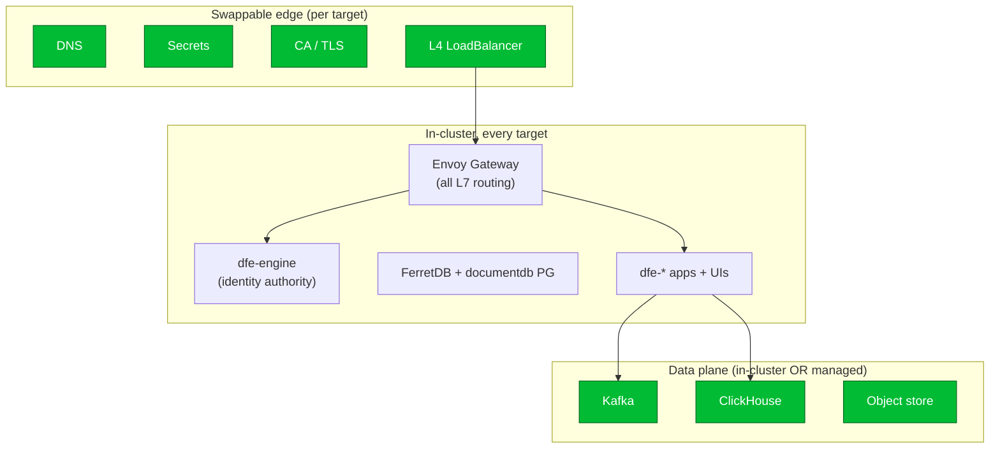

# Deployment portability matrix

DFE is ONE product deployed into many estates. Every major component sits behind
a config-driven seam so a deployment swaps it without a code change -- the seam is
always an existing k8s abstraction or a chart mode, never a fork. This page is the
per-target instantiation of that contract; the seam DEFINITIONS (the knob each one
turns) live in [../architecture.md](../architecture.md) "Swappable components" and
stay the SSoT.

RKE2 on-prem is the STANDARD and the tested path (devex is its test rig). The
managed-cloud columns are overlays: same charts, same seams, different values +
credentials. A cloud column is not built until the on-prem path is green, but the
SEAM must be clean now so the overlay is config, not rework.

## The invariant core vs the swappable edge

One cloud L4 LoadBalancer backs the single in-k8s Envoy Gateway, which does ALL
L7 routing -- there are no per-app cloud LBs and no cloud L7 (ALB/App Gateway).
dfe-engine (the identity authority), the Envoy edge, and FerretDB's documentdb PG
are always in-cluster; Kafka, ClickHouse and object storage can be in-cluster or a
managed endpoint.

## The matrix

| Component | Seam (the knob) | On-prem RKE2 | AWS | Azure | GCP |
|---|---|---|---|---|---|
| Kubernetes | vanilla-cluster contract (preflight) | RKE2 (standard) | EKS | AKS | GKE |
| External DNS | external-dns provider / estate record | estate CoreDNS record | Route53 | Azure DNS | Cloud DNS |
| Secrets | ESO ClusterSecretStore | OpenBao | Secrets Manager | Key Vault | Secret Manager |
| Private CA / TLS | cert-manager ClusterIssuer (+ external issuer) | OpenBao PKI | ACME or AWS PCA | ACME or Key Vault | ACME or Google CAS |
| Kafka | chart mode + `kafka.bootstrapServers` | Strimzi / Redpanda* | MSK | Event Hubs / Confluent | Confluent / Redpanda Cloud |
| ClickHouse | `clickhouse.mode` + `.host` | in-k8s operator | CH Cloud (pref) / in-k8s | CH Cloud (pref) / in-k8s | CH Cloud (pref) / in-k8s |
| Edge LoadBalancer | `gateway.service` type=LoadBalancer | MetalLB | NLB | Azure LB | GCP LB |
| Object store | S3-compatible endpoint + creds | MinIO / Ceph RGW | S3 | Blob (S3 API) | GCS (S3 API) |
| Container registry | `global.registry` + pull secret | Harbor | ECR | ACR | GAR |
| StorageClass / CSI | `storageClass` (empty -> cluster default) | local-path / Longhorn | EBS | Azure Disk | PD |
| Workload identity | ServiceAccount annotations | static creds (OpenBao) | IRSA | Azure Workload Identity | GKE Workload Identity |
| etcd-at-rest KMS | cluster EncryptionConfiguration provider | secretbox / aescbc | KMS | Key Vault KMS | Cloud KMS |
| Document store PG | ferretdb chart (always in-cluster) | documentdb StatefulSet | " | " | " |
| Identity authority | dfe-engine account store (always in-cluster) | dfe-engine | dfe-engine | dfe-engine | dfe-engine |
| Federated login | `oidc.providers` external OIDC (opt-in) | any OIDC IdP | Entra / Okta / ... | Entra | Google / ... |

\* Redpanda on-prem is behind a licence gate.

## Notes that matter

- **One LB, dumb L4.** The only cloud LB per deployment is the `Service
  type=LoadBalancer` fronting the gateway (MetalLB provides it on-prem). Cloud L7
  (routing, WAF, OIDC) is NOT used -- Envoy owns L7 in-cluster, so behaviour is
  identical everywhere. Cloud-specific LB tuning rides `gateway.service.annotations`.
- **Workload identity is the credential seam for cloud.** ESO, external-dns and the
  cloud LB controller reach their cloud APIs via IRSA / Workload Identity, annotated
  onto the ServiceAccount. On-prem there is no cloud API -- creds come from OpenBao
  through ESO. Nothing hardcodes a static cloud key.
- **etcd-at-rest is a cluster seam, not an app one.** dfe-engine (and every
  `secrets` consumer) inherits whatever the cluster's EncryptionConfiguration uses -- cloud
  KMS on managed clusters, secretbox/aescbc on-prem. No app couples to a KMS.
- **Data services are in-cluster OR managed, per deployment.** Kafka and ClickHouse
  default to in-cluster (Strimzi, CH operator) and swap to a managed endpoint by
  pointing the chart's `*.host` / `bootstrapServers` at it. FerretDB's PG stays
  in-cluster (it is the document store's backend, not a general PG).
- **ClickHouse on cloud:** ClickHouse Cloud is PREFERRED, but self-hosted ClickHouse
  in-k8s (the operator) is equally ACCEPTABLE on any cloud -- the `clickhouse.mode`
  seam supports both everywhere, so it is a per-deployment call, not a hard rule.
- **Nothing cloud-specific is assumed by a chart.** A component reachable through
  only one provider is a bug (architecture.md). The 443/6443 API-egress fix and the
  local-signer-over-OpenBao correction are the kind of on-prem assumption a
  de-hardcoding audit exists to catch.

## Node autoscaling

Cluster Autoscaler (NOT Karpenter -- CA supports all our deploy types via its
per-provider backends: cluster-api/on-prem, AWS ASG, Azure VMSS, GCP MIG). This is
the LAST item of the reform and is spec'd separately in a follow-up GH issue, not
built as part of this workstream.

## Status

DESIGN ARTIFACT for review (2026-08-18). The de-hardcoding CODE AUDIT across charts
+ bootstrap, and the actual EKS/AKS/GKE overlays, are the deferred follow-up -- to
be sequenced after this matrix is signed off.
