<!--
  Project:      dfe-infra
  File:         docs/suite-graph.md
  Purpose:      The DFE suite as a graph - which repos are members, what each
                one is to an outside reader, and what moves when one of them
                releases. The human view of suite.yaml; the diagrams are
                generated from it and checked against it.
  Language:     Markdown
  License:      BUSL-1.1
  Copyright:    (c) 2026 HYPERI PTY LIMITED
-->

# The DFE suite graph

Three files at the root of this repo, one question each:

- `versions.yaml` - which VERSION of each thing a stack pins.
- `apps.yaml` - what KIND of app each deployed workload is.
- `suite.yaml` - which REPOS are ours, what each one IS, and what MOVES when one
  of them releases.

`suite.yaml` carries no version literal, so it can never become a second place
to look a pin up. Membership is declared there and nowhere else: a repo absent
from the file is not a member, whatever its name. The test for membership is
release authority - if we do not cut its releases, it is not in.

The diagrams on this page are generated from `suite.yaml` by
`scripts/dfe-stack suite --render-docs` and compared against it by
`scripts/check_suite_drift.py`. Edit the file, not the diagrams.

That drift check has two halves. The in-repo half - structure, the charts, the
pins, these diagrams - is binding wherever it runs. The cross-repo half reads
each member's own file at the cited line, so it is SKIPPED, and says so, on a
bare checkout with no member clones beside it, which is what CI has. An
operator running it on a box with the clones on disk gets that half checked,
and `--strict` there turns a skip into a failure.

## Reading a node

One repo we own and release. Each declares what it is (`role`), who it is for
(`audience`), what it ships (`artefacts`, each with its own `public` flag), and
its licence and classification. `licence` is what the repo itself states, and
`none-declared` there is a reading of the repo rather than an omission in the
graph. `classification` always has an answer, and `classification_source` says
which rung gave it: `in-repo` for a marker in the repo itself, `org-property`
for the hyperi-io custom property that answers when the repo declares nothing.

`audience` is the tag written for the reader we will have at OSS GA:

- `general` - stands alone. Someone with no DFE deployment can install it and
  get value. scalo-rs, scalo-py, logreducer, vector-vrl, clickhouse-dfe, and
  culvert, the optional VPN.
- `suite` - only makes sense inside a DFE deployment.

It is kept separate from whether the artefact is public, because those come
apart: dfe-schemas publishes to PyPI for anyone to install and is useless
outside DFE.

A node is coloured by that same `audience` tag - green for `general`, blue for
`suite`. Navy is the producer of the diagram you are reading, and there is one
of those per picture. A faded fill is an optional member, and its label says
`(optional)` as well, so the colour is never the only signal.

<!-- suite-graph:begin overview -->
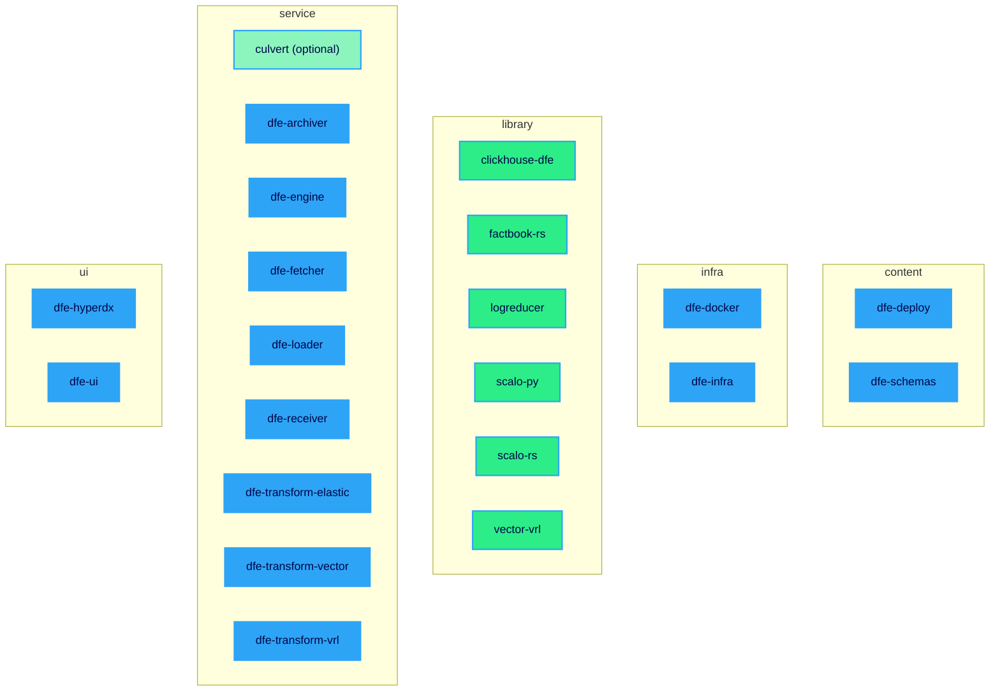
<!-- suite-graph:end overview -->

## Reading an edge

An edge points PRODUCER -> CONSUMER and means: when the producer releases, the
consumer is CHECKED. Not bumped - checked.

- `potential` is the default. The consumer declares a range or holds a copy;
  run the check, and usually nothing moves.
- `lockstep` means the consumer cannot stay behind. Every lockstep edge carries
  its evidence - a gate that fails the build, or a stated policy that the two
  are tagged together.
- `derived` means the consumer holds no copy at all. dfe-docker renders its
  pins from dfe-infra at build time, so there is nothing to drift. Recorded so
  the tooling knows to walk past it.

The `kind` says HOW the two are tied, and `edge_kinds` in the file carries the
check and the gates once per kind. Every edge cites the consumer's own file at
a line where a line is meaningful - a whole-file vendored copy cites the file,
because no one line of it is the evidence. That citation is `evidence` and it
is always the consumer's side; where the producer keeps its own copy of the
same content, that copy is the edge's `source`, and it is the only second
reference an edge carries. An edge nobody could cite from the consumer side is
not in the file.

## The build cycles

One diagram per producer whose release puts something in motion - every
producer in the file has one, so a new producer with no block is an advisory
the drift check raises rather than a gap nobody sees. Thick arrows are
lockstep, plain arrows are potential, dotted arrows are derived.

### scalo-rs

The crate range is the obvious edge. The one that is easy to miss: scalo
GENERATES each Rust member's Dockerfile and supplies the runtime base image
inside it, so a scalo-rs release can change a consumer's image with no Cargo
range moving. Both edges are walked.

<!-- suite-graph:begin producer:scalo-rs -->
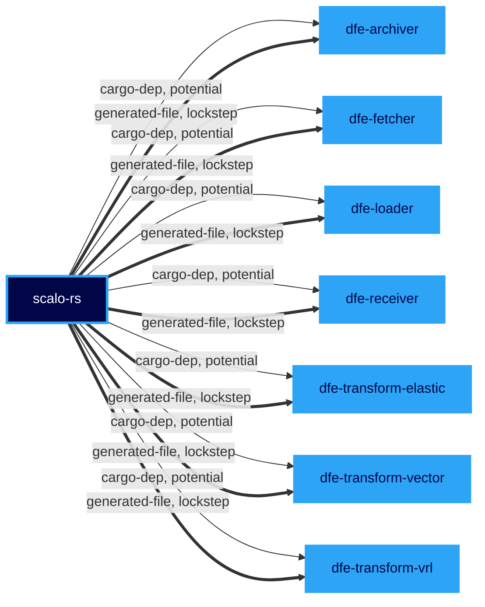
<!-- suite-graph:end producer:scalo-rs -->

### scalo-py

dfe-engine, culvert and vector-vrl each declare it by range - vector-vrl in its
build system rather than in the published wheel. dfe-engine also pins the
runtime base image it inherits from scalo and guards that with its own test,
which is the lockstep half.

<!-- suite-graph:begin producer:scalo-py -->
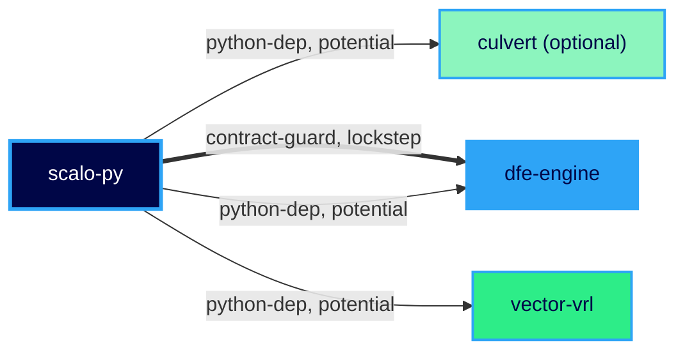
<!-- suite-graph:end producer:scalo-py -->

### dfe-engine

Its image tag sits in three places in this repo (its own chart, the dfe-schema
chart that runs an engine entry point, and the hyperdx chart's init container),
and the drift check holds all three. dfe-ui vendors the engine's API spec and
generates its scopes file from an engine module.

<!-- suite-graph:begin producer:dfe-engine -->
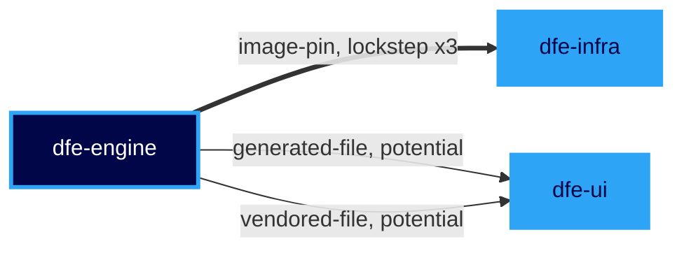
<!-- suite-graph:end producer:dfe-engine -->

### dfe-infra

The app catalogue goes OUT to dfe-engine before any library moves, which is why
dfe-infra opens a pass as well as closing it. dfe-deploy pins the certified
stack; dfe-docker renders and holds nothing.

<!-- suite-graph:begin producer:dfe-infra -->
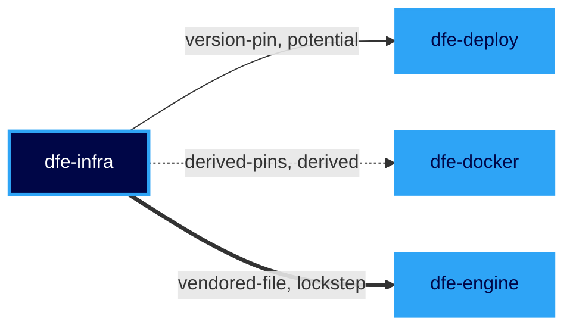
<!-- suite-graph:end producer:dfe-infra -->

### dfe-schemas

dfe-engine takes it as a package dependency by range. The two version pins are
lockstep by policy rather than by a gate: the content block in `versions.yaml`
is tagged with the stack release, so the pin here and the one in dfe-deploy
move with it.

<!-- suite-graph:begin producer:dfe-schemas -->
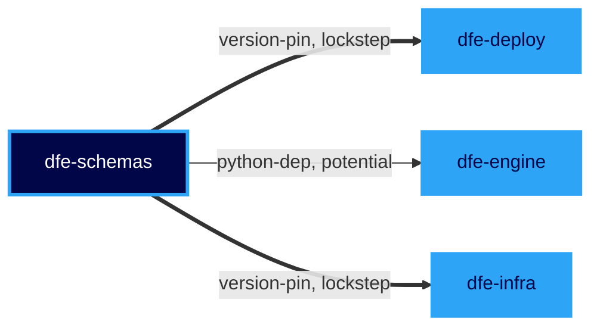
<!-- suite-graph:end producer:dfe-schemas -->

### logreducer

dfe-engine imports it and declares no dependency on it, deliberately: the
sampler degrades with a message when it is absent. There is no range to test,
so the check is running the tests that cover the named import sites.

<!-- suite-graph:begin producer:logreducer -->

<!-- suite-graph:end producer:logreducer -->

## The build cycles: the deployed members

The other direction. Every deployed member is a producer too, and what its
release puts in motion is a pin in this repo.

### dfe-ui and dfe-hyperdx

Each moves one image pin in this repo when it releases. dfe-hyperdx also has
its release tag pinned in the content block.

<!-- suite-graph:begin producer:dfe-ui -->
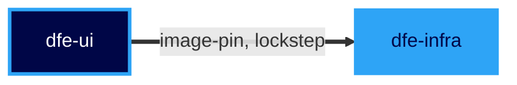
<!-- suite-graph:end producer:dfe-ui -->

<!-- suite-graph:begin producer:dfe-hyperdx -->
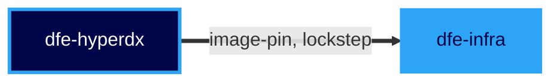
<!-- suite-graph:end producer:dfe-hyperdx -->

### dfe-deploy

The certified stack's own tag comes back the other way: dfe-deploy is pinned in
this repo's content block as well as pinning this repo.

<!-- suite-graph:begin producer:dfe-deploy -->
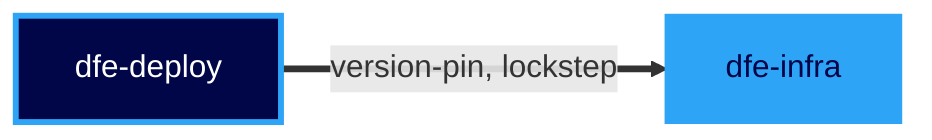
<!-- suite-graph:end producer:dfe-deploy -->

### The components

Every deployed component is a producer too. A component release moves its image
pin here - its chart's appVersion and the digest mirror, both held by the drift
check - and nothing else, with two exceptions: dfe-engine authors the loader's
and the receiver's configs, so it carries a hand-written copy of each one's
validation rules that no script can compare.

<!-- suite-graph:begin producer:dfe-loader -->
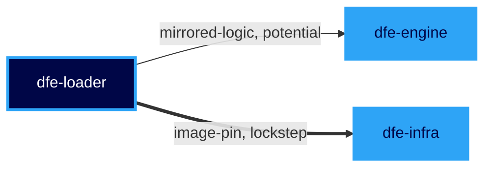
<!-- suite-graph:end producer:dfe-loader -->

<!-- suite-graph:begin producer:dfe-receiver -->
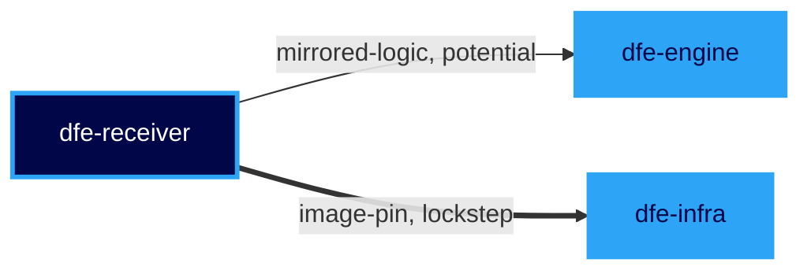
<!-- suite-graph:end producer:dfe-receiver -->

<!-- suite-graph:begin producer:dfe-fetcher -->
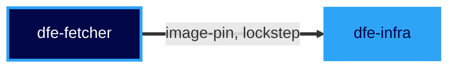
<!-- suite-graph:end producer:dfe-fetcher -->

<!-- suite-graph:begin producer:dfe-archiver -->
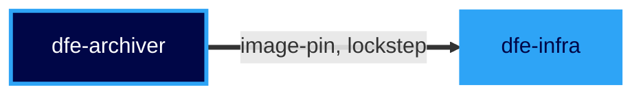
<!-- suite-graph:end producer:dfe-archiver -->

<!-- suite-graph:begin producer:dfe-transform-vrl -->
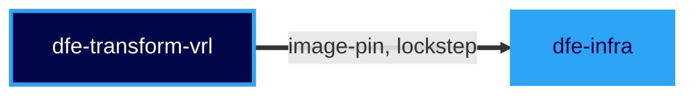
<!-- suite-graph:end producer:dfe-transform-vrl -->

<!-- suite-graph:begin producer:dfe-transform-vector -->

<!-- suite-graph:end producer:dfe-transform-vector -->

<!-- suite-graph:begin producer:dfe-transform-elastic -->
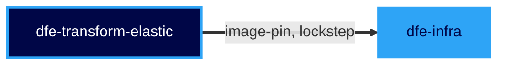
<!-- suite-graph:end producer:dfe-transform-elastic -->

## The build-cycle table

`scripts/dfe-stack suite --cycles` prints it from the file: one row per
producer and edge kind, the consumers merged, with the check text and the gates
that prove it. The tooling that walks a release walks that table. It is not a
listing of cycles in the graph - the graph has one, dfe-infra to dfe-engine and
back, and the lanes are what resolve it.

## What reaches one member

`scripts/dfe-stack suite --consumer <node>` answers the other direction: the
in-edges, so someone picking up one member sees every producer whose release
puts work on their desk.

## Lanes

A full suite pass runs the lanes in this order: `toolchain` (dfe-infra,
dfe-docker), `libraries`, `consumers`, `deployment`. The order is declared in
the file rather than derived from the edges, because dfe-infra sits at both
ends - it feeds the catalogue out first and consumes the new app versions last,
and no sort can place a node at both ends.

## What is deliberately not here

Runtime dependencies - the UI calling the engine's API, the engine driving the
components through their management API - sit in `runtime_edges`. They are
real and recorded so an outside reader sees the whole picture, but a release on
either side changes no file in the other, so a build pass has nothing to check.

dfe-transform-wasm and dfe-transform-splack are not members: neither has a
release tag. Their charts and placeholder pins in this repo predate that test,
and each joins the file when its first tag exists.

Both are listed under `non_members` with the reason, because a chart or
a pin with no member is otherwise an advisory on every drift-check run, and an
advisory nobody can act on trains the reader to skip the ones that mean
something. The listing is checked rather than trusted: `check_suite_drift.py`
fails when an entry is also a node, and when an entry names no chart and no
app pin, so it cannot outlive what it silences.
