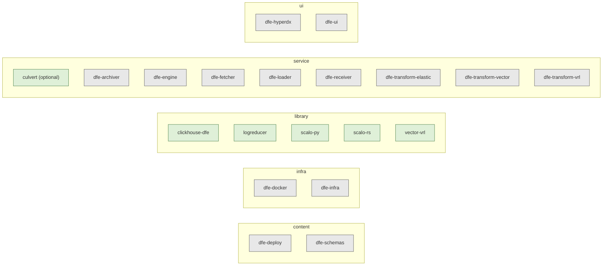

<!--
  Project:      dfe-infra
  File:         docs/suite-graph.md
  Purpose:      The DFE suite as a graph - which repos are members, what each
                one is to an outside reader, and what moves when one of them
                releases. The human view of suite.yaml; the diagrams are
                generated from it and checked against it.
  Language:     Markdown
  License:      BUSL-1.1
  Copyright:    (c) 2026 HYPERI PTY LIMITED
-->

# The DFE suite graph

Three files at the root of this repo, one question each:

- `versions.yaml` - which VERSION of each thing a stack pins.
- `apps.yaml` - what KIND of app each deployed workload is.
- `suite.yaml` - which REPOS are ours, what each one IS, and what MOVES when one
  of them releases.

`suite.yaml` carries no version literal, so it can never become a second place
to look a pin up. Membership is declared there and nowhere else: a repo absent
from the file is not a member, whatever its name. The test for membership is
release authority - if we do not cut its releases, it is not in.

The diagrams on this page are generated from `suite.yaml` by
`scripts/dfe-stack suite --render-docs` and compared against it by
`scripts/check_suite_drift.py`. Edit the file, not the diagrams.

## Reading a node

One repo we own and release. Each declares what it is (`role`), who it is for
(`audience`), what it ships (`artefacts`, each with its own `public` flag), and
the licence and classification the repo itself states. `none-declared` is a
reading of the repo, not an omission in the graph.

`audience` is the tag written for the reader we will have at OSS GA:

- `general` - stands alone. Someone with no DFE deployment can install it and
  get value. scalo-rs, scalo-py, logreducer, vector-vrl, clickhouse-dfe, and
  culvert, the optional VPN.
- `suite` - only makes sense inside a DFE deployment.

It is kept separate from whether the artefact is public, because those come
apart: dfe-schemas publishes to PyPI for anyone to install and is useless
outside DFE.

<!-- suite-graph:begin overview -->

<!-- suite-graph:end overview -->

## Reading an edge

An edge points PRODUCER -> CONSUMER and means: when the producer releases, the
consumer is CHECKED. Not bumped - checked.

- `potential` is the default. The consumer declares a range or holds a copy;
  run the check, and usually nothing moves.
- `lockstep` means the consumer cannot stay behind. Every lockstep edge carries
  its evidence - a gate that fails the build, or a stated policy that the two
  are tagged together.
- `derived` means the consumer holds no copy at all. dfe-docker renders its
  pins from dfe-infra at build time, so there is nothing to drift. Recorded so
  the tooling knows to walk past it.

The `kind` says HOW the two are tied, and `edge_kinds` in the file carries the
check and the gates once per kind. Every edge cites the consumer's own file at
a line; an edge nobody could cite from the consumer side is not in the file.

## The build cycles

One diagram per producer whose release puts something in motion. Thick arrows
are lockstep, plain arrows are potential, dotted arrows are derived.

### scalo-rs

The crate range is the obvious edge. The one that is easy to miss: scalo
GENERATES each Rust member's Dockerfile and supplies the runtime base image
inside it, so a scalo-rs release can change a consumer's image with no Cargo
range moving. Both edges are walked.

<!-- suite-graph:begin producer:scalo-rs -->
```mermaid
flowchart LR
  scalo_rs["scalo-rs"]:::producer
  dfe_archiver["dfe-archiver"]
  scalo_rs -->|cargo-dep (potential)| dfe_archiver
  scalo_rs ==>|generated-file (lockstep)| dfe_archiver
  dfe_fetcher["dfe-fetcher"]
  scalo_rs -->|cargo-dep (potential)| dfe_fetcher
  scalo_rs ==>|generated-file (lockstep)| dfe_fetcher
  dfe_loader["dfe-loader"]
  scalo_rs -->|cargo-dep (potential)| dfe_loader
  scalo_rs ==>|generated-file (lockstep)| dfe_loader
  dfe_receiver["dfe-receiver"]
  scalo_rs -->|cargo-dep (potential)| dfe_receiver
  scalo_rs ==>|generated-file (lockstep)| dfe_receiver
  dfe_transform_elastic["dfe-transform-elastic"]
  scalo_rs -->|cargo-dep (potential)| dfe_transform_elastic
  scalo_rs ==>|generated-file (lockstep)| dfe_transform_elastic
  dfe_transform_vector["dfe-transform-vector"]
  scalo_rs -->|cargo-dep (potential)| dfe_transform_vector
  scalo_rs ==>|generated-file (lockstep)| dfe_transform_vector
  dfe_transform_vrl["dfe-transform-vrl"]
  scalo_rs -->|cargo-dep (potential)| dfe_transform_vrl
  scalo_rs ==>|generated-file (lockstep)| dfe_transform_vrl
  classDef producer fill:#fcf8e3,stroke:#8a6d3b
```
<!-- suite-graph:end producer:scalo-rs -->

### scalo-py

dfe-engine and culvert declare it by range. dfe-engine also pins the runtime
base image it inherits from scalo and guards that with its own test, which is
the lockstep half.

<!-- suite-graph:begin producer:scalo-py -->
```mermaid
flowchart LR
  scalo_py["scalo-py"]:::producer
  culvert["culvert"]
  scalo_py -->|python-dep (potential)| culvert
  dfe_engine["dfe-engine"]
  scalo_py ==>|contract-guard (lockstep)| dfe_engine
  scalo_py -->|python-dep (potential)| dfe_engine
  vector_vrl["vector-vrl"]
  scalo_py -->|python-dep (potential)| vector_vrl
  classDef producer fill:#fcf8e3,stroke:#8a6d3b
```
<!-- suite-graph:end producer:scalo-py -->

### dfe-engine

Its image tag sits in three places in this repo (its own chart, the dfe-schema
chart that runs an engine entry point, and the hyperdx chart's init container),
and the drift check holds all three. dfe-ui vendors the engine's API spec and
generates its scopes file from an engine module.

<!-- suite-graph:begin producer:dfe-engine -->
```mermaid
flowchart LR
  dfe_engine["dfe-engine"]:::producer
  dfe_infra["dfe-infra"]
  dfe_engine ==>|image-pin (lockstep)| dfe_infra
  dfe_engine ==>|image-pin (lockstep)| dfe_infra
  dfe_engine ==>|image-pin (lockstep)| dfe_infra
  dfe_ui["dfe-ui"]
  dfe_engine -->|generated-file (potential)| dfe_ui
  dfe_engine -->|vendored-file (potential)| dfe_ui
  classDef producer fill:#fcf8e3,stroke:#8a6d3b
```
<!-- suite-graph:end producer:dfe-engine -->

### dfe-infra

The app catalogue goes OUT to dfe-engine before any library moves, which is why
dfe-infra opens a pass as well as closing it. dfe-deploy pins the certified
stack; dfe-docker renders and holds nothing.

<!-- suite-graph:begin producer:dfe-infra -->
```mermaid
flowchart LR
  dfe_infra["dfe-infra"]:::producer
  dfe_deploy["dfe-deploy"]
  dfe_infra -->|version-pin (potential)| dfe_deploy
  dfe_docker["dfe-docker"]
  dfe_infra -.->|derived-pins (derived)| dfe_docker
  dfe_engine["dfe-engine"]
  dfe_infra ==>|vendored-file (lockstep)| dfe_engine
  classDef producer fill:#fcf8e3,stroke:#8a6d3b
```
<!-- suite-graph:end producer:dfe-infra -->

### dfe-schemas

<!-- suite-graph:begin producer:dfe-schemas -->
```mermaid
flowchart LR
  dfe_schemas["dfe-schemas"]:::producer
  dfe_deploy["dfe-deploy"]
  dfe_schemas ==>|version-pin (lockstep)| dfe_deploy
  dfe_engine["dfe-engine"]
  dfe_schemas -->|python-dep (potential)| dfe_engine
  dfe_infra["dfe-infra"]
  dfe_schemas ==>|version-pin (lockstep)| dfe_infra
  classDef producer fill:#fcf8e3,stroke:#8a6d3b
```
<!-- suite-graph:end producer:dfe-schemas -->

## The cycle table

`scripts/dfe-stack suite --cycles` prints it from the file: one row per
producer and edge kind, the consumers merged, with the check text and the gates
that prove it. The tooling that walks a release walks that table.

## Lanes

A full suite pass runs the lanes in this order: `toolchain` (dfe-infra,
dfe-docker), `libraries`, `consumers`, `deployment`. The order is declared in
the file rather than derived from the edges, because dfe-infra sits at both
ends - it feeds the catalogue out first and consumes the new app versions last,
and no sort can place a node at both ends.

## What is deliberately not here

Runtime dependencies - the UI calling the engine's API, the engine driving the
components through their management API - sit in `runtime_edges`. They are
real and recorded so an outside reader sees the whole picture, but a release on
either side changes no file in the other, so a build pass has nothing to check.

dfe-transform-wasm and dfe-transform-splack are not members: neither has a
release tag. Their charts and placeholder pins in this repo predate that test,
and each joins the file when its first tag exists.
